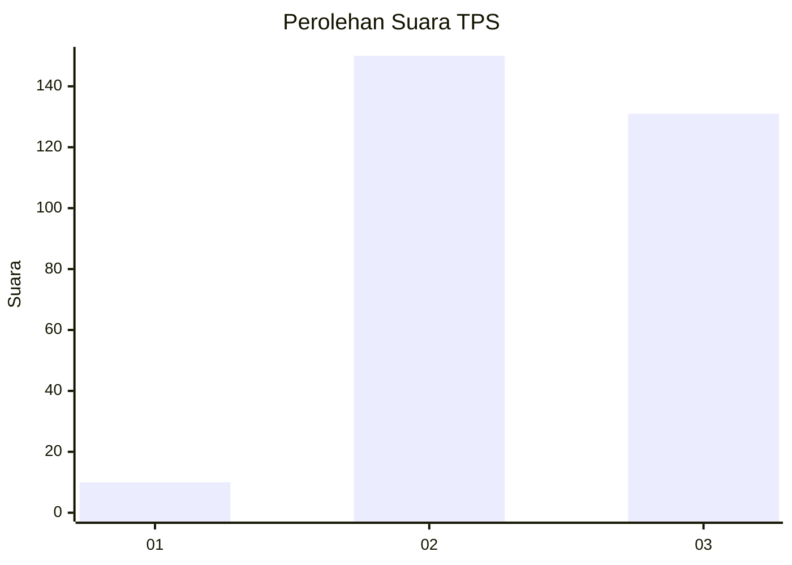
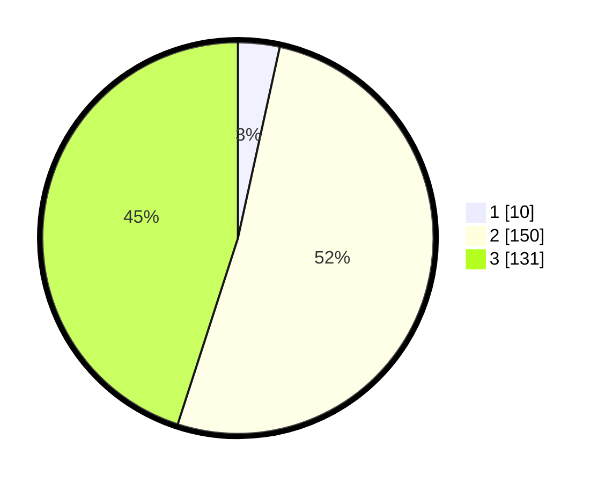

# Hasil

## Grafik

## Tabel

| No. | Nama Paslon    | Suara | Suara (raw) | Persentase |
|:--- |:-------------- | -----:| -----------:| ----------:|
| 1   | ANIES MUHAIMIN | 10    | [10][p-1]   | 3,44       |
| 2   | PRABOWO GIBRAN | 150   | [150][p-2]  | 51,55      |
| 3   | GANJAR MAHFUD  | 131   | [131][p-3]  | 45,02      |

[p-1]: https://github.com/gigit-pemilu/pemilu-2024-35-jawa-timur/blob/main/pilpres/hitung-suara/sub/35-jawa-timur/sub/27-sampang/sub/08-tambelangan/sub/2006-tambelangan/sub/011-tps/sub/paslon-1.txt
[p-2]: https://github.com/gigit-pemilu/pemilu-2024-35-jawa-timur/blob/main/pilpres/hitung-suara/sub/35-jawa-timur/sub/27-sampang/sub/08-tambelangan/sub/2006-tambelangan/sub/011-tps/sub/paslon-2.txt
[p-3]: https://github.com/gigit-pemilu/pemilu-2024-35-jawa-timur/blob/main/pilpres/hitung-suara/sub/35-jawa-timur/sub/27-sampang/sub/08-tambelangan/sub/2006-tambelangan/sub/011-tps/sub/paslon-3.txt

## Foto C Plano

https://sirekap-obj-formc.kpu.go.id/b638/pemilu/ppwp/35/27/08/20/06/3527082006011-20240214-184743--8f471b62-647b-4d4f-9890-a165c97d1adb.jpg

https://sirekap-obj-formc.kpu.go.id/b638/pemilu/ppwp/35/27/08/20/06/3527082006011-20240214-184809--8feceb8f-9b7a-4f72-9e57-2e5ced98afbb.jpg

## Metadata

| Key        | Value               |
| ---------- | ------------------- |
| Time Stamp | 2024-02-15 22:30:27 |

