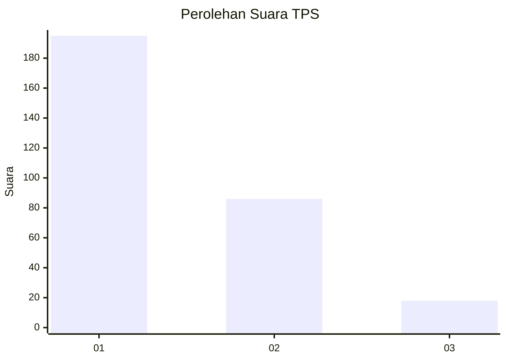
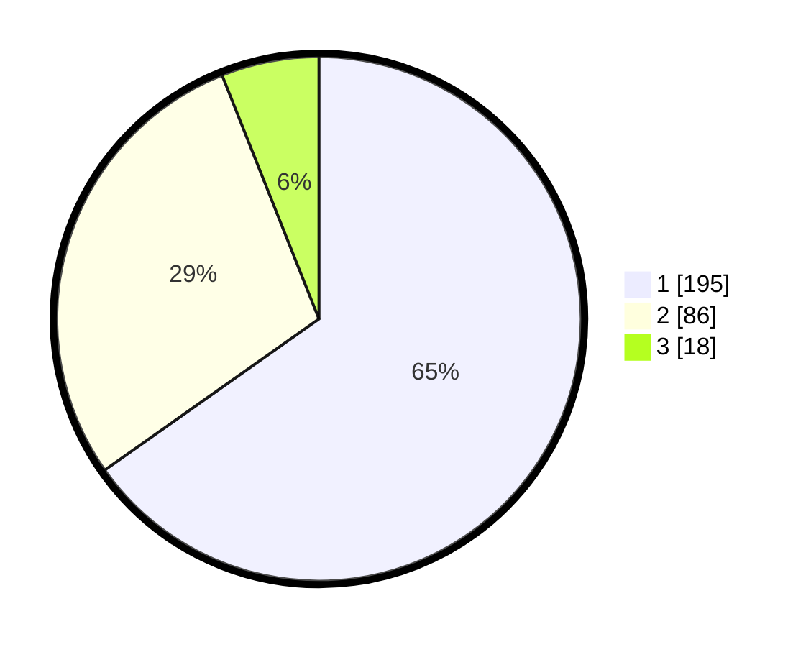

# Hasil

## Grafik

## Tabel

| No. | Nama Paslon    | Suara | Suara (raw) | Persentase |
|:--- |:-------------- | -----:| -----------:| ----------:|
| 1   | ANIES MUHAIMIN | 195   | [195][p-1]  | 65,22      |
| 2   | PRABOWO GIBRAN | 86    | [86][p-2]   | 28,76      |
| 3   | GANJAR MAHFUD  | 18    | [18][p-3]   | 6,02       |

[p-1]: https://github.com/gigit-pemilu/pemilu-2024-35-jawa-timur/blob/main/pilpres/hitung-suara/sub/35-jawa-timur/sub/27-sampang/sub/08-tambelangan/sub/2007-barunggagah/sub/013-tps/sub/paslon-1.txt
[p-2]: https://github.com/gigit-pemilu/pemilu-2024-35-jawa-timur/blob/main/pilpres/hitung-suara/sub/35-jawa-timur/sub/27-sampang/sub/08-tambelangan/sub/2007-barunggagah/sub/013-tps/sub/paslon-2.txt
[p-3]: https://github.com/gigit-pemilu/pemilu-2024-35-jawa-timur/blob/main/pilpres/hitung-suara/sub/35-jawa-timur/sub/27-sampang/sub/08-tambelangan/sub/2007-barunggagah/sub/013-tps/sub/paslon-3.txt

## Foto C Plano

https://sirekap-obj-formc.kpu.go.id/861e/pemilu/ppwp/35/27/08/20/07/3527082007013-20240214-200504--c9367453-14b0-4764-89ad-cce62ec03f0c.jpg

https://sirekap-obj-formc.kpu.go.id/861e/pemilu/ppwp/35/27/08/20/07/3527082007013-20240214-201236--e604d805-7b52-4bcc-b39f-df33b75458e9.jpg

https://sirekap-obj-formc.kpu.go.id/861e/pemilu/ppwp/35/27/08/20/07/3527082007013-20240214-201353--c9a6e26e-21da-451e-9737-d27f60b21368.jpg

## Metadata

| Key        | Value               |
| ---------- | ------------------- |
| Time Stamp | 2024-02-16 17:30:00 |

