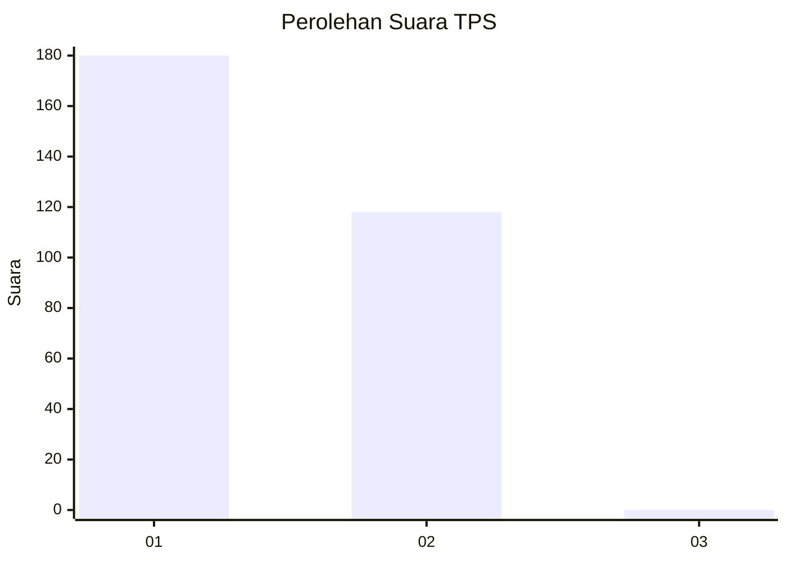
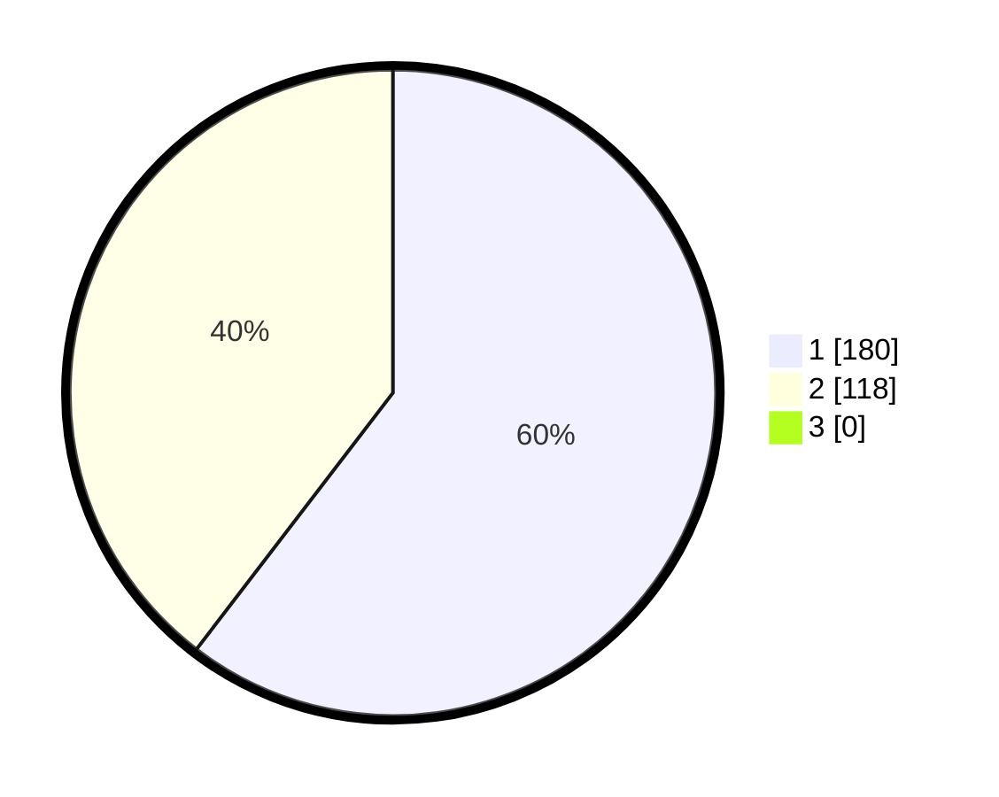

# Hasil

## Grafik

## Tabel

| No. | Nama Paslon    | Suara | Suara (raw) | Persentase |
|:--- |:-------------- | -----:| -----------:| ----------:|
| 1   | ANIES MUHAIMIN | 180   | [180][p-1]  | 60,40      |
| 2   | PRABOWO GIBRAN | 118   | [118][p-2]  | 39,60      |
| 3   | GANJAR MAHFUD  | 0     | [0][p-3]    | 0,00       |

[p-1]: https://github.com/gigit-pemilu/pemilu-2024-35-jawa-timur/blob/main/pilpres/hitung-suara/sub/35-jawa-timur/sub/27-sampang/sub/08-tambelangan/sub/2008-banjarbillah/sub/002-tps/sub/paslon-1.txt
[p-2]: https://github.com/gigit-pemilu/pemilu-2024-35-jawa-timur/blob/main/pilpres/hitung-suara/sub/35-jawa-timur/sub/27-sampang/sub/08-tambelangan/sub/2008-banjarbillah/sub/002-tps/sub/paslon-2.txt
[p-3]: https://github.com/gigit-pemilu/pemilu-2024-35-jawa-timur/blob/main/pilpres/hitung-suara/sub/35-jawa-timur/sub/27-sampang/sub/08-tambelangan/sub/2008-banjarbillah/sub/002-tps/sub/paslon-3.txt

## Foto C Plano

https://sirekap-obj-formc.kpu.go.id/ce49/pemilu/ppwp/35/27/08/20/08/3527082008002-20240214-200533--75acc0c9-3759-46f3-93ea-4ba939107f3b.jpg

https://sirekap-obj-formc.kpu.go.id/ce49/pemilu/ppwp/35/27/08/20/08/3527082008002-20240214-200705--48adefc5-456d-4fc2-8f52-b8db936a55af.jpg

https://sirekap-obj-formc.kpu.go.id/ce49/pemilu/ppwp/35/27/08/20/08/3527082008002-20240214-201116--f9a5bf4f-c2b6-4b91-98d4-3dc7005c9554.jpg

## Metadata

| Key        | Value               |
| ---------- | ------------------- |
| Time Stamp | 2024-02-16 11:00:29 |

