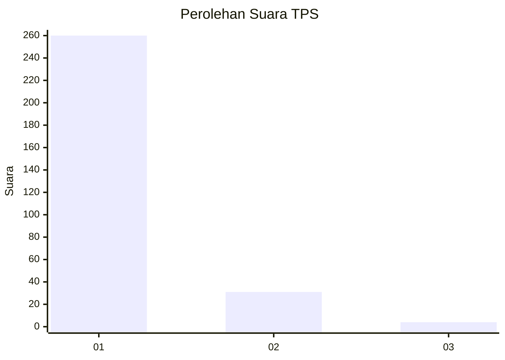
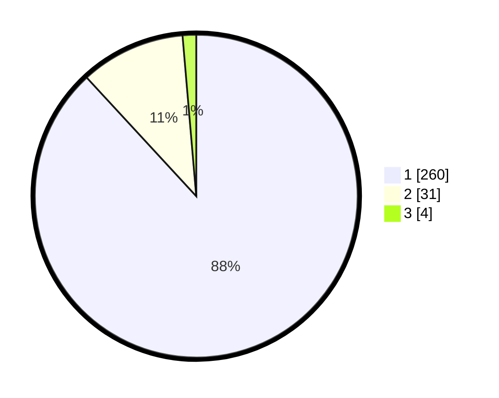

# Hasil

## Grafik

## Tabel

| No. | Nama Paslon    | Suara | Suara (raw) | Persentase |
|:--- |:-------------- | -----:| -----------:| ----------:|
| 1   | ANIES MUHAIMIN | 260   | [260][p-1]  | 88,14      |
| 2   | PRABOWO GIBRAN | 31    | [31][p-2]   | 10,51      |
| 3   | GANJAR MAHFUD  | 4     | [4][p-3]    | 1,36       |

[p-1]: https://github.com/gigit-pemilu/pemilu-2024-35-jawa-timur/blob/main/pilpres/hitung-suara/sub/35-jawa-timur/sub/27-sampang/sub/08-tambelangan/sub/2010-birem/sub/024-tps/sub/paslon-1.txt
[p-2]: https://github.com/gigit-pemilu/pemilu-2024-35-jawa-timur/blob/main/pilpres/hitung-suara/sub/35-jawa-timur/sub/27-sampang/sub/08-tambelangan/sub/2010-birem/sub/024-tps/sub/paslon-2.txt
[p-3]: https://github.com/gigit-pemilu/pemilu-2024-35-jawa-timur/blob/main/pilpres/hitung-suara/sub/35-jawa-timur/sub/27-sampang/sub/08-tambelangan/sub/2010-birem/sub/024-tps/sub/paslon-3.txt

## Foto C Plano

https://sirekap-obj-formc.kpu.go.id/da74/pemilu/ppwp/35/27/08/20/10/3527082010024-20240214-204349--a2d8d945-c896-4571-9d5b-1ce0d63cd8af.jpg

https://sirekap-obj-formc.kpu.go.id/da74/pemilu/ppwp/35/27/08/20/10/3527082010024-20240214-204617--6cbb9c1e-fcd1-4e5b-a20f-fd92c6bd465d.jpg

https://sirekap-obj-formc.kpu.go.id/da74/pemilu/ppwp/35/27/08/20/10/3527082010024-20240214-204915--862d92d0-62c4-49f1-bf9f-9216ba4c782b.jpg

## Metadata

| Key        | Value               |
| ---------- | ------------------- |
| Time Stamp | 2024-02-17 10:00:02 |

