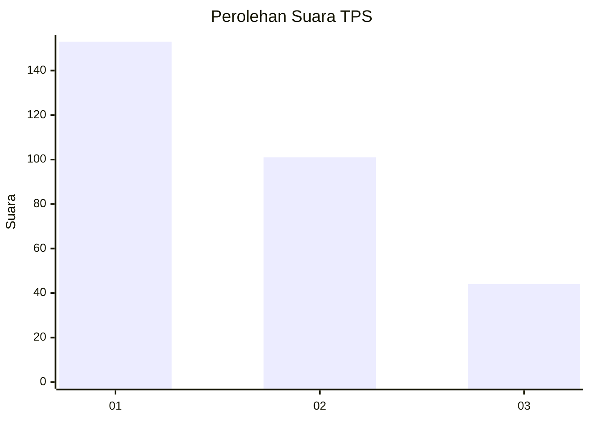
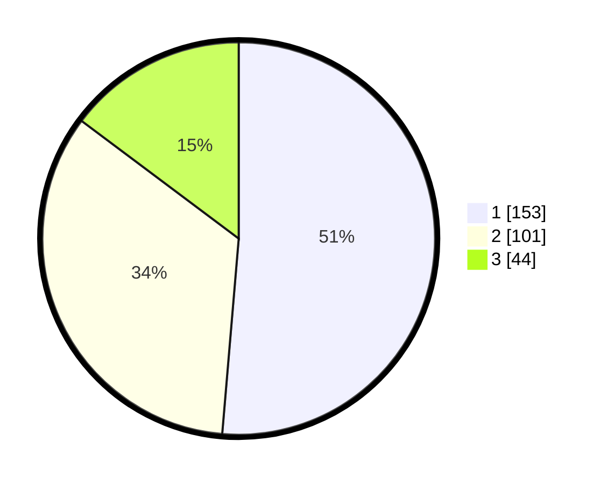

# Hasil

## Grafik

## Tabel

| No. | Nama Paslon    | Suara | Suara (raw) | Persentase |
|:--- |:-------------- | -----:| -----------:| ----------:|
| 1   | ANIES MUHAIMIN | 153   | [153][p-1]  | 51,34      |
| 2   | PRABOWO GIBRAN | 101   | [101][p-2]  | 33,89      |
| 3   | GANJAR MAHFUD  | 44    | [44][p-3]   | 14,77      |

[p-1]: https://github.com/gigit-pemilu/pemilu-2024-35-jawa-timur/blob/main/pilpres/hitung-suara/sub/35-jawa-timur/sub/27-sampang/sub/09-banyuates/sub/2002-planggaran-barat/sub/001-tps/sub/paslon-1.txt
[p-2]: https://github.com/gigit-pemilu/pemilu-2024-35-jawa-timur/blob/main/pilpres/hitung-suara/sub/35-jawa-timur/sub/27-sampang/sub/09-banyuates/sub/2002-planggaran-barat/sub/001-tps/sub/paslon-2.txt
[p-3]: https://github.com/gigit-pemilu/pemilu-2024-35-jawa-timur/blob/main/pilpres/hitung-suara/sub/35-jawa-timur/sub/27-sampang/sub/09-banyuates/sub/2002-planggaran-barat/sub/001-tps/sub/paslon-3.txt

## Foto C Plano

https://sirekap-obj-formc.kpu.go.id/f112/pemilu/ppwp/35/27/09/20/02/3527092002001-20240215-011056--02a060bd-92e3-4b64-be40-67133b986942.jpg

https://sirekap-obj-formc.kpu.go.id/f112/pemilu/ppwp/35/27/09/20/02/3527092002001-20240214-235020--996e16b5-47fa-40ce-80bb-abf117a59b31.jpg

https://sirekap-obj-formc.kpu.go.id/f112/pemilu/ppwp/35/27/09/20/02/3527092002001-20240214-235318--962ff23e-4721-4b63-81d7-6f0ed0b2e470.jpg

## Metadata

| Key        | Value               |
| ---------- | ------------------- |
| Time Stamp | 2024-02-16 10:00:28 |

