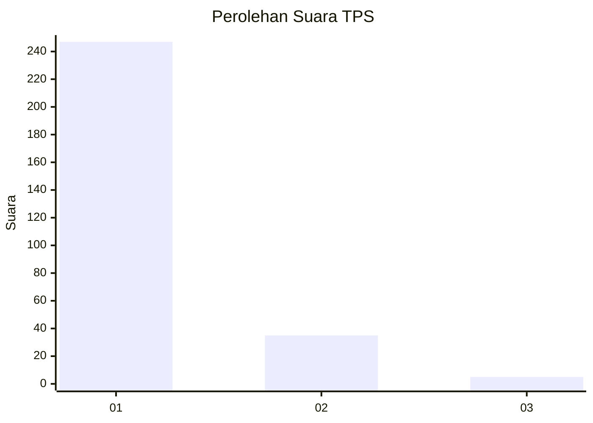
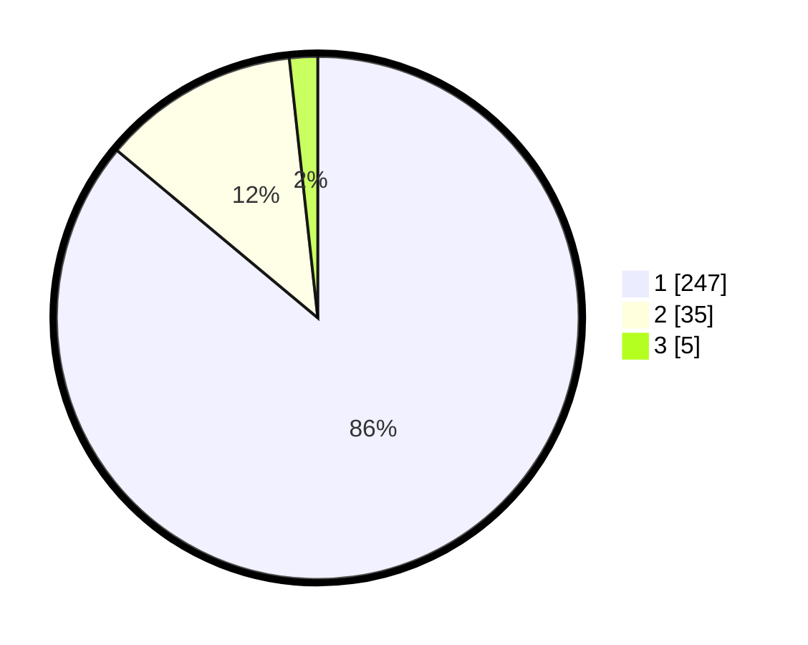

# Hasil

## Grafik

## Tabel

| No. | Nama Paslon    | Suara | Suara (raw) | Persentase |
|:--- |:-------------- | -----:| -----------:| ----------:|
| 1   | ANIES MUHAIMIN | 247   | [247][p-1]  | 86,06      |
| 2   | PRABOWO GIBRAN | 35    | [35][p-2]   | 12,20      |
| 3   | GANJAR MAHFUD  | 5     | [5][p-3]    | 1,74       |

[p-1]: https://github.com/gigit-pemilu/pemilu-2024/blob/main/pilpres/hitung-suara/sub/35-jawa-timur/sub/27-sampang/sub/09-banyuates/sub/2002-planggaran-barat/sub/003-tps/sub/paslon-1.txt
[p-2]: https://github.com/gigit-pemilu/pemilu-2024/blob/main/pilpres/hitung-suara/sub/35-jawa-timur/sub/27-sampang/sub/09-banyuates/sub/2002-planggaran-barat/sub/003-tps/sub/paslon-2.txt
[p-3]: https://github.com/gigit-pemilu/pemilu-2024/blob/main/pilpres/hitung-suara/sub/35-jawa-timur/sub/27-sampang/sub/09-banyuates/sub/2002-planggaran-barat/sub/003-tps/sub/paslon-3.txt

## Foto C Plano

https://sirekap-obj-formc.kpu.go.id/2fe6/pemilu/ppwp/35/27/09/20/02/3527092002003-20240215-023532--b73415ac-ef0b-4a94-b64e-ab4d0f3f3c72.jpg

https://sirekap-obj-formc.kpu.go.id/2fe6/pemilu/ppwp/35/27/09/20/02/3527092002003-20240215-023537--023e8c4b-227f-488b-8ec3-ec3effcd77f9.jpg

https://sirekap-obj-formc.kpu.go.id/2fe6/pemilu/ppwp/35/27/09/20/02/3527092002003-20240215-023514--d199aa87-640d-488f-ba0a-ba8b7a9b177c.jpg

## Metadata

| Key        | Value               |
| ---------- | ------------------- |
| Time Stamp | 2024-02-16 11:00:29 |

