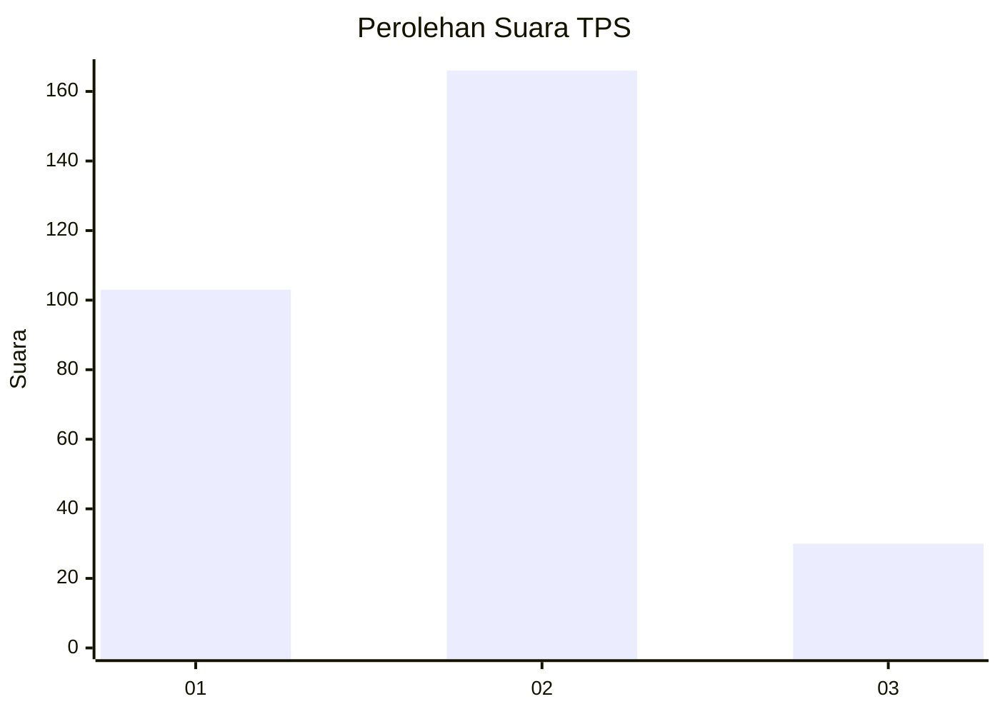
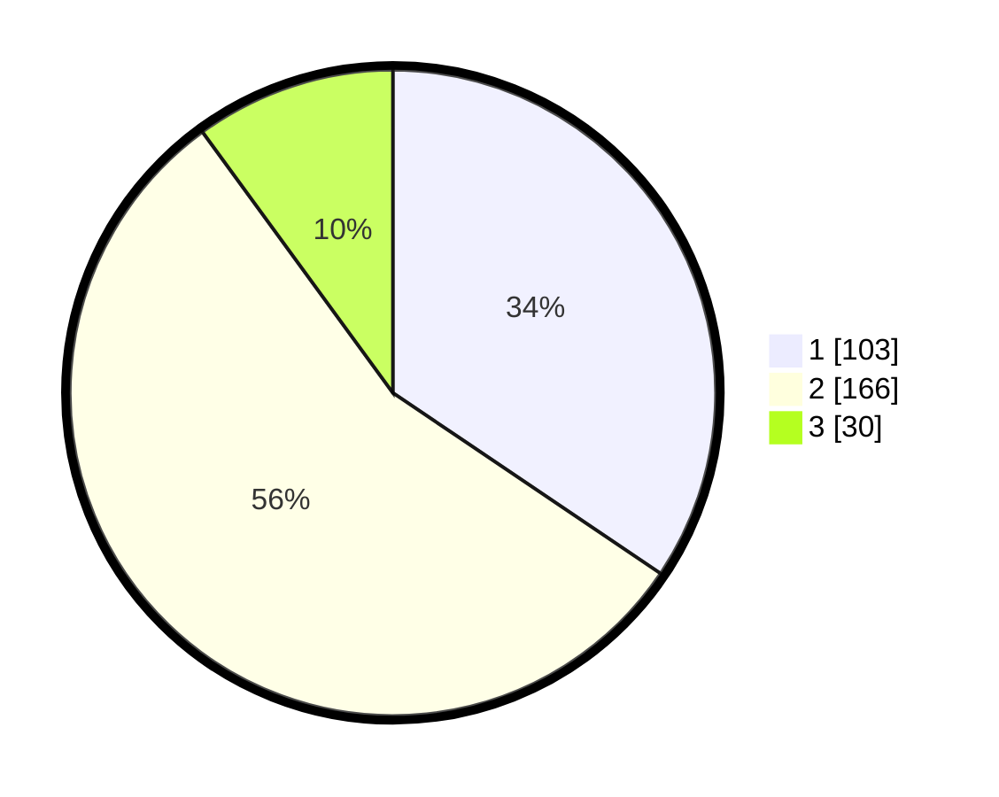

# Hasil

## Grafik

## Tabel

| No. | Nama Paslon    | Suara | Suara (raw) | Persentase |
|:--- |:-------------- | -----:| -----------:| ----------:|
| 1   | ANIES MUHAIMIN | 103   | [103][p-1]  | 34,45      |
| 2   | PRABOWO GIBRAN | 166   | [166][p-2]  | 55,52      |
| 3   | GANJAR MAHFUD  | 30    | [30][p-3]   | 10,03      |

[p-1]: https://github.com/gigit-pemilu/pemilu-2024-35-jawa-timur/blob/main/pilpres/hitung-suara/sub/35-jawa-timur/sub/27-sampang/sub/09-banyuates/sub/2002-planggaran-barat/sub/004-tps/sub/paslon-1.txt
[p-2]: https://github.com/gigit-pemilu/pemilu-2024-35-jawa-timur/blob/main/pilpres/hitung-suara/sub/35-jawa-timur/sub/27-sampang/sub/09-banyuates/sub/2002-planggaran-barat/sub/004-tps/sub/paslon-2.txt
[p-3]: https://github.com/gigit-pemilu/pemilu-2024-35-jawa-timur/blob/main/pilpres/hitung-suara/sub/35-jawa-timur/sub/27-sampang/sub/09-banyuates/sub/2002-planggaran-barat/sub/004-tps/sub/paslon-3.txt

## Foto C Plano

https://sirekap-obj-formc.kpu.go.id/5f48/pemilu/ppwp/35/27/09/20/02/3527092002004-20240215-002107--d892b7b1-0a34-43f4-9682-910f32ef382d.jpg

https://sirekap-obj-formc.kpu.go.id/5f48/pemilu/ppwp/35/27/09/20/02/3527092002004-20240215-001539--9292b15d-b80d-44d5-b4b4-4b8ade1d7de4.jpg

https://sirekap-obj-formc.kpu.go.id/5f48/pemilu/ppwp/35/27/09/20/02/3527092002004-20240215-001608--68f35802-5946-4e3c-bfda-02c0b80eb3d6.jpg

## Metadata

| Key        | Value               |
| ---------- | ------------------- |
| Time Stamp | 2024-02-19 06:16:00 |

## DATA PEMILIH TETAP

Jumlah pemilih dalam DPT: **300**.
 * L: **139**.
 * P: **161**.

## DATA PENGGUNA HAK PILIH

Jumlah pengguna hak pilih dalam DPT: **300**.
 * L: **139**.
 * P: **161**.

Jumlah pengguna hak pilih dalam DPTb: **0**.
 * L: **0**.
 * P: **0**.

Jumlah pengguna hak pilih dalam DPK: **0**.
 * L: **0**.
 * P: **0**.

Jumlah pengguna hak pilih: **300**.
 * L: **139**.
 * P: **161**.

## JUMLAH SUARA SAH DAN TIDAK SAH

JUMLAH SELURUH SUARA SAH: **299**.

JUMLAH SUARA TIDAK SAH: **1**.

JUMLAH SELURUH SUARA SAH DAN SUARA TIDAK SAH: **300**.

