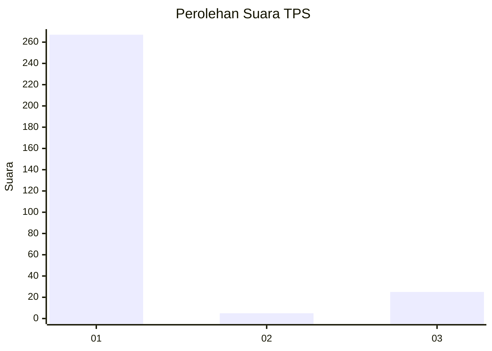
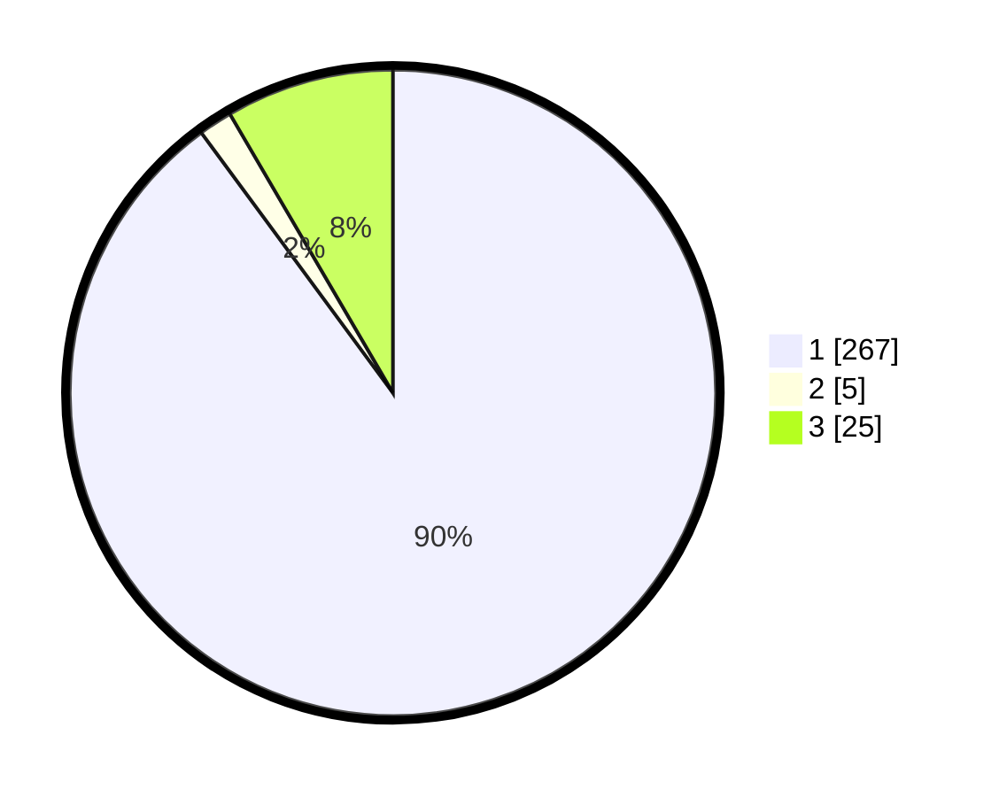

# Hasil

## Grafik

## Tabel

| No. | Nama Paslon    | Suara | Suara (raw) | Persentase |
|:--- |:-------------- | -----:| -----------:| ----------:|
| 1   | ANIES MUHAIMIN | 267   | [267][p-1]  | 89,90      |
| 2   | PRABOWO GIBRAN | 5     | [5][p-2]    | 1,68       |
| 3   | GANJAR MAHFUD  | 25    | [25][p-3]   | 8,42       |

[p-1]: https://github.com/gigit-pemilu/pemilu-2024/blob/main/pilpres/hitung-suara/sub/35-jawa-timur/sub/27-sampang/sub/09-banyuates/sub/2002-planggaran-barat/sub/005-tps/sub/paslon-1.txt
[p-2]: https://github.com/gigit-pemilu/pemilu-2024/blob/main/pilpres/hitung-suara/sub/35-jawa-timur/sub/27-sampang/sub/09-banyuates/sub/2002-planggaran-barat/sub/005-tps/sub/paslon-2.txt
[p-3]: https://github.com/gigit-pemilu/pemilu-2024/blob/main/pilpres/hitung-suara/sub/35-jawa-timur/sub/27-sampang/sub/09-banyuates/sub/2002-planggaran-barat/sub/005-tps/sub/paslon-3.txt

## Foto C Plano

https://sirekap-obj-formc.kpu.go.id/2be6/pemilu/ppwp/35/27/09/20/02/3527092002005-20240215-014400--204b5b68-c895-4c05-b37f-c3c074bd35e3.jpg

https://sirekap-obj-formc.kpu.go.id/2be6/pemilu/ppwp/35/27/09/20/02/3527092002005-20240215-014403--c9ea9f47-6cc4-4e55-93b1-8951e0c49f36.jpg

https://sirekap-obj-formc.kpu.go.id/2be6/pemilu/ppwp/35/27/09/20/02/3527092002005-20240215-014411--5a3f4f47-d2f5-4170-800f-a0742d27ca0c.jpg

## Metadata

| Key        | Value               |
| ---------- | ------------------- |
| Time Stamp | 2024-02-16 22:30:00 |

