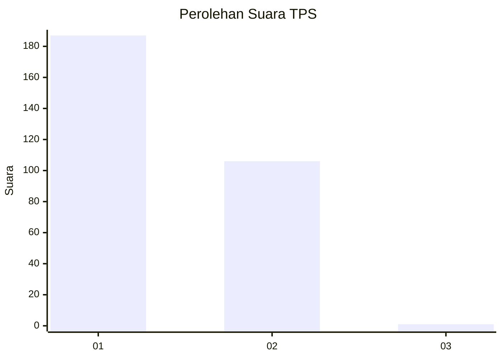
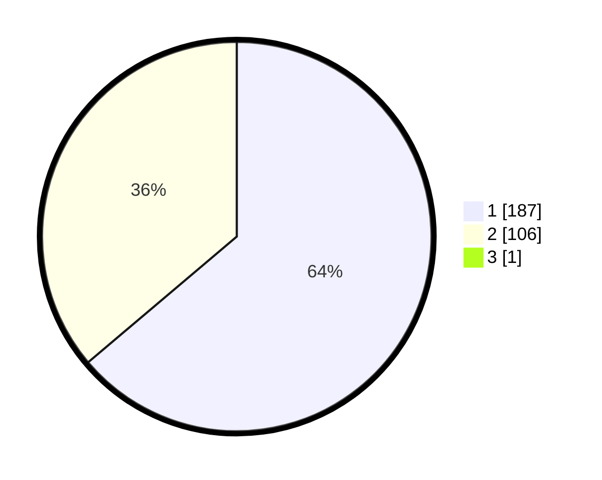

# Hasil

## Grafik

## Tabel

| No. | Nama Paslon    | Suara | Suara (raw) | Persentase |
|:--- |:-------------- | -----:| -----------:| ----------:|
| 1   | ANIES MUHAIMIN | 187   | [187][p-1]  | 63,61      |
| 2   | PRABOWO GIBRAN | 106   | [106][p-2]  | 36,05      |
| 3   | GANJAR MAHFUD  | 1     | [1][p-3]    | 0,34       |

[p-1]: https://github.com/gigit-pemilu/pemilu-2024-35-jawa-timur/blob/main/pilpres/hitung-suara/sub/35-jawa-timur/sub/27-sampang/sub/09-banyuates/sub/2004-tolang/sub/004-tps/sub/paslon-1.txt
[p-2]: https://github.com/gigit-pemilu/pemilu-2024-35-jawa-timur/blob/main/pilpres/hitung-suara/sub/35-jawa-timur/sub/27-sampang/sub/09-banyuates/sub/2004-tolang/sub/004-tps/sub/paslon-2.txt
[p-3]: https://github.com/gigit-pemilu/pemilu-2024-35-jawa-timur/blob/main/pilpres/hitung-suara/sub/35-jawa-timur/sub/27-sampang/sub/09-banyuates/sub/2004-tolang/sub/004-tps/sub/paslon-3.txt

## Foto C Plano

https://sirekap-obj-formc.kpu.go.id/29ea/pemilu/ppwp/35/27/09/20/04/3527092004004-20240215-163141--b5354190-e76e-4f27-9c45-4e293663d4a1.jpg

https://sirekap-obj-formc.kpu.go.id/29ea/pemilu/ppwp/35/27/09/20/04/3527092004004-20240215-153157--cc3af765-3bf2-40b8-8159-be3cd1b87cc3.jpg

https://sirekap-obj-formc.kpu.go.id/29ea/pemilu/ppwp/35/27/09/20/04/3527092004004-20240215-163518--ec7ad646-c7f6-41dd-9945-8b0f14ec230c.jpg

## Metadata

| Key        | Value               |
| ---------- | ------------------- |
| Time Stamp | 2024-02-15 22:30:27 |

