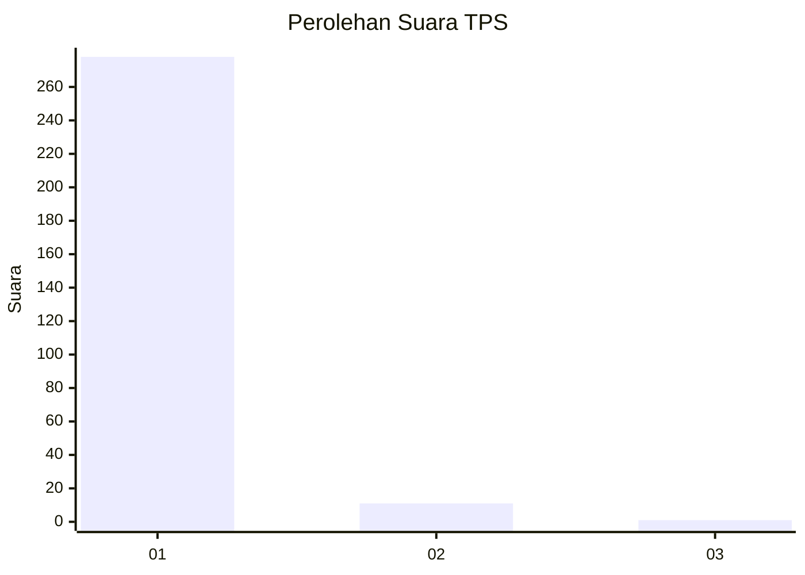
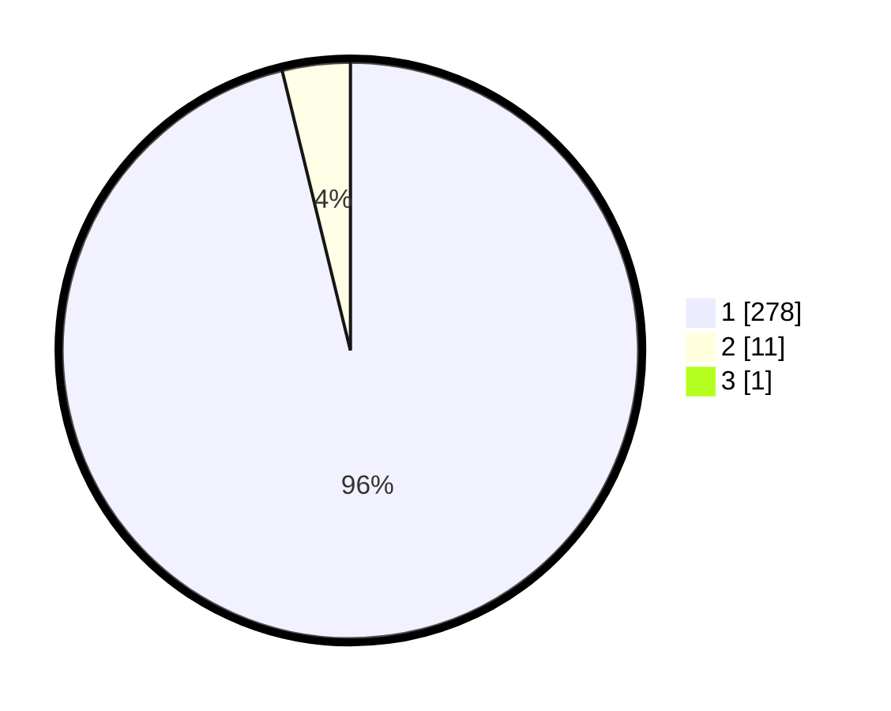

# Hasil

## Grafik

## Tabel

| No. | Nama Paslon    | Suara | Suara (raw) | Persentase |
|:--- |:-------------- | -----:| -----------:| ----------:|
| 1   | ANIES MUHAIMIN | 278   | [278][p-1]  | 95,86      |
| 2   | PRABOWO GIBRAN | 11    | [11][p-2]   | 3,79       |
| 3   | GANJAR MAHFUD  | 1     | [1][p-3]    | 0,34       |

[p-1]: https://github.com/gigit-pemilu/pemilu-2024-35-jawa-timur/blob/main/pilpres/hitung-suara/sub/35-jawa-timur/sub/27-sampang/sub/09-banyuates/sub/2004-tolang/sub/005-tps/sub/paslon-1.txt
[p-2]: https://github.com/gigit-pemilu/pemilu-2024-35-jawa-timur/blob/main/pilpres/hitung-suara/sub/35-jawa-timur/sub/27-sampang/sub/09-banyuates/sub/2004-tolang/sub/005-tps/sub/paslon-2.txt
[p-3]: https://github.com/gigit-pemilu/pemilu-2024-35-jawa-timur/blob/main/pilpres/hitung-suara/sub/35-jawa-timur/sub/27-sampang/sub/09-banyuates/sub/2004-tolang/sub/005-tps/sub/paslon-3.txt

## Foto C Plano

https://sirekap-obj-formc.kpu.go.id/c2b2/pemilu/ppwp/35/27/09/20/04/3527092004005-20240215-170956--9fd054c7-d875-4cc3-8ce7-3b0fb5ae802a.jpg

https://sirekap-obj-formc.kpu.go.id/c2b2/pemilu/ppwp/35/27/09/20/04/3527092004005-20240215-171105--64f08403-2339-4863-8ec1-7d4ff947a4fc.jpg

https://sirekap-obj-formc.kpu.go.id/c2b2/pemilu/ppwp/35/27/09/20/04/3527092004005-20240215-171212--f1c4b1d4-1b2b-4141-b175-c731cf54bcfb.jpg

## Metadata

| Key        | Value               |
| ---------- | ------------------- |
| Time Stamp | 2024-02-16 12:51:22 |

