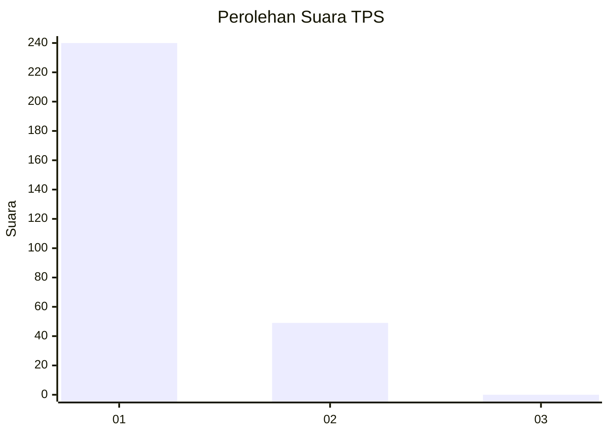
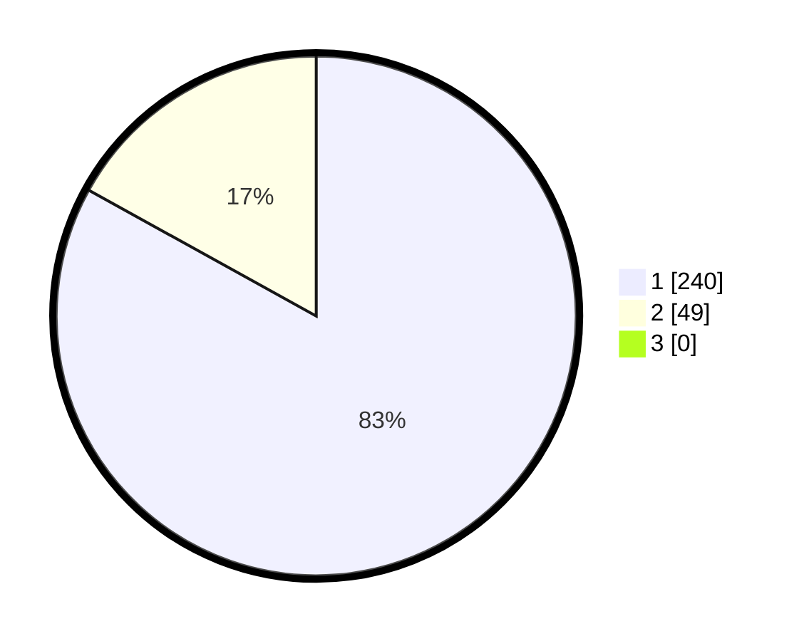

# Hasil

## Grafik

## Tabel

| No. | Nama Paslon    | Suara | Suara (raw) | Persentase |
|:--- |:-------------- | -----:| -----------:| ----------:|
| 1   | ANIES MUHAIMIN | 240   | [240][p-1]  | 83,04      |
| 2   | PRABOWO GIBRAN | 49    | [49][p-2]   | 16,96      |
| 3   | GANJAR MAHFUD  | 0     | [0][p-3]    | 0,00       |

[p-1]: https://github.com/gigit-pemilu/pemilu-2024/blob/main/pilpres/hitung-suara/sub/35-jawa-timur/sub/27-sampang/sub/09-banyuates/sub/2004-tolang/sub/008-tps/sub/paslon-1.txt
[p-2]: https://github.com/gigit-pemilu/pemilu-2024/blob/main/pilpres/hitung-suara/sub/35-jawa-timur/sub/27-sampang/sub/09-banyuates/sub/2004-tolang/sub/008-tps/sub/paslon-2.txt
[p-3]: https://github.com/gigit-pemilu/pemilu-2024/blob/main/pilpres/hitung-suara/sub/35-jawa-timur/sub/27-sampang/sub/09-banyuates/sub/2004-tolang/sub/008-tps/sub/paslon-3.txt

## Foto C Plano

https://sirekap-obj-formc.kpu.go.id/e874/pemilu/ppwp/35/27/09/20/04/3527092004008-20240215-163051--7485a8c9-2e9c-4090-be8b-e9cc51fd2fbb.jpg

https://sirekap-obj-formc.kpu.go.id/e874/pemilu/ppwp/35/27/09/20/04/3527092004008-20240215-162033--136482c7-03e5-4eaa-b4f5-0362305eee77.jpg

https://sirekap-obj-formc.kpu.go.id/e874/pemilu/ppwp/35/27/09/20/04/3527092004008-20240215-162105--c9c0ec2f-9ef3-43d9-b749-79040b0298c4.jpg

## Metadata

| Key        | Value               |
| ---------- | ------------------- |
| Time Stamp | 2024-02-15 21:30:27 |

## DATA PEMILIH TETAP

Jumlah pemilih dalam DPT: **283**.
 * L: **143**.
 * P: **146**.

## DATA PENGGUNA HAK PILIH

Jumlah pengguna hak pilih dalam DPT: **285**.
 * L: **143**.
 * P: **196**.

Jumlah pengguna hak pilih dalam DPTb: **5**.
 * L: **557**.
 * P: **135**.

Jumlah pengguna hak pilih dalam DPK: **100**.
 * L: **335**.
 * P: **520**.

Jumlah pengguna hak pilih: **289**.
 * L: **143**.
 * P: **146**.

## JUMLAH SUARA SAH DAN TIDAK SAH

JUMLAH SELURUH SUARA SAH: **289**.

JUMLAH SUARA TIDAK SAH: **0**.

JUMLAH SELURUH SUARA SAH DAN SUARA TIDAK SAH: **289**.

