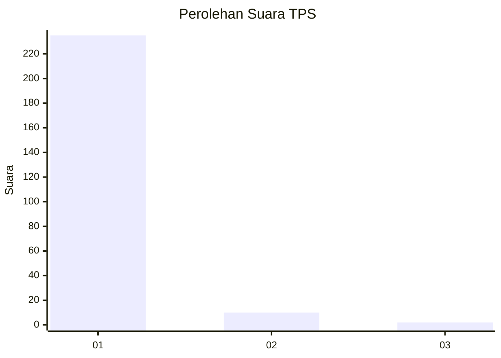
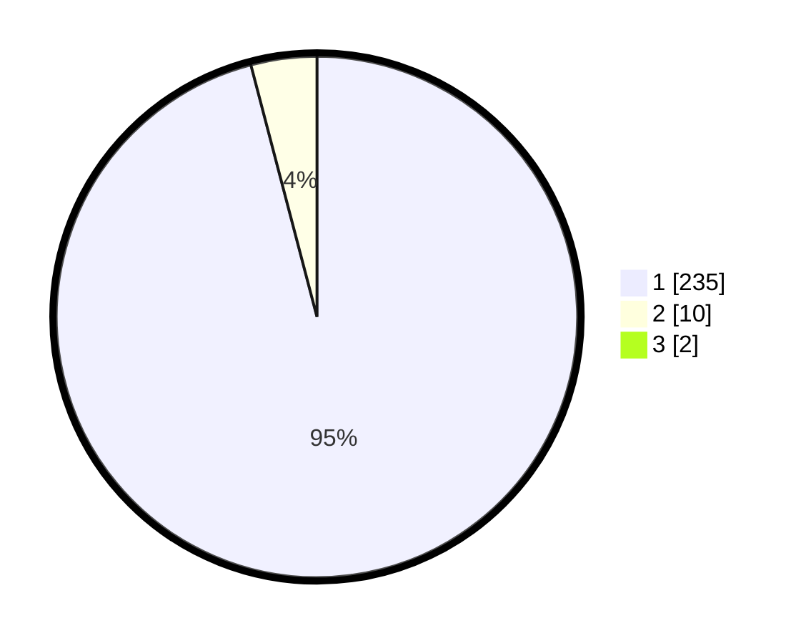

# Hasil

## Grafik

## Tabel

| No. | Nama Paslon    | Suara | Suara (raw) | Persentase |
|:--- |:-------------- | -----:| -----------:| ----------:|
| 1   | ANIES MUHAIMIN | 235   | [235][p-1]  | 95,14      |
| 2   | PRABOWO GIBRAN | 10    | [10][p-2]   | 4,05       |
| 3   | GANJAR MAHFUD  | 2     | [2][p-3]    | 0,81       |

[p-1]: https://github.com/gigit-pemilu/pemilu-2024/blob/main/pilpres/hitung-suara/sub/35-jawa-timur/sub/27-sampang/sub/09-banyuates/sub/2004-tolang/sub/009-tps/sub/paslon-1.txt
[p-2]: https://github.com/gigit-pemilu/pemilu-2024/blob/main/pilpres/hitung-suara/sub/35-jawa-timur/sub/27-sampang/sub/09-banyuates/sub/2004-tolang/sub/009-tps/sub/paslon-2.txt
[p-3]: https://github.com/gigit-pemilu/pemilu-2024/blob/main/pilpres/hitung-suara/sub/35-jawa-timur/sub/27-sampang/sub/09-banyuates/sub/2004-tolang/sub/009-tps/sub/paslon-3.txt

## Foto C Plano

https://sirekap-obj-formc.kpu.go.id/3b7f/pemilu/ppwp/35/27/09/20/04/3527092004009-20240215-103338--f4f72f47-69b0-410e-a326-a2ec96e36411.jpg

https://sirekap-obj-formc.kpu.go.id/3b7f/pemilu/ppwp/35/27/09/20/04/3527092004009-20240215-103436--82019666-4a14-45a6-ad61-ae37145b8110.jpg

https://sirekap-obj-formc.kpu.go.id/3b7f/pemilu/ppwp/35/27/09/20/04/3527092004009-20240215-103553--8f1fd2e9-cf1d-49aa-9c4c-50960ddefb50.jpg

## Metadata

| Key        | Value               |
| ---------- | ------------------- |
| Time Stamp | 2024-02-16 22:30:00 |

