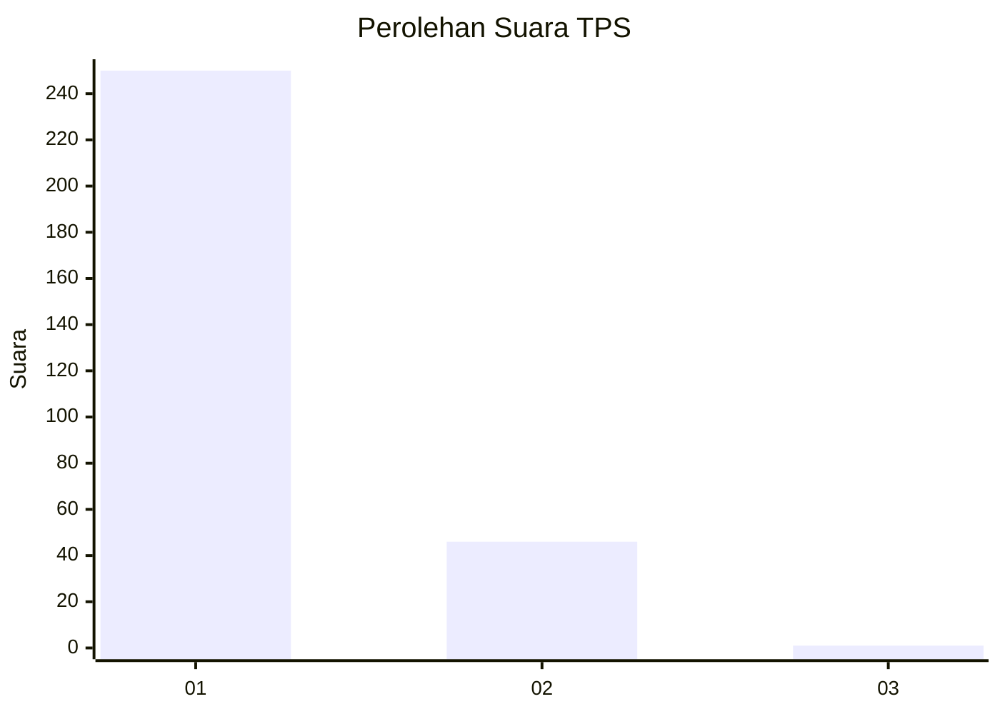
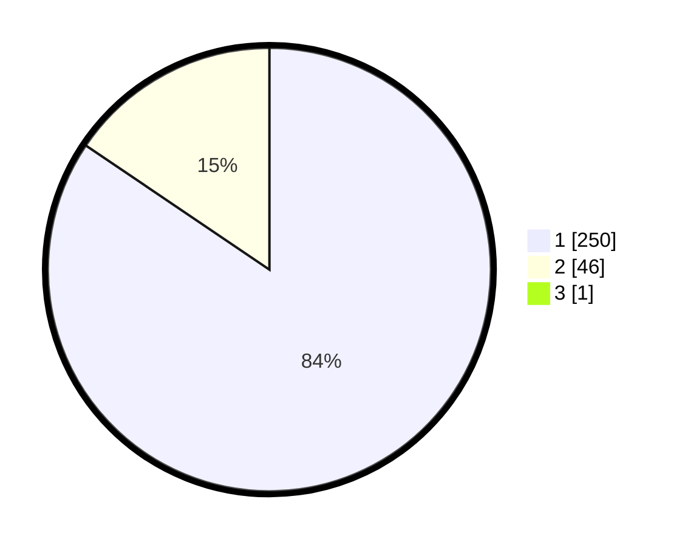

# Hasil

## Grafik

## Tabel

| No. | Nama Paslon    | Suara | Suara (raw) | Persentase |
|:--- |:-------------- | -----:| -----------:| ----------:|
| 1   | ANIES MUHAIMIN | 250   | [250][p-1]  | 84,18      |
| 2   | PRABOWO GIBRAN | 46    | [46][p-2]   | 15,49      |
| 3   | GANJAR MAHFUD  | 1     | [1][p-3]    | 0,34       |

[p-1]: https://github.com/gigit-pemilu/pemilu-2024/blob/main/pilpres/hitung-suara/sub/35-jawa-timur/sub/27-sampang/sub/09-banyuates/sub/2004-tolang/sub/010-tps/sub/paslon-1.txt
[p-2]: https://github.com/gigit-pemilu/pemilu-2024/blob/main/pilpres/hitung-suara/sub/35-jawa-timur/sub/27-sampang/sub/09-banyuates/sub/2004-tolang/sub/010-tps/sub/paslon-2.txt
[p-3]: https://github.com/gigit-pemilu/pemilu-2024/blob/main/pilpres/hitung-suara/sub/35-jawa-timur/sub/27-sampang/sub/09-banyuates/sub/2004-tolang/sub/010-tps/sub/paslon-3.txt

## Foto C Plano

https://sirekap-obj-formc.kpu.go.id/3143/pemilu/ppwp/35/27/09/20/04/3527092004010-20240214-201625--b7831f73-3c53-43a6-93f0-74cabeeba039.jpg

https://sirekap-obj-formc.kpu.go.id/3143/pemilu/ppwp/35/27/09/20/04/3527092004010-20240214-201910--74208caf-a97c-41b0-87b4-6b85f469aed4.jpg

https://sirekap-obj-formc.kpu.go.id/3143/pemilu/ppwp/35/27/09/20/04/3527092004010-20240214-202046--fe0e9c0e-47cc-4a61-8cdf-dd43b8a741f9.jpg

## Metadata

| Key        | Value               |
| ---------- | ------------------- |
| Time Stamp | 2024-02-16 22:30:00 |

