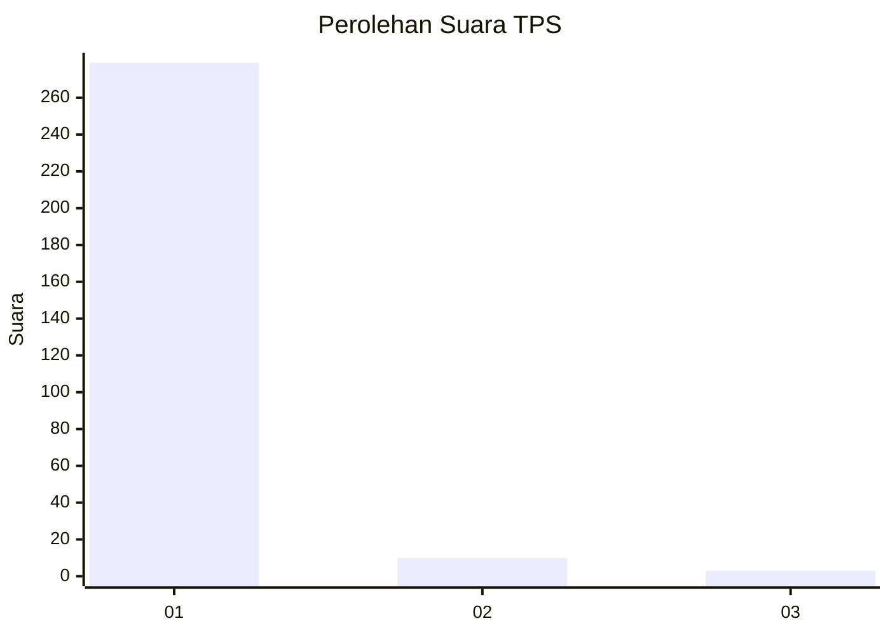
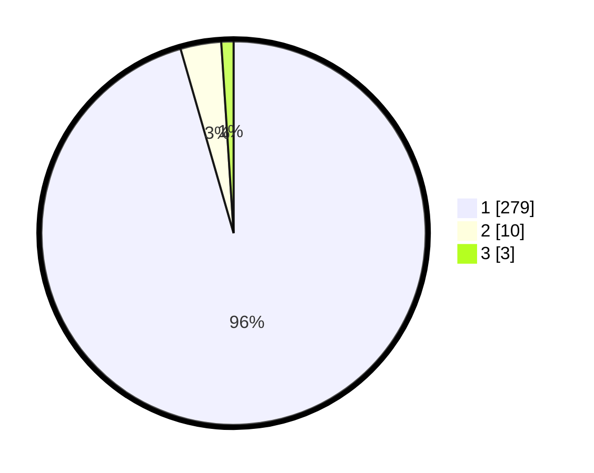

# Hasil

## Grafik

## Tabel

| No. | Nama Paslon    | Suara | Suara (raw) | Persentase |
|:--- |:-------------- | -----:| -----------:| ----------:|
| 1   | ANIES MUHAIMIN | 279   | [279][p-1]  | 95,55      |
| 2   | PRABOWO GIBRAN | 10    | [10][p-2]   | 3,42       |
| 3   | GANJAR MAHFUD  | 3     | [3][p-3]    | 1,03       |

[p-1]: https://github.com/gigit-pemilu/pemilu-2024/blob/main/pilpres/hitung-suara/sub/35-jawa-timur/sub/27-sampang/sub/09-banyuates/sub/2006-tlagah/sub/003-tps/sub/paslon-1.txt
[p-2]: https://github.com/gigit-pemilu/pemilu-2024/blob/main/pilpres/hitung-suara/sub/35-jawa-timur/sub/27-sampang/sub/09-banyuates/sub/2006-tlagah/sub/003-tps/sub/paslon-2.txt
[p-3]: https://github.com/gigit-pemilu/pemilu-2024/blob/main/pilpres/hitung-suara/sub/35-jawa-timur/sub/27-sampang/sub/09-banyuates/sub/2006-tlagah/sub/003-tps/sub/paslon-3.txt

## Foto C Plano

https://sirekap-obj-formc.kpu.go.id/0ea7/pemilu/ppwp/35/27/09/20/06/3527092006003-20240214-155220--7b04e14d-6747-4fda-a3e7-c12a42c588a3.jpg

https://sirekap-obj-formc.kpu.go.id/0ea7/pemilu/ppwp/35/27/09/20/06/3527092006003-20240214-155516--7a2d74b2-e157-49f0-b1df-fc41d069c6d3.jpg

https://sirekap-obj-formc.kpu.go.id/0ea7/pemilu/ppwp/35/27/09/20/06/3527092006003-20240214-155756--564271d9-ce0b-4090-9fa0-7a1633fe2fb6.jpg

## Metadata

| Key        | Value               |
| ---------- | ------------------- |
| Time Stamp | 2024-02-16 22:30:00 |

