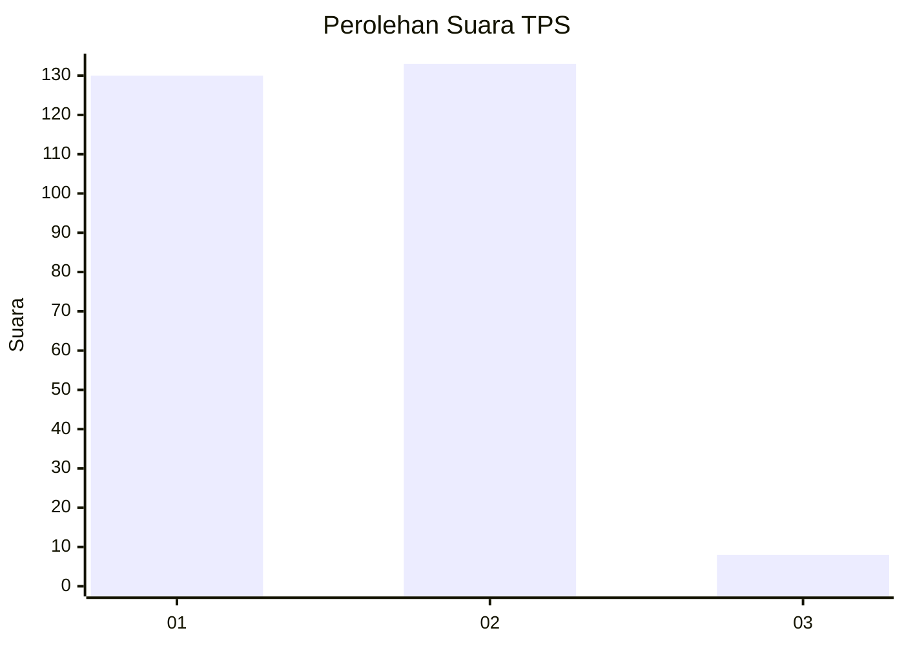
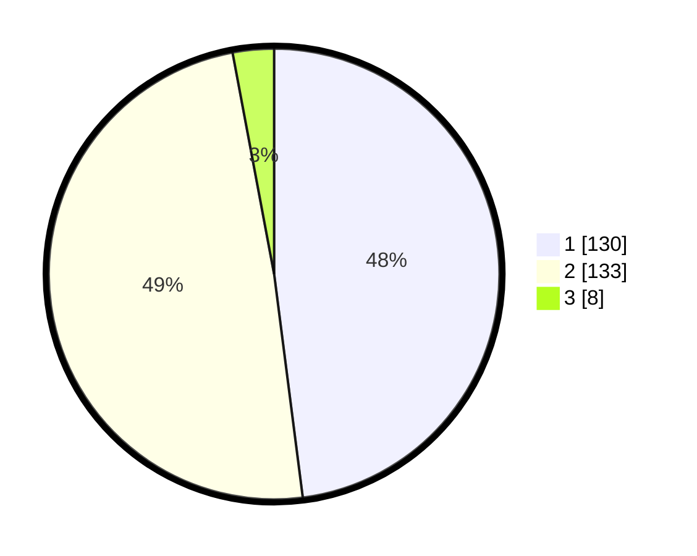

# Hasil

## Grafik

## Tabel

| No. | Nama Paslon    | Suara | Suara (raw) | Persentase |
|:--- |:-------------- | -----:| -----------:| ----------:|
| 1   | ANIES MUHAIMIN | 130   | [130][p-1]  | 47,97      |
| 2   | PRABOWO GIBRAN | 133   | [133][p-2]  | 49,08      |
| 3   | GANJAR MAHFUD  | 8     | [8][p-3]    | 2,95       |

[p-1]: https://github.com/gigit-pemilu/pemilu-2024-35-jawa-timur/blob/main/pilpres/hitung-suara/sub/35-jawa-timur/sub/27-sampang/sub/09-banyuates/sub/2008-trapang/sub/002-tps/sub/paslon-1.txt
[p-2]: https://github.com/gigit-pemilu/pemilu-2024-35-jawa-timur/blob/main/pilpres/hitung-suara/sub/35-jawa-timur/sub/27-sampang/sub/09-banyuates/sub/2008-trapang/sub/002-tps/sub/paslon-2.txt
[p-3]: https://github.com/gigit-pemilu/pemilu-2024-35-jawa-timur/blob/main/pilpres/hitung-suara/sub/35-jawa-timur/sub/27-sampang/sub/09-banyuates/sub/2008-trapang/sub/002-tps/sub/paslon-3.txt

## Foto C Plano

https://sirekap-obj-formc.kpu.go.id/3182/pemilu/ppwp/35/27/09/20/08/3527092008002-20240215-092646--1191d783-089b-4fc2-942e-58dc909ee3a9.jpg

https://sirekap-obj-formc.kpu.go.id/3182/pemilu/ppwp/35/27/09/20/08/3527092008002-20240215-092839--6e1d9a62-49d9-4978-b004-2934fd7aa186.jpg

https://sirekap-obj-formc.kpu.go.id/3182/pemilu/ppwp/35/27/09/20/08/3527092008002-20240215-093043--75586b3f-2908-4ca8-885e-989fa236d236.jpg

## Metadata

| Key        | Value               |
| ---------- | ------------------- |
| Time Stamp | 2024-02-17 10:00:02 |

