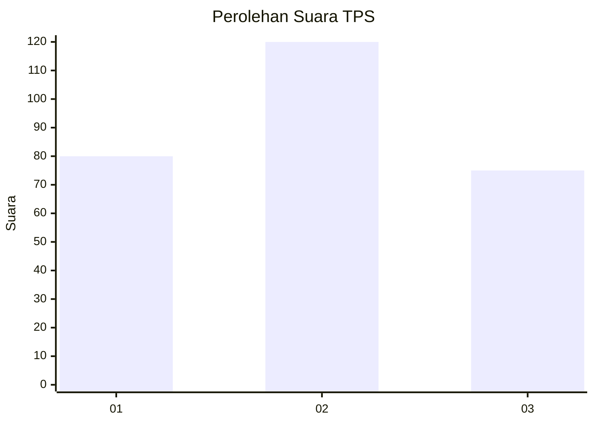
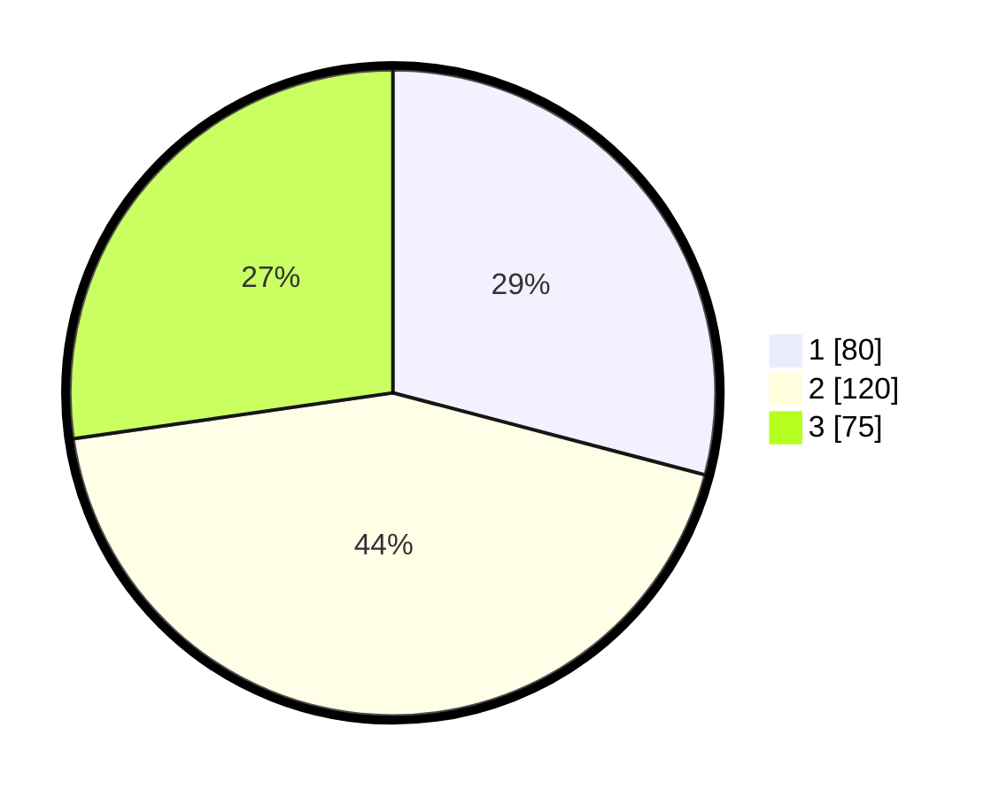

# Hasil

## Grafik

## Tabel

| No. | Nama Paslon    | Suara | Suara (raw) | Persentase |
|:--- |:-------------- | -----:| -----------:| ----------:|
| 1   | ANIES MUHAIMIN | 80    | [80][p-1]   | 29,09      |
| 2   | PRABOWO GIBRAN | 120   | [120][p-2]  | 43,64      |
| 3   | GANJAR MAHFUD  | 75    | [75][p-3]   | 27,27      |

[p-1]: https://github.com/gigit-pemilu/pemilu-2024-35-jawa-timur/blob/main/pilpres/hitung-suara/sub/35-jawa-timur/sub/27-sampang/sub/09-banyuates/sub/2008-trapang/sub/004-tps/sub/paslon-1.txt
[p-2]: https://github.com/gigit-pemilu/pemilu-2024-35-jawa-timur/blob/main/pilpres/hitung-suara/sub/35-jawa-timur/sub/27-sampang/sub/09-banyuates/sub/2008-trapang/sub/004-tps/sub/paslon-2.txt
[p-3]: https://github.com/gigit-pemilu/pemilu-2024-35-jawa-timur/blob/main/pilpres/hitung-suara/sub/35-jawa-timur/sub/27-sampang/sub/09-banyuates/sub/2008-trapang/sub/004-tps/sub/paslon-3.txt

## Foto C Plano

https://sirekap-obj-formc.kpu.go.id/7dbe/pemilu/ppwp/35/27/09/20/08/3527092008004-20240215-100011--cd132dde-39d4-4947-a385-3ddcd10b43af.jpg

https://sirekap-obj-formc.kpu.go.id/7dbe/pemilu/ppwp/35/27/09/20/08/3527092008004-20240215-100052--bb29f0ea-cd59-4629-8d5f-c44c2abcb601.jpg

https://sirekap-obj-formc.kpu.go.id/7dbe/pemilu/ppwp/35/27/09/20/08/3527092008004-20240215-100124--03002c5b-a5d2-4468-9997-b3dc39bc9811.jpg

## Metadata

| Key        | Value               |
| ---------- | ------------------- |
| Time Stamp | 2024-02-16 23:00:00 |

