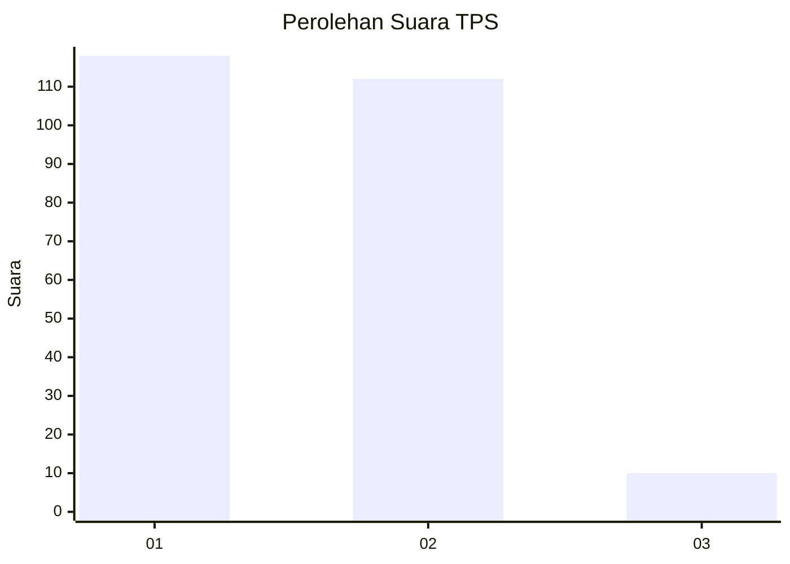
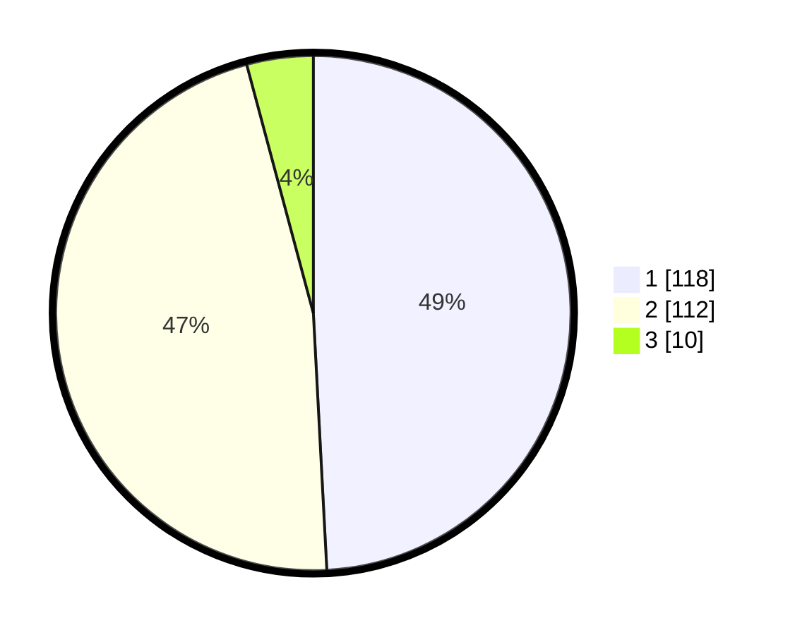

# Hasil

## Grafik

## Tabel

| No. | Nama Paslon    | Suara | Suara (raw) | Persentase |
|:--- |:-------------- | -----:| -----------:| ----------:|
| 1   | ANIES MUHAIMIN | 118   | [118][p-1]  | 49,17      |
| 2   | PRABOWO GIBRAN | 112   | [112][p-2]  | 46,67      |
| 3   | GANJAR MAHFUD  | 10    | [10][p-3]   | 4,17       |

[p-1]: https://github.com/gigit-pemilu/pemilu-2024/blob/main/pilpres/hitung-suara/sub/35-jawa-timur/sub/27-sampang/sub/09-banyuates/sub/2008-trapang/sub/005-tps/sub/paslon-1.txt
[p-2]: https://github.com/gigit-pemilu/pemilu-2024/blob/main/pilpres/hitung-suara/sub/35-jawa-timur/sub/27-sampang/sub/09-banyuates/sub/2008-trapang/sub/005-tps/sub/paslon-2.txt
[p-3]: https://github.com/gigit-pemilu/pemilu-2024/blob/main/pilpres/hitung-suara/sub/35-jawa-timur/sub/27-sampang/sub/09-banyuates/sub/2008-trapang/sub/005-tps/sub/paslon-3.txt

## Foto C Plano

https://sirekap-obj-formc.kpu.go.id/cb3b/pemilu/ppwp/35/27/09/20/08/3527092008005-20240215-094816--f0d1b3e8-209f-4d36-9556-a21ff47340db.jpg

https://sirekap-obj-formc.kpu.go.id/cb3b/pemilu/ppwp/35/27/09/20/08/3527092008005-20240215-094916--aaedd39c-9e68-47d2-8b9e-48e6c4bfa01c.jpg

https://sirekap-obj-formc.kpu.go.id/cb3b/pemilu/ppwp/35/27/09/20/08/3527092008005-20240215-095002--b2973b6c-8ce2-4b55-b2a0-0085e2dfffdc.jpg

## Metadata

| Key        | Value               |
| ---------- | ------------------- |
| Time Stamp | 2024-02-16 23:00:00 |

