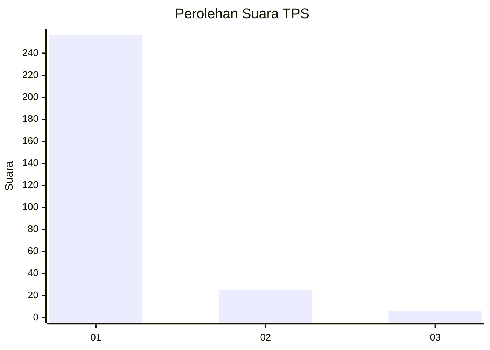
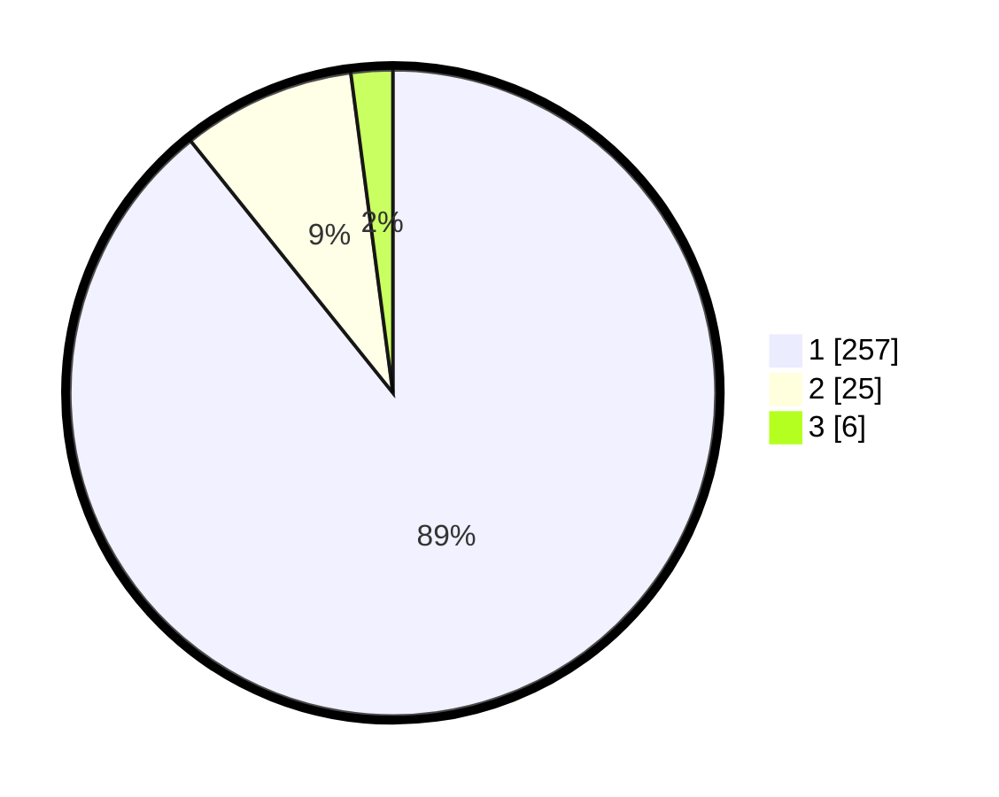

# Hasil

## Grafik

## Tabel

| No. | Nama Paslon    | Suara | Suara (raw) | Persentase |
|:--- |:-------------- | -----:| -----------:| ----------:|
| 1   | ANIES MUHAIMIN | 257   | [257][p-1]  | 89,24      |
| 2   | PRABOWO GIBRAN | 25    | [25][p-2]   | 8,68       |
| 3   | GANJAR MAHFUD  | 6     | [6][p-3]    | 2,08       |

[p-1]: https://github.com/gigit-pemilu/pemilu-2024-35-jawa-timur/blob/main/pilpres/hitung-suara/sub/35-jawa-timur/sub/27-sampang/sub/09-banyuates/sub/2013-montor/sub/012-tps/sub/paslon-1.txt
[p-2]: https://github.com/gigit-pemilu/pemilu-2024-35-jawa-timur/blob/main/pilpres/hitung-suara/sub/35-jawa-timur/sub/27-sampang/sub/09-banyuates/sub/2013-montor/sub/012-tps/sub/paslon-2.txt
[p-3]: https://github.com/gigit-pemilu/pemilu-2024-35-jawa-timur/blob/main/pilpres/hitung-suara/sub/35-jawa-timur/sub/27-sampang/sub/09-banyuates/sub/2013-montor/sub/012-tps/sub/paslon-3.txt

## Foto C Plano

https://sirekap-obj-formc.kpu.go.id/1741/pemilu/ppwp/35/27/09/20/13/3527092013012-20240214-192454--acf997ac-7bb7-4d95-ae7a-66c7b276da94.jpg

https://sirekap-obj-formc.kpu.go.id/1741/pemilu/ppwp/35/27/09/20/13/3527092013012-20240214-215738--4e150e9c-cf77-4fee-81d5-917b749e422e.jpg

## Metadata

| Key        | Value               |
| ---------- | ------------------- |
| Time Stamp | 2024-02-15 21:30:27 |

