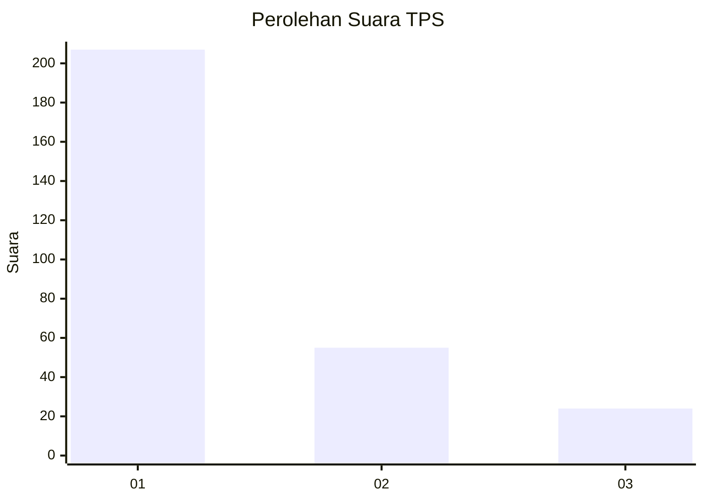
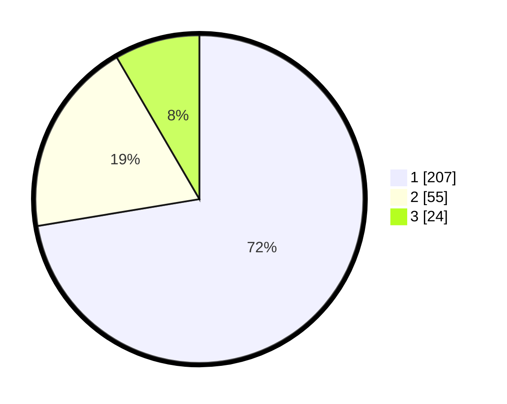

# Hasil

## Grafik

## Tabel

| No. | Nama Paslon    | Suara | Suara (raw) | Persentase |
|:--- |:-------------- | -----:| -----------:| ----------:|
| 1   | ANIES MUHAIMIN | 207   | [207][p-1]  | 72,38      |
| 2   | PRABOWO GIBRAN | 55    | [55][p-2]   | 19,23      |
| 3   | GANJAR MAHFUD  | 24    | [24][p-3]   | 8,39       |

[p-1]: https://github.com/gigit-pemilu/pemilu-2024-35-jawa-timur/blob/main/pilpres/hitung-suara/sub/35-jawa-timur/sub/27-sampang/sub/09-banyuates/sub/2014-tebanah/sub/002-tps/sub/paslon-1.txt
[p-2]: https://github.com/gigit-pemilu/pemilu-2024-35-jawa-timur/blob/main/pilpres/hitung-suara/sub/35-jawa-timur/sub/27-sampang/sub/09-banyuates/sub/2014-tebanah/sub/002-tps/sub/paslon-2.txt
[p-3]: https://github.com/gigit-pemilu/pemilu-2024-35-jawa-timur/blob/main/pilpres/hitung-suara/sub/35-jawa-timur/sub/27-sampang/sub/09-banyuates/sub/2014-tebanah/sub/002-tps/sub/paslon-3.txt

## Foto C Plano

https://sirekap-obj-formc.kpu.go.id/e12e/pemilu/ppwp/35/27/09/20/14/3527092014002-20240214-191010--a2fee91b-58eb-4e51-92bd-03667a61575a.jpg

https://sirekap-obj-formc.kpu.go.id/e12e/pemilu/ppwp/35/27/09/20/14/3527092014002-20240214-191126--9b2d1931-ec1a-4f0c-b2ac-bd21c4aad7e1.jpg

https://sirekap-obj-formc.kpu.go.id/e12e/pemilu/ppwp/35/27/09/20/14/3527092014002-20240214-191225--0aecd125-8059-4453-a7f1-75b8d48e763e.jpg

## Metadata

| Key        | Value               |
| ---------- | ------------------- |
| Time Stamp | 2024-02-17 10:00:02 |

