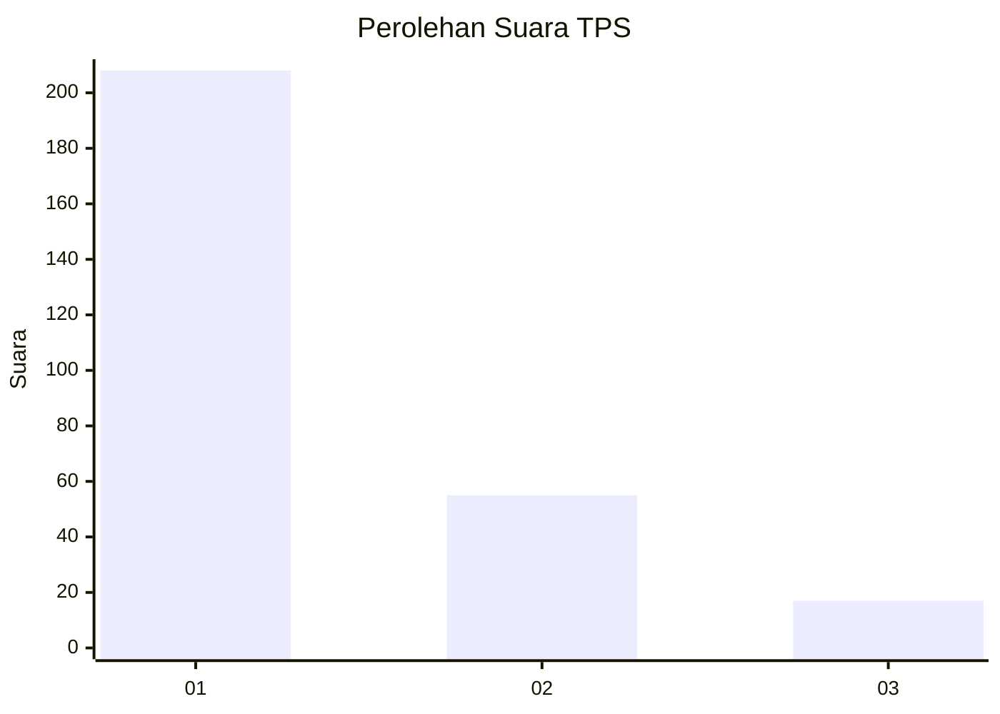
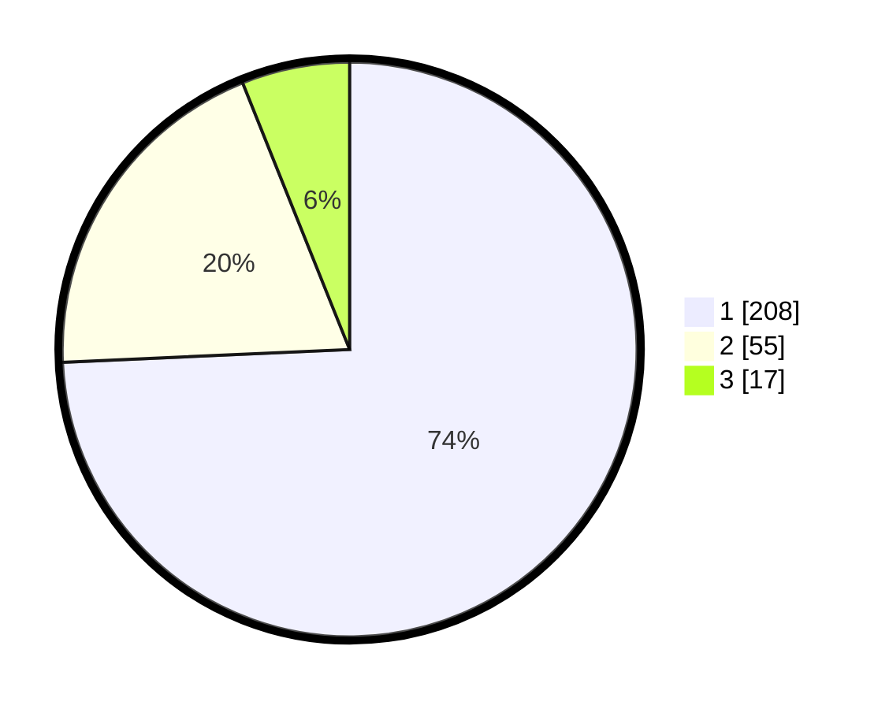

# Hasil

## Grafik

## Tabel

| No. | Nama Paslon    | Suara | Suara (raw) | Persentase |
|:--- |:-------------- | -----:| -----------:| ----------:|
| 1   | ANIES MUHAIMIN | 208   | [208][p-1]  | 74,29      |
| 2   | PRABOWO GIBRAN | 55    | [55][p-2]   | 19,64      |
| 3   | GANJAR MAHFUD  | 17    | [17][p-3]   | 6,07       |

[p-1]: https://github.com/gigit-pemilu/pemilu-2024/blob/main/pilpres/hitung-suara/sub/35-jawa-timur/sub/27-sampang/sub/09-banyuates/sub/2014-tebanah/sub/004-tps/sub/paslon-1.txt
[p-2]: https://github.com/gigit-pemilu/pemilu-2024/blob/main/pilpres/hitung-suara/sub/35-jawa-timur/sub/27-sampang/sub/09-banyuates/sub/2014-tebanah/sub/004-tps/sub/paslon-2.txt
[p-3]: https://github.com/gigit-pemilu/pemilu-2024/blob/main/pilpres/hitung-suara/sub/35-jawa-timur/sub/27-sampang/sub/09-banyuates/sub/2014-tebanah/sub/004-tps/sub/paslon-3.txt

## Foto C Plano

https://sirekap-obj-formc.kpu.go.id/5f4a/pemilu/ppwp/35/27/09/20/14/3527092014004-20240214-190035--f379c7dd-e935-4d97-b3ed-6177e73085d0.jpg

https://sirekap-obj-formc.kpu.go.id/5f4a/pemilu/ppwp/35/27/09/20/14/3527092014004-20240214-190937--8ec6d2bc-7407-429f-aaa1-1dd3ad560b18.jpg

https://sirekap-obj-formc.kpu.go.id/5f4a/pemilu/ppwp/35/27/09/20/14/3527092014004-20240214-190533--72b74cfa-2eb3-4be0-a8a4-62e7655ff0e4.jpg

## Metadata

| Key        | Value               |
| ---------- | ------------------- |
| Time Stamp | 2024-02-17 10:00:02 |

