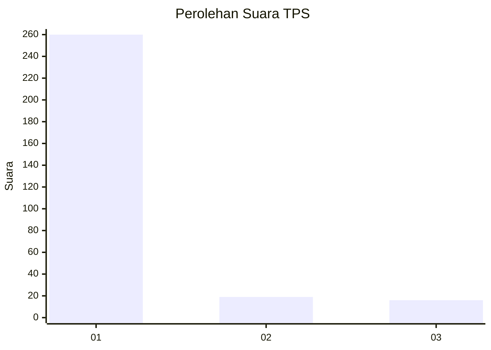
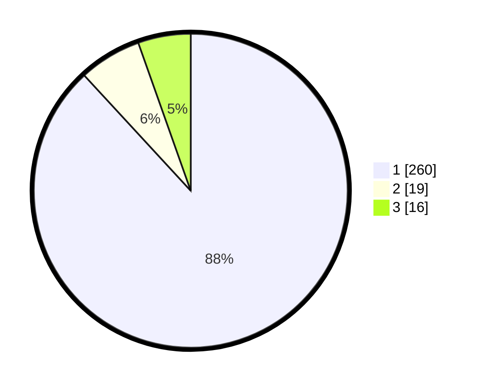

# Hasil

## Grafik

## Tabel

| No. | Nama Paslon    | Suara | Suara (raw) | Persentase |
|:--- |:-------------- | -----:| -----------:| ----------:|
| 1   | ANIES MUHAIMIN | 260   | [260][p-1]  | 88,14      |
| 2   | PRABOWO GIBRAN | 19    | [19][p-2]   | 6,44       |
| 3   | GANJAR MAHFUD  | 16    | [16][p-3]   | 5,42       |

[p-1]: https://github.com/gigit-pemilu/pemilu-2024-35-jawa-timur/blob/main/pilpres/hitung-suara/sub/35-jawa-timur/sub/27-sampang/sub/09-banyuates/sub/2014-tebanah/sub/005-tps/sub/paslon-1.txt
[p-2]: https://github.com/gigit-pemilu/pemilu-2024-35-jawa-timur/blob/main/pilpres/hitung-suara/sub/35-jawa-timur/sub/27-sampang/sub/09-banyuates/sub/2014-tebanah/sub/005-tps/sub/paslon-2.txt
[p-3]: https://github.com/gigit-pemilu/pemilu-2024-35-jawa-timur/blob/main/pilpres/hitung-suara/sub/35-jawa-timur/sub/27-sampang/sub/09-banyuates/sub/2014-tebanah/sub/005-tps/sub/paslon-3.txt

## Foto C Plano

https://sirekap-obj-formc.kpu.go.id/4735/pemilu/ppwp/35/27/09/20/14/3527092014005-20240228-143551--420770aa-936a-4908-9430-d534a5e2f7c0.jpg

https://sirekap-obj-formc.kpu.go.id/4735/pemilu/ppwp/35/27/09/20/14/3527092014005-20240214-193037--651340ce-dcbf-468f-9546-907ee1ce0ca7.jpg

https://sirekap-obj-formc.kpu.go.id/4735/pemilu/ppwp/35/27/09/20/14/3527092014005-20240214-193323--e1b533d2-a421-46e2-8417-b9ab95e61013.jpg

## Metadata

| Key        | Value               |
| ---------- | ------------------- |
| Time Stamp | 2024-02-28 15:00:00 |

