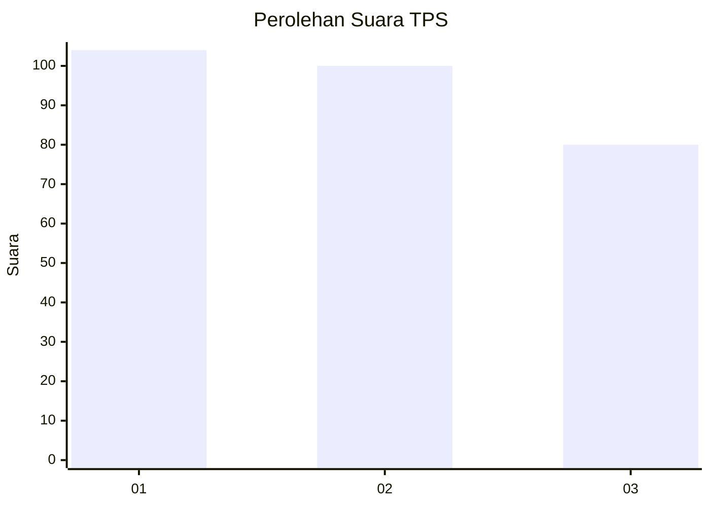
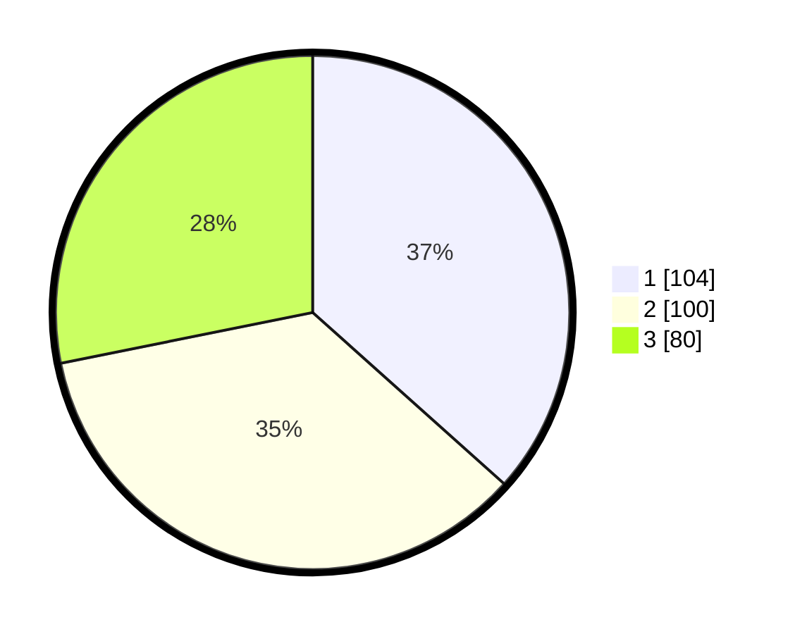

# Hasil

## Grafik

## Tabel

| No. | Nama Paslon    | Suara | Suara (raw) | Persentase |
|:--- |:-------------- | -----:| -----------:| ----------:|
| 1   | ANIES MUHAIMIN | 104   | [104][p-1]  | 36,62      |
| 2   | PRABOWO GIBRAN | 100   | [100][p-2]  | 35,21      |
| 3   | GANJAR MAHFUD  | 80    | [80][p-3]   | 28,17      |

[p-1]: https://github.com/gigit-pemilu/pemilu-2024/blob/main/pilpres/hitung-suara/sub/35-jawa-timur/sub/27-sampang/sub/09-banyuates/sub/2015-nepa/sub/001-tps/sub/paslon-1.txt
[p-2]: https://github.com/gigit-pemilu/pemilu-2024/blob/main/pilpres/hitung-suara/sub/35-jawa-timur/sub/27-sampang/sub/09-banyuates/sub/2015-nepa/sub/001-tps/sub/paslon-2.txt
[p-3]: https://github.com/gigit-pemilu/pemilu-2024/blob/main/pilpres/hitung-suara/sub/35-jawa-timur/sub/27-sampang/sub/09-banyuates/sub/2015-nepa/sub/001-tps/sub/paslon-3.txt

## Foto C Plano

https://sirekap-obj-formc.kpu.go.id/0530/pemilu/ppwp/35/27/09/20/15/3527092015001-20240215-082721--c0f699fa-bec0-452d-ab64-c4ab864acba6.jpg

https://sirekap-obj-formc.kpu.go.id/0530/pemilu/ppwp/35/27/09/20/15/3527092015001-20240215-082856--5fd117d7-3ba7-40a1-96c8-0dfcaa722a21.jpg

https://sirekap-obj-formc.kpu.go.id/0530/pemilu/ppwp/35/27/09/20/15/3527092015001-20240215-083017--0b66afe8-526a-47b1-872d-bb1134275c01.jpg

## Metadata

| Key        | Value               |
| ---------- | ------------------- |
| Time Stamp | 2024-02-16 23:00:00 |

