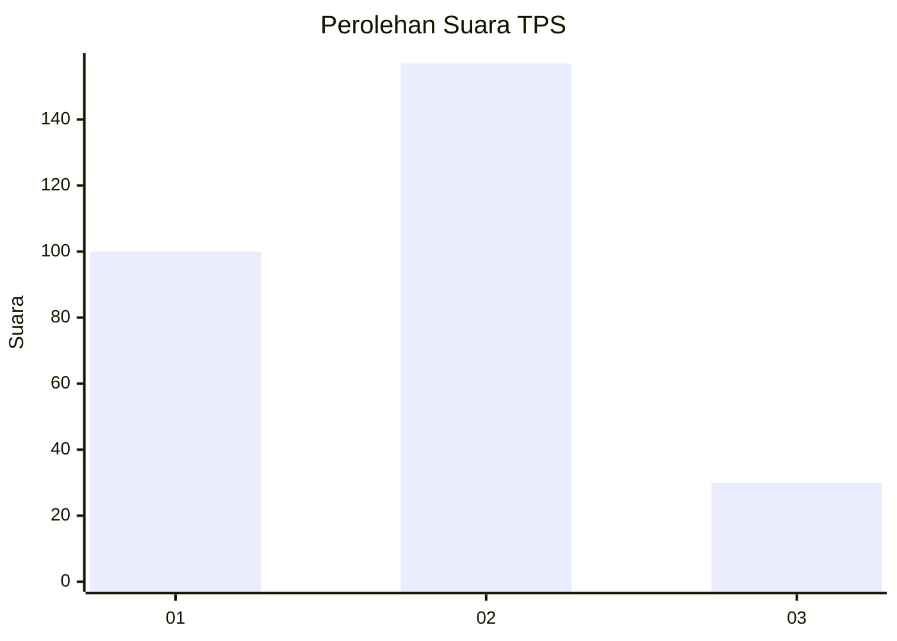
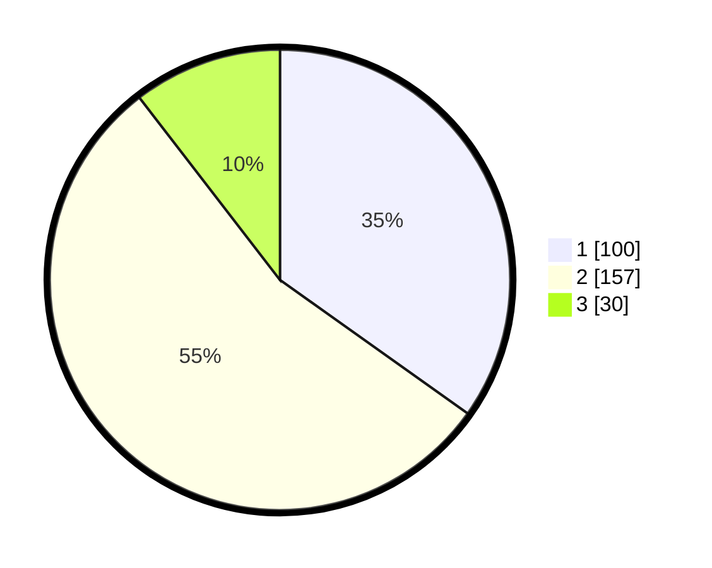

# Hasil

## Grafik

## Tabel

| No. | Nama Paslon    | Suara | Suara (raw) | Persentase |
|:--- |:-------------- | -----:| -----------:| ----------:|
| 1   | ANIES MUHAIMIN | 100   | [100][p-1]  | 34,84      |
| 2   | PRABOWO GIBRAN | 157   | [157][p-2]  | 54,70      |
| 3   | GANJAR MAHFUD  | 30    | [30][p-3]   | 10,45      |

[p-1]: https://github.com/gigit-pemilu/pemilu-2024-35-jawa-timur/blob/main/pilpres/hitung-suara/sub/35-jawa-timur/sub/27-sampang/sub/09-banyuates/sub/2015-nepa/sub/002-tps/sub/paslon-1.txt
[p-2]: https://github.com/gigit-pemilu/pemilu-2024-35-jawa-timur/blob/main/pilpres/hitung-suara/sub/35-jawa-timur/sub/27-sampang/sub/09-banyuates/sub/2015-nepa/sub/002-tps/sub/paslon-2.txt
[p-3]: https://github.com/gigit-pemilu/pemilu-2024-35-jawa-timur/blob/main/pilpres/hitung-suara/sub/35-jawa-timur/sub/27-sampang/sub/09-banyuates/sub/2015-nepa/sub/002-tps/sub/paslon-3.txt

## Foto C Plano

https://sirekap-obj-formc.kpu.go.id/c45d/pemilu/ppwp/35/27/09/20/15/3527092015002-20240215-095754--b346e87e-e988-4fdd-b2a5-d5f54493da8c.jpg

https://sirekap-obj-formc.kpu.go.id/c45d/pemilu/ppwp/35/27/09/20/15/3527092015002-20240215-095923--3f048fb0-4295-4151-8e6e-fbd053bfc537.jpg

https://sirekap-obj-formc.kpu.go.id/c45d/pemilu/ppwp/35/27/09/20/15/3527092015002-20240215-100102--4080fc18-a54f-4384-bfe8-0ca1b55a3f29.jpg

## Metadata

| Key        | Value               |
| ---------- | ------------------- |
| Time Stamp | 2024-02-16 23:00:00 |

