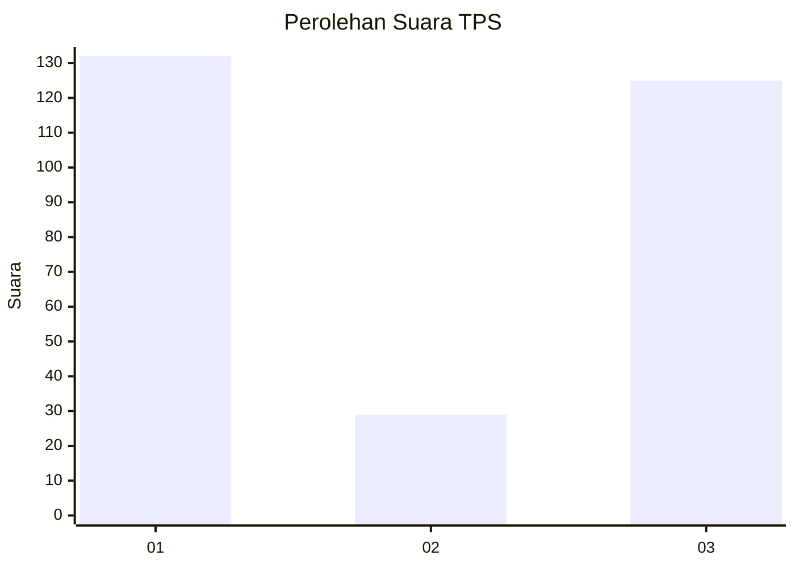
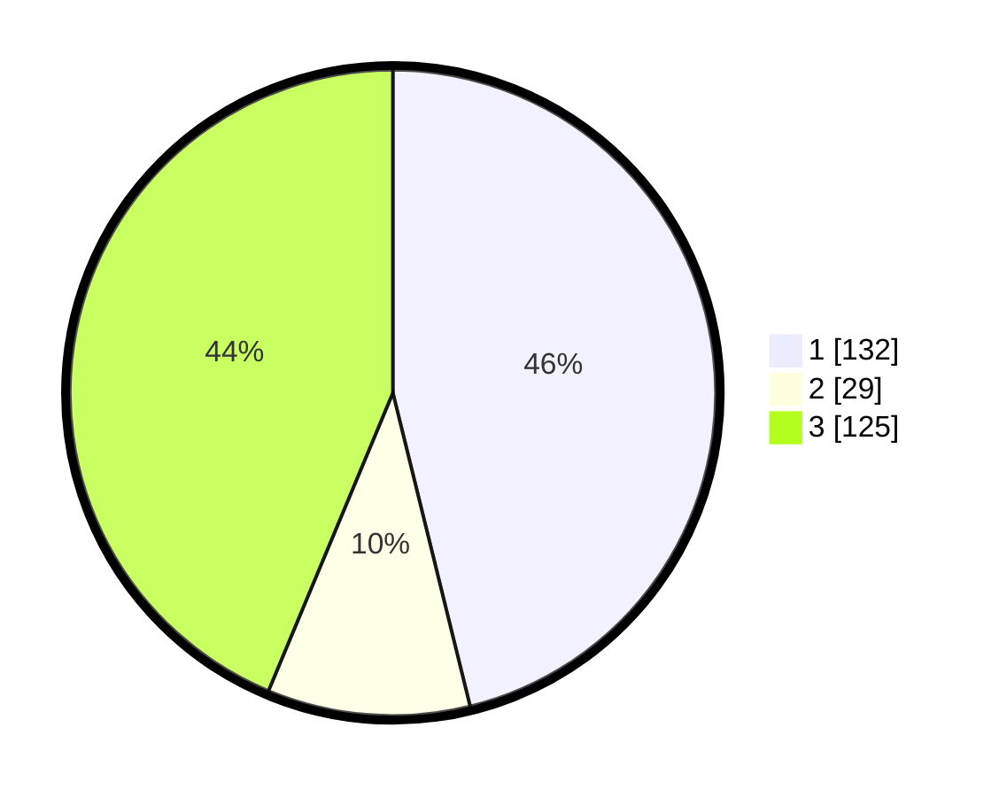

# Hasil

## Grafik

## Tabel

| No. | Nama Paslon    | Suara | Suara (raw) | Persentase |
|:--- |:-------------- | -----:| -----------:| ----------:|
| 1   | ANIES MUHAIMIN | 132   | [132][p-1]  | 46,15      |
| 2   | PRABOWO GIBRAN | 29    | [29][p-2]   | 10,14      |
| 3   | GANJAR MAHFUD  | 125   | [125][p-3]  | 43,71      |

[p-1]: https://github.com/gigit-pemilu/pemilu-2024/blob/main/pilpres/hitung-suara/sub/35-jawa-timur/sub/27-sampang/sub/09-banyuates/sub/2015-nepa/sub/004-tps/sub/paslon-1.txt
[p-2]: https://github.com/gigit-pemilu/pemilu-2024/blob/main/pilpres/hitung-suara/sub/35-jawa-timur/sub/27-sampang/sub/09-banyuates/sub/2015-nepa/sub/004-tps/sub/paslon-2.txt
[p-3]: https://github.com/gigit-pemilu/pemilu-2024/blob/main/pilpres/hitung-suara/sub/35-jawa-timur/sub/27-sampang/sub/09-banyuates/sub/2015-nepa/sub/004-tps/sub/paslon-3.txt

## Foto C Plano

https://sirekap-obj-formc.kpu.go.id/9c81/pemilu/ppwp/35/27/09/20/15/3527092015004-20240215-082330--28312e74-bbef-4f31-a5de-6e2f138a7a89.jpg

https://sirekap-obj-formc.kpu.go.id/9c81/pemilu/ppwp/35/27/09/20/15/3527092015004-20240215-082516--c7e95cff-4635-4a36-9c28-956cc6cd939e.jpg

https://sirekap-obj-formc.kpu.go.id/9c81/pemilu/ppwp/35/27/09/20/15/3527092015004-20240215-082631--744d4ffa-fc91-4b3d-8293-d48d7d4ce0dc.jpg

## Metadata

| Key        | Value               |
| ---------- | ------------------- |
| Time Stamp | 2024-02-16 23:00:00 |

