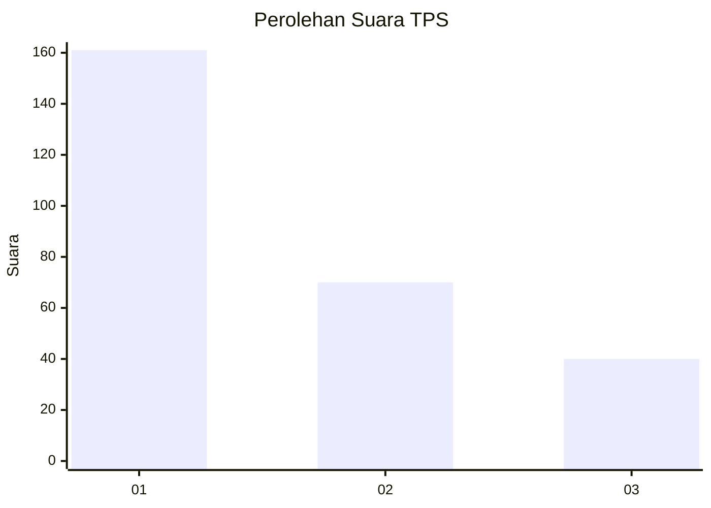
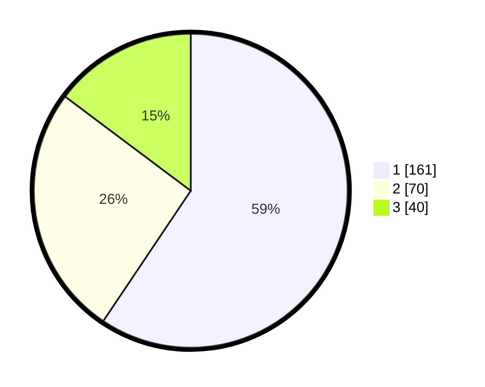

# Hasil

## Grafik

## Tabel

| No. | Nama Paslon    | Suara | Suara (raw) | Persentase |
|:--- |:-------------- | -----:| -----------:| ----------:|
| 1   | ANIES MUHAIMIN | 161   | [161][p-1]  | 59,41      |
| 2   | PRABOWO GIBRAN | 70    | [70][p-2]   | 25,83      |
| 3   | GANJAR MAHFUD  | 40    | [40][p-3]   | 14,76      |

[p-1]: https://github.com/gigit-pemilu/pemilu-2024/blob/main/pilpres/hitung-suara/sub/35-jawa-timur/sub/27-sampang/sub/09-banyuates/sub/2015-nepa/sub/005-tps/sub/paslon-1.txt
[p-2]: https://github.com/gigit-pemilu/pemilu-2024/blob/main/pilpres/hitung-suara/sub/35-jawa-timur/sub/27-sampang/sub/09-banyuates/sub/2015-nepa/sub/005-tps/sub/paslon-2.txt
[p-3]: https://github.com/gigit-pemilu/pemilu-2024/blob/main/pilpres/hitung-suara/sub/35-jawa-timur/sub/27-sampang/sub/09-banyuates/sub/2015-nepa/sub/005-tps/sub/paslon-3.txt

## Foto C Plano

https://sirekap-obj-formc.kpu.go.id/3a00/pemilu/ppwp/35/27/09/20/15/3527092015005-20240214-232630--2b8de491-b28f-4132-95c6-ca7344290b8a.jpg

https://sirekap-obj-formc.kpu.go.id/3a00/pemilu/ppwp/35/27/09/20/15/3527092015005-20240214-232837--022baf32-ae39-46b1-b98f-d6b5e47217ad.jpg

## Metadata

| Key        | Value               |
| ---------- | ------------------- |
| Time Stamp | 2024-02-17 10:00:02 |

