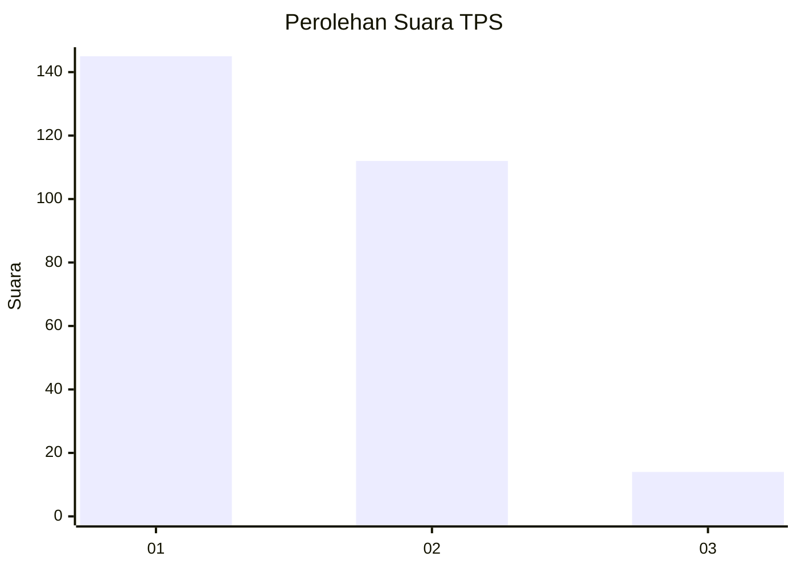
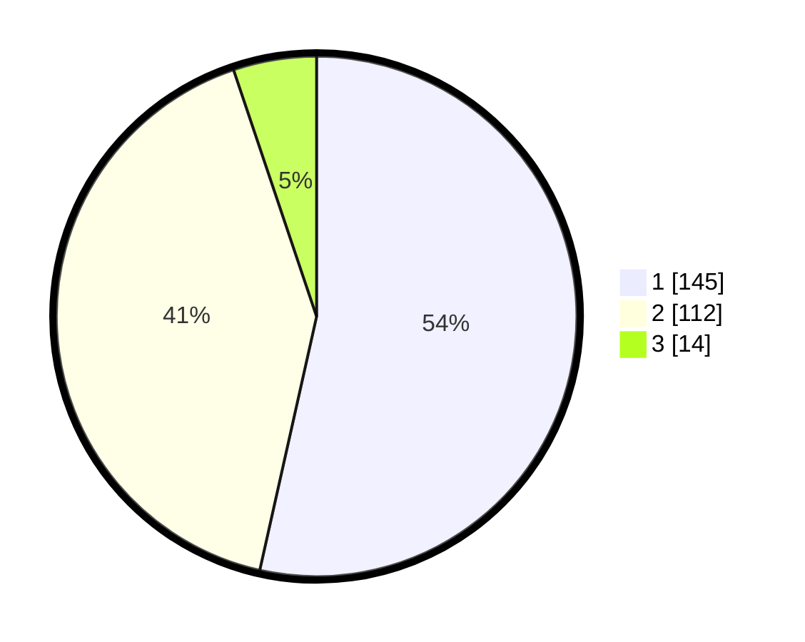

# Hasil

## Grafik

## Tabel

| No. | Nama Paslon    | Suara | Suara (raw) | Persentase |
|:--- |:-------------- | -----:| -----------:| ----------:|
| 1   | ANIES MUHAIMIN | 145   | [145][p-1]  | 53,51      |
| 2   | PRABOWO GIBRAN | 112   | [112][p-2]  | 41,33      |
| 3   | GANJAR MAHFUD  | 14    | [14][p-3]   | 5,17       |

[p-1]: https://github.com/gigit-pemilu/pemilu-2024-35-jawa-timur/blob/main/pilpres/hitung-suara/sub/35-jawa-timur/sub/27-sampang/sub/09-banyuates/sub/2015-nepa/sub/007-tps/sub/paslon-1.txt
[p-2]: https://github.com/gigit-pemilu/pemilu-2024-35-jawa-timur/blob/main/pilpres/hitung-suara/sub/35-jawa-timur/sub/27-sampang/sub/09-banyuates/sub/2015-nepa/sub/007-tps/sub/paslon-2.txt
[p-3]: https://github.com/gigit-pemilu/pemilu-2024-35-jawa-timur/blob/main/pilpres/hitung-suara/sub/35-jawa-timur/sub/27-sampang/sub/09-banyuates/sub/2015-nepa/sub/007-tps/sub/paslon-3.txt

## Foto C Plano

https://sirekap-obj-formc.kpu.go.id/b648/pemilu/ppwp/35/27/09/20/15/3527092015007-20240215-081834--55a68c89-4ccd-4aba-8d2c-9c6c6f6ba489.jpg

https://sirekap-obj-formc.kpu.go.id/b648/pemilu/ppwp/35/27/09/20/15/3527092015007-20240215-081908--0acede36-14d0-4d5c-859b-ef490e8bb332.jpg

https://sirekap-obj-formc.kpu.go.id/b648/pemilu/ppwp/35/27/09/20/15/3527092015007-20240215-081943--2a1b34b5-7f53-4877-aa86-d4f2fe88f9be.jpg

## Metadata

| Key        | Value               |
| ---------- | ------------------- |
| Time Stamp | 2024-02-16 23:00:00 |

