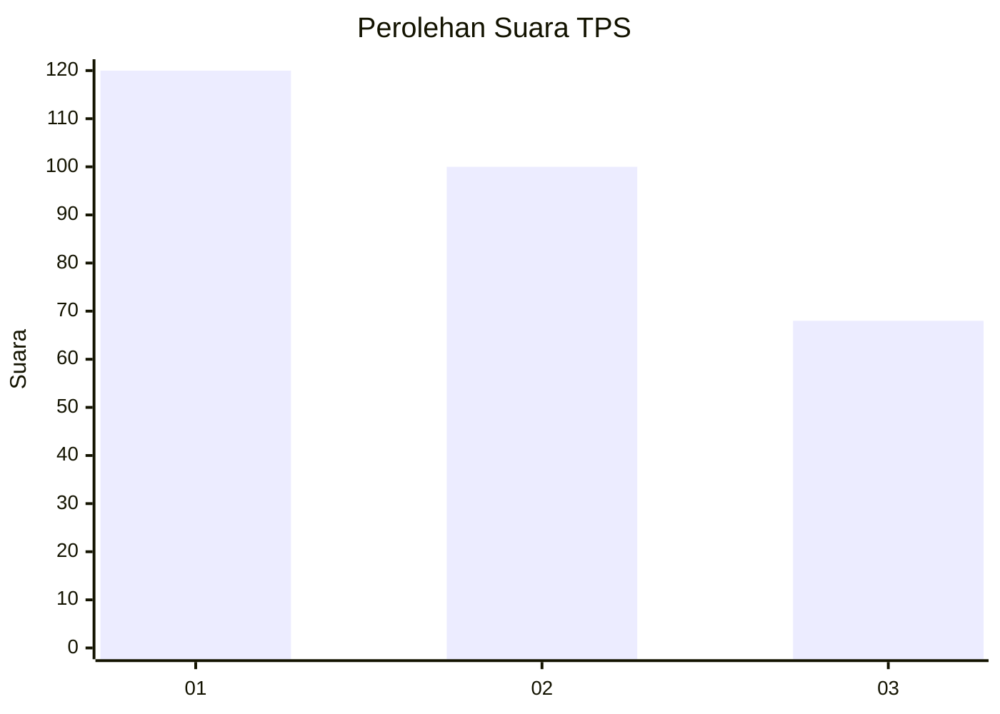
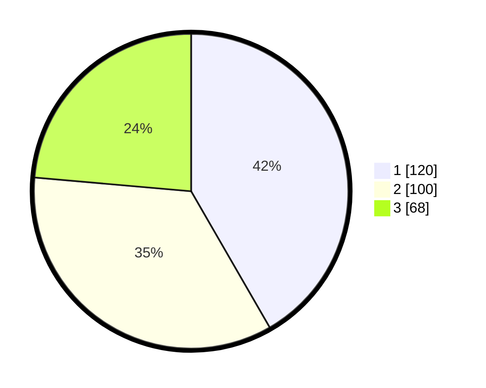

# Hasil

## Grafik

## Tabel

| No. | Nama Paslon    | Suara | Suara (raw) | Persentase |
|:--- |:-------------- | -----:| -----------:| ----------:|
| 1   | ANIES MUHAIMIN | 120   | [120][p-1]  | 41,67      |
| 2   | PRABOWO GIBRAN | 100   | [100][p-2]  | 34,72      |
| 3   | GANJAR MAHFUD  | 68    | [68][p-3]   | 23,61      |

[p-1]: https://github.com/gigit-pemilu/pemilu-2024/blob/main/pilpres/hitung-suara/sub/35-jawa-timur/sub/27-sampang/sub/09-banyuates/sub/2015-nepa/sub/009-tps/sub/paslon-1.txt
[p-2]: https://github.com/gigit-pemilu/pemilu-2024/blob/main/pilpres/hitung-suara/sub/35-jawa-timur/sub/27-sampang/sub/09-banyuates/sub/2015-nepa/sub/009-tps/sub/paslon-2.txt
[p-3]: https://github.com/gigit-pemilu/pemilu-2024/blob/main/pilpres/hitung-suara/sub/35-jawa-timur/sub/27-sampang/sub/09-banyuates/sub/2015-nepa/sub/009-tps/sub/paslon-3.txt

## Foto C Plano

https://sirekap-obj-formc.kpu.go.id/3a07/pemilu/ppwp/35/27/09/20/15/3527092015009-20240215-080119--2ed991e7-9c24-4eda-99e8-f2c47a5834cd.jpg

https://sirekap-obj-formc.kpu.go.id/3a07/pemilu/ppwp/35/27/09/20/15/3527092015009-20240215-080540--fd05f823-be29-4c42-8d18-73d7327ae49a.jpg

https://sirekap-obj-formc.kpu.go.id/3a07/pemilu/ppwp/35/27/09/20/15/3527092015009-20240215-080733--d30df653-0861-427e-b66e-8a0a277a69ba.jpg

## Metadata

| Key        | Value               |
| ---------- | ------------------- |
| Time Stamp | 2024-02-16 23:00:00 |

