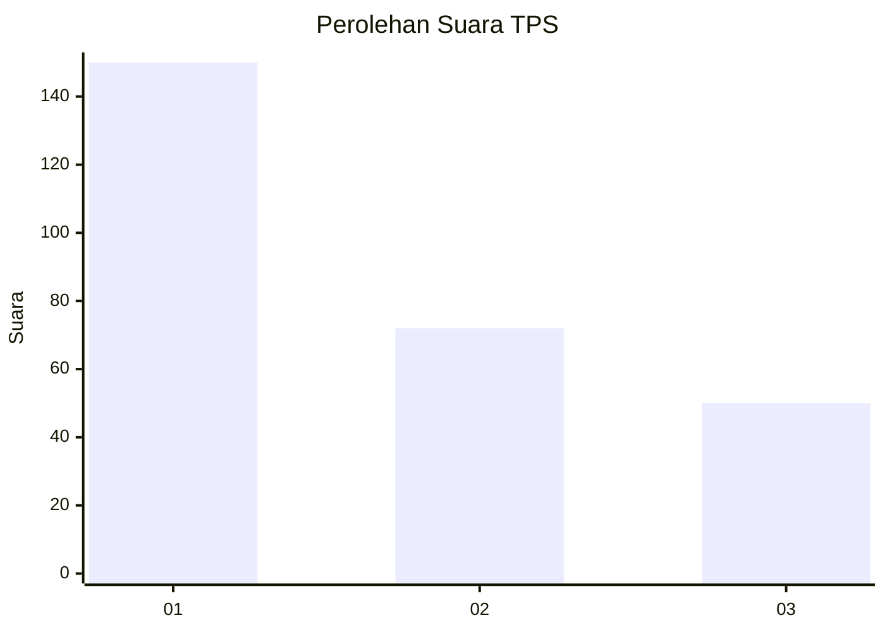
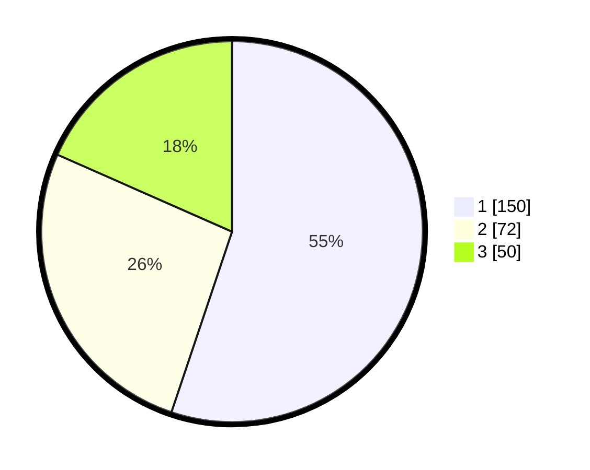

# Hasil

## Grafik

## Tabel

| No. | Nama Paslon    | Suara | Suara (raw) | Persentase |
|:--- |:-------------- | -----:| -----------:| ----------:|
| 1   | ANIES MUHAIMIN | 150   | [150][p-1]  | 55,15      |
| 2   | PRABOWO GIBRAN | 72    | [72][p-2]   | 26,47      |
| 3   | GANJAR MAHFUD  | 50    | [50][p-3]   | 18,38      |

[p-1]: https://github.com/gigit-pemilu/pemilu-2024-35-jawa-timur/blob/main/pilpres/hitung-suara/sub/35-jawa-timur/sub/27-sampang/sub/09-banyuates/sub/2015-nepa/sub/010-tps/sub/paslon-1.txt
[p-2]: https://github.com/gigit-pemilu/pemilu-2024-35-jawa-timur/blob/main/pilpres/hitung-suara/sub/35-jawa-timur/sub/27-sampang/sub/09-banyuates/sub/2015-nepa/sub/010-tps/sub/paslon-2.txt
[p-3]: https://github.com/gigit-pemilu/pemilu-2024-35-jawa-timur/blob/main/pilpres/hitung-suara/sub/35-jawa-timur/sub/27-sampang/sub/09-banyuates/sub/2015-nepa/sub/010-tps/sub/paslon-3.txt

## Foto C Plano

https://sirekap-obj-formc.kpu.go.id/3a74/pemilu/ppwp/35/27/09/20/15/3527092015010-20240214-213730--57cf16f3-abfb-4ab1-8527-46ded385d4eb.jpg

https://sirekap-obj-formc.kpu.go.id/3a74/pemilu/ppwp/35/27/09/20/15/3527092015010-20240214-213831--888342a1-fad1-4440-9132-c7fa70f9dbda.jpg

https://sirekap-obj-formc.kpu.go.id/3a74/pemilu/ppwp/35/27/09/20/15/3527092015010-20240214-213915--10ca4c9e-28fa-4156-a878-3a44e40d19f5.jpg

## Metadata

| Key        | Value               |
| ---------- | ------------------- |
| Time Stamp | 2024-02-17 10:00:02 |

