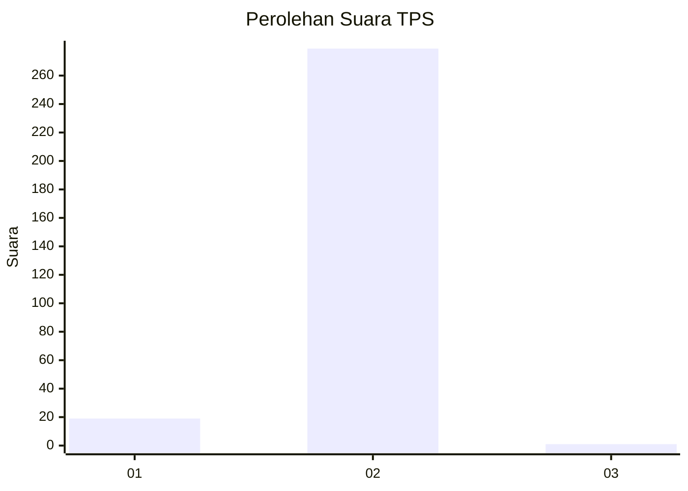
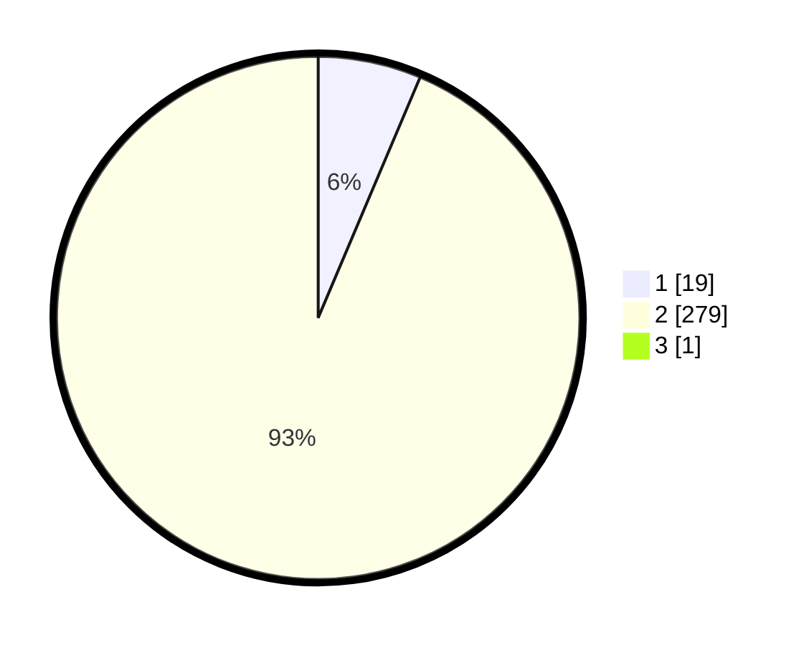

# Hasil

## Grafik

## Tabel

| No. | Nama Paslon    | Suara | Suara (raw) | Persentase |
|:--- |:-------------- | -----:| -----------:| ----------:|
| 1   | ANIES MUHAIMIN | 19    | [19][p-1]   | 6,35       |
| 2   | PRABOWO GIBRAN | 279   | [279][p-2]  | 93,31      |
| 3   | GANJAR MAHFUD  | 1     | [1][p-3]    | 0,33       |

[p-1]: https://github.com/gigit-pemilu/pemilu-2024/blob/main/pilpres/hitung-suara/sub/35-jawa-timur/sub/27-sampang/sub/09-banyuates/sub/2016-batioh/sub/002-tps/sub/paslon-1.txt
[p-2]: https://github.com/gigit-pemilu/pemilu-2024/blob/main/pilpres/hitung-suara/sub/35-jawa-timur/sub/27-sampang/sub/09-banyuates/sub/2016-batioh/sub/002-tps/sub/paslon-2.txt
[p-3]: https://github.com/gigit-pemilu/pemilu-2024/blob/main/pilpres/hitung-suara/sub/35-jawa-timur/sub/27-sampang/sub/09-banyuates/sub/2016-batioh/sub/002-tps/sub/paslon-3.txt

## Foto C Plano

https://sirekap-obj-formc.kpu.go.id/784c/pemilu/ppwp/35/27/09/20/16/3527092016002-20240214-213929--699eb7ea-87fc-478f-8162-fdbd53613251.jpg

https://sirekap-obj-formc.kpu.go.id/784c/pemilu/ppwp/35/27/09/20/16/3527092016002-20240214-213943--737a38fc-ccdf-4079-a1a6-3711ac56690e.jpg

https://sirekap-obj-formc.kpu.go.id/784c/pemilu/ppwp/35/27/09/20/16/3527092016002-20240214-213949--8dd663d7-2c51-4628-a047-a839fda057c2.jpg

## Metadata

| Key        | Value               |
| ---------- | ------------------- |
| Time Stamp | 2024-02-25 11:00:00 |

