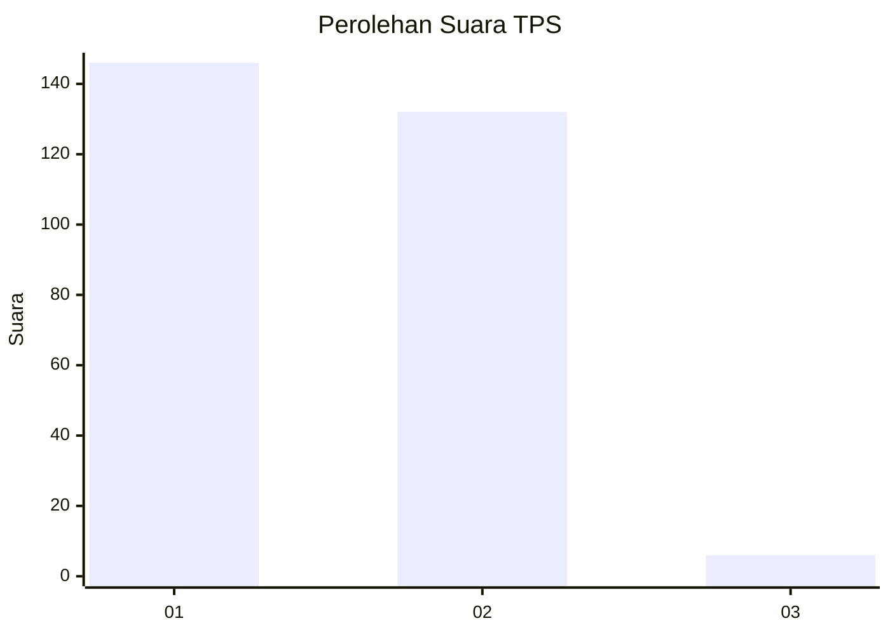
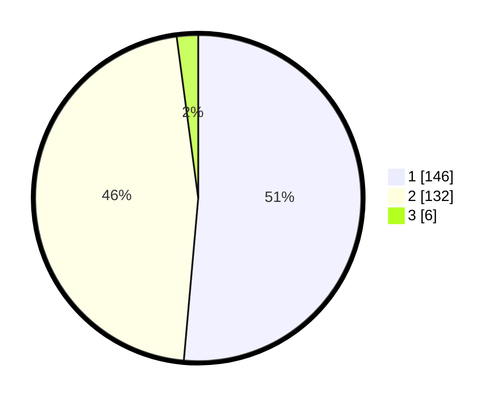

# Hasil

## Grafik

## Tabel

| No. | Nama Paslon    | Suara | Suara (raw) | Persentase |
|:--- |:-------------- | -----:| -----------:| ----------:|
| 1   | ANIES MUHAIMIN | 146   | [146][p-1]  | 51,41      |
| 2   | PRABOWO GIBRAN | 132   | [132][p-2]  | 46,48      |
| 3   | GANJAR MAHFUD  | 6     | [6][p-3]    | 2,11       |

[p-1]: https://github.com/gigit-pemilu/pemilu-2024-35-jawa-timur/blob/main/pilpres/hitung-suara/sub/35-jawa-timur/sub/27-sampang/sub/09-banyuates/sub/2016-batioh/sub/003-tps/sub/paslon-1.txt
[p-2]: https://github.com/gigit-pemilu/pemilu-2024-35-jawa-timur/blob/main/pilpres/hitung-suara/sub/35-jawa-timur/sub/27-sampang/sub/09-banyuates/sub/2016-batioh/sub/003-tps/sub/paslon-2.txt
[p-3]: https://github.com/gigit-pemilu/pemilu-2024-35-jawa-timur/blob/main/pilpres/hitung-suara/sub/35-jawa-timur/sub/27-sampang/sub/09-banyuates/sub/2016-batioh/sub/003-tps/sub/paslon-3.txt

## Foto C Plano

https://sirekap-obj-formc.kpu.go.id/cce1/pemilu/ppwp/35/27/09/20/16/3527092016003-20240214-160108--abf898f0-edae-4ee5-813d-108e0530913b.jpg

https://sirekap-obj-formc.kpu.go.id/cce1/pemilu/ppwp/35/27/09/20/16/3527092016003-20240214-160113--ac4d6c40-d3c4-4b1d-9333-080ed7da323b.jpg

https://sirekap-obj-formc.kpu.go.id/cce1/pemilu/ppwp/35/27/09/20/16/3527092016003-20240214-160055--e59535d3-7d1b-4a53-b51d-5f9e5f78dfd6.jpg

## Metadata

| Key        | Value               |
| ---------- | ------------------- |
| Time Stamp | 2024-02-17 10:00:02 |

