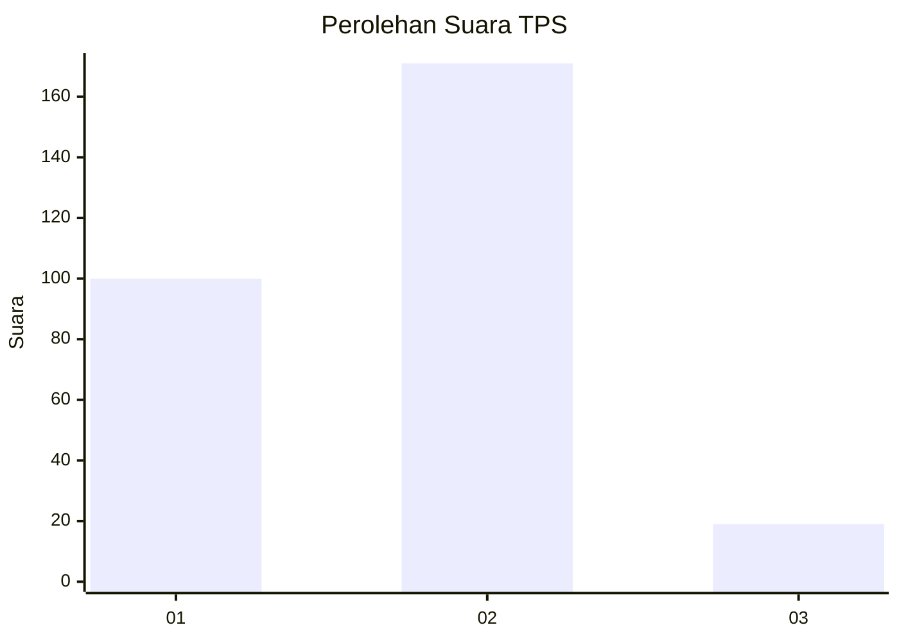
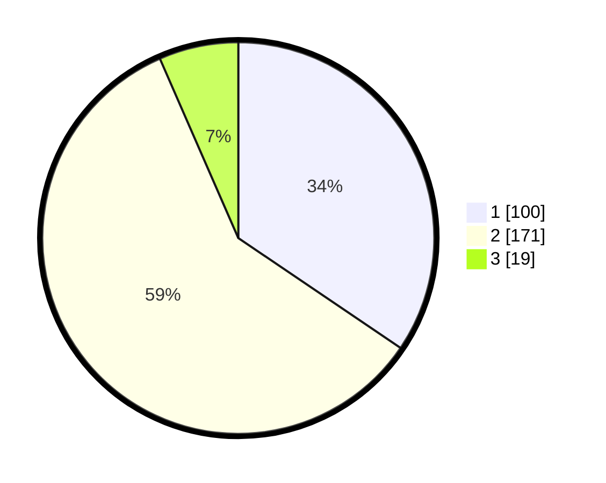

# Hasil

## Grafik

## Tabel

| No. | Nama Paslon    | Suara | Suara (raw) | Persentase |
|:--- |:-------------- | -----:| -----------:| ----------:|
| 1   | ANIES MUHAIMIN | 100   | [100][p-1]  | 34,48      |
| 2   | PRABOWO GIBRAN | 171   | [171][p-2]  | 58,97      |
| 3   | GANJAR MAHFUD  | 19    | [19][p-3]   | 6,55       |

[p-1]: https://github.com/gigit-pemilu/pemilu-2024-35-jawa-timur/blob/main/pilpres/hitung-suara/sub/35-jawa-timur/sub/27-sampang/sub/09-banyuates/sub/2016-batioh/sub/010-tps/sub/paslon-1.txt
[p-2]: https://github.com/gigit-pemilu/pemilu-2024-35-jawa-timur/blob/main/pilpres/hitung-suara/sub/35-jawa-timur/sub/27-sampang/sub/09-banyuates/sub/2016-batioh/sub/010-tps/sub/paslon-2.txt
[p-3]: https://github.com/gigit-pemilu/pemilu-2024-35-jawa-timur/blob/main/pilpres/hitung-suara/sub/35-jawa-timur/sub/27-sampang/sub/09-banyuates/sub/2016-batioh/sub/010-tps/sub/paslon-3.txt

## Foto C Plano

https://sirekap-obj-formc.kpu.go.id/50dd/pemilu/ppwp/35/27/09/20/16/3527092016010-20240214-222407--3af0699d-7909-496c-9904-fe94def638ad.jpg

https://sirekap-obj-formc.kpu.go.id/50dd/pemilu/ppwp/35/27/09/20/16/3527092016010-20240214-222452--48f49952-30c8-4f43-ab42-557d0a271a57.jpg

https://sirekap-obj-formc.kpu.go.id/50dd/pemilu/ppwp/35/27/09/20/16/3527092016010-20240214-211053--d5782406-c741-4cb5-b4cc-692f4ab84ba9.jpg

## Metadata

| Key        | Value               |
| ---------- | ------------------- |
| Time Stamp | 2024-02-16 23:00:00 |

