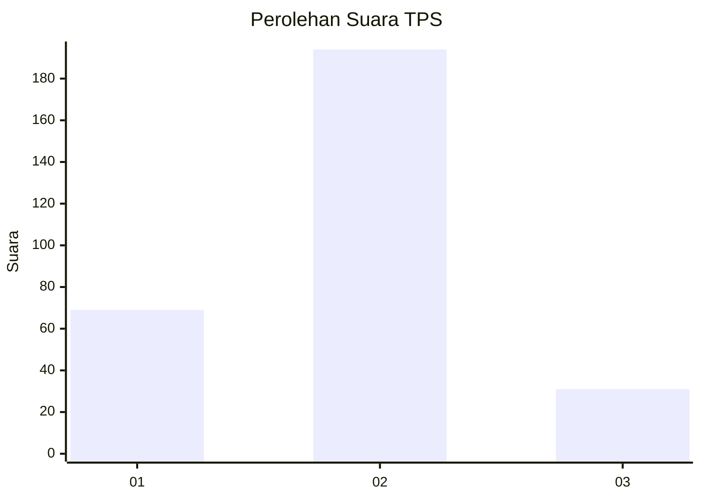
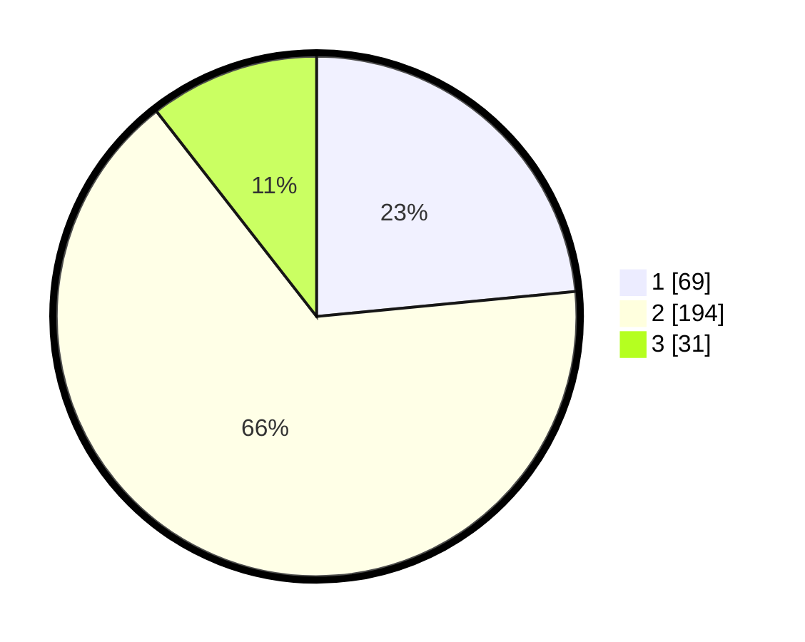

# Hasil

## Grafik

## Tabel

| No. | Nama Paslon    | Suara | Suara (raw) | Persentase |
|:--- |:-------------- | -----:| -----------:| ----------:|
| 1   | ANIES MUHAIMIN | 69    | [69][p-1]   | 23,47      |
| 2   | PRABOWO GIBRAN | 194   | [194][p-2]  | 65,99      |
| 3   | GANJAR MAHFUD  | 31    | [31][p-3]   | 10,54      |

[p-1]: https://github.com/gigit-pemilu/pemilu-2024-35-jawa-timur/blob/main/pilpres/hitung-suara/sub/35-jawa-timur/sub/27-sampang/sub/09-banyuates/sub/2016-batioh/sub/011-tps/sub/paslon-1.txt
[p-2]: https://github.com/gigit-pemilu/pemilu-2024-35-jawa-timur/blob/main/pilpres/hitung-suara/sub/35-jawa-timur/sub/27-sampang/sub/09-banyuates/sub/2016-batioh/sub/011-tps/sub/paslon-2.txt
[p-3]: https://github.com/gigit-pemilu/pemilu-2024-35-jawa-timur/blob/main/pilpres/hitung-suara/sub/35-jawa-timur/sub/27-sampang/sub/09-banyuates/sub/2016-batioh/sub/011-tps/sub/paslon-3.txt

## Foto C Plano

https://sirekap-obj-formc.kpu.go.id/dc96/pemilu/ppwp/35/27/09/20/16/3527092016011-20240214-225344--048613fb-c820-43e2-b389-20763c06f09c.jpg

https://sirekap-obj-formc.kpu.go.id/dc96/pemilu/ppwp/35/27/09/20/16/3527092016011-20240214-225358--65f6c07c-15f9-4fd8-9cc2-f943c334630b.jpg

https://sirekap-obj-formc.kpu.go.id/dc96/pemilu/ppwp/35/27/09/20/16/3527092016011-20240214-141850--c4dfba58-8fda-4c0b-9c2b-236203d5c703.jpg

## Metadata

| Key        | Value               |
| ---------- | ------------------- |
| Time Stamp | 2024-02-17 10:00:02 |

