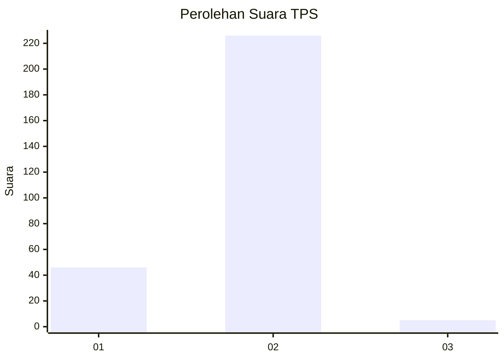
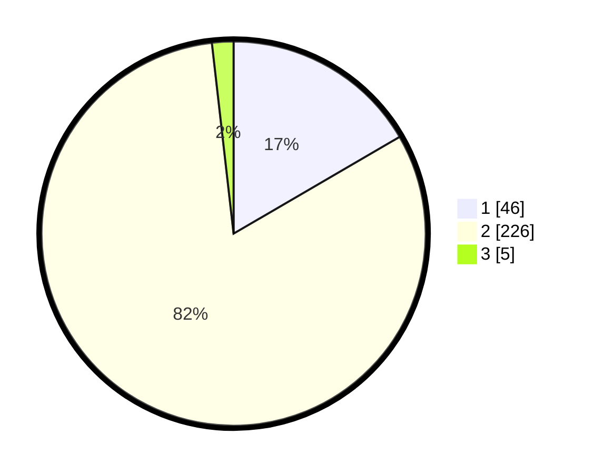

# Hasil

## Grafik

## Tabel

| No. | Nama Paslon    | Suara | Suara (raw) | Persentase |
|:--- |:-------------- | -----:| -----------:| ----------:|
| 1   | ANIES MUHAIMIN | 46    | [46][p-1]   | 16,61      |
| 2   | PRABOWO GIBRAN | 226   | [226][p-2]  | 81,59      |
| 3   | GANJAR MAHFUD  | 5     | [5][p-3]    | 1,81       |

[p-1]: https://github.com/gigit-pemilu/pemilu-2024/blob/main/pilpres/hitung-suara/sub/35-jawa-timur/sub/27-sampang/sub/09-banyuates/sub/2016-batioh/sub/012-tps/sub/paslon-1.txt
[p-2]: https://github.com/gigit-pemilu/pemilu-2024/blob/main/pilpres/hitung-suara/sub/35-jawa-timur/sub/27-sampang/sub/09-banyuates/sub/2016-batioh/sub/012-tps/sub/paslon-2.txt
[p-3]: https://github.com/gigit-pemilu/pemilu-2024/blob/main/pilpres/hitung-suara/sub/35-jawa-timur/sub/27-sampang/sub/09-banyuates/sub/2016-batioh/sub/012-tps/sub/paslon-3.txt

## Foto C Plano

https://sirekap-obj-formc.kpu.go.id/b91a/pemilu/ppwp/35/27/09/20/16/3527092016012-20240214-214419--e3d68540-e67a-4e41-b6c8-ea293c65f09c.jpg

https://sirekap-obj-formc.kpu.go.id/b91a/pemilu/ppwp/35/27/09/20/16/3527092016012-20240214-214523--75e3983d-4004-4389-ac45-9c3d32710182.jpg

https://sirekap-obj-formc.kpu.go.id/b91a/pemilu/ppwp/35/27/09/20/16/3527092016012-20240214-214603--f787e34f-5bde-46e7-a2a0-c11a8135ab79.jpg

## Metadata

| Key        | Value               |
| ---------- | ------------------- |
| Time Stamp | 2024-02-17 10:00:02 |

