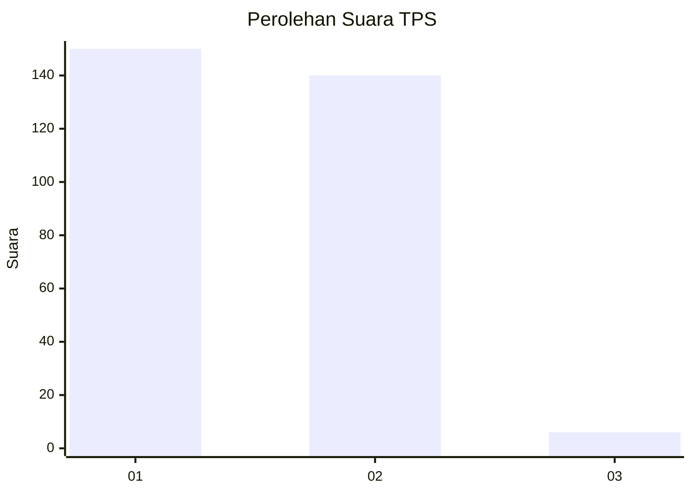
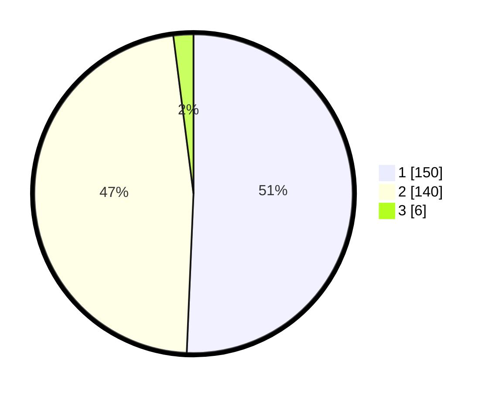

# Hasil

## Grafik

## Tabel

| No. | Nama Paslon    | Suara | Suara (raw) | Persentase |
|:--- |:-------------- | -----:| -----------:| ----------:|
| 1   | ANIES MUHAIMIN | 150   | [150][p-1]  | 50,68      |
| 2   | PRABOWO GIBRAN | 140   | [140][p-2]  | 47,30      |
| 3   | GANJAR MAHFUD  | 6     | [6][p-3]    | 2,03       |

[p-1]: https://github.com/gigit-pemilu/pemilu-2024/blob/main/pilpres/hitung-suara/sub/35-jawa-timur/sub/27-sampang/sub/09-banyuates/sub/2016-batioh/sub/013-tps/sub/paslon-1.txt
[p-2]: https://github.com/gigit-pemilu/pemilu-2024/blob/main/pilpres/hitung-suara/sub/35-jawa-timur/sub/27-sampang/sub/09-banyuates/sub/2016-batioh/sub/013-tps/sub/paslon-2.txt
[p-3]: https://github.com/gigit-pemilu/pemilu-2024/blob/main/pilpres/hitung-suara/sub/35-jawa-timur/sub/27-sampang/sub/09-banyuates/sub/2016-batioh/sub/013-tps/sub/paslon-3.txt

## Foto C Plano

https://sirekap-obj-formc.kpu.go.id/4cb2/pemilu/ppwp/35/27/09/20/16/3527092016013-20240214-192400--f50d52b8-d337-47b1-b428-8b9cc97d4363.jpg

https://sirekap-obj-formc.kpu.go.id/4cb2/pemilu/ppwp/35/27/09/20/16/3527092016013-20240214-192447--0ca8af15-5b8b-4bad-bede-8dccf40b7077.jpg

https://sirekap-obj-formc.kpu.go.id/4cb2/pemilu/ppwp/35/27/09/20/16/3527092016013-20240214-192534--a47cf57a-f6d6-41da-89c1-722b726b2ced.jpg

## Metadata

| Key        | Value               |
| ---------- | ------------------- |
| Time Stamp | 2024-02-16 22:30:00 |

