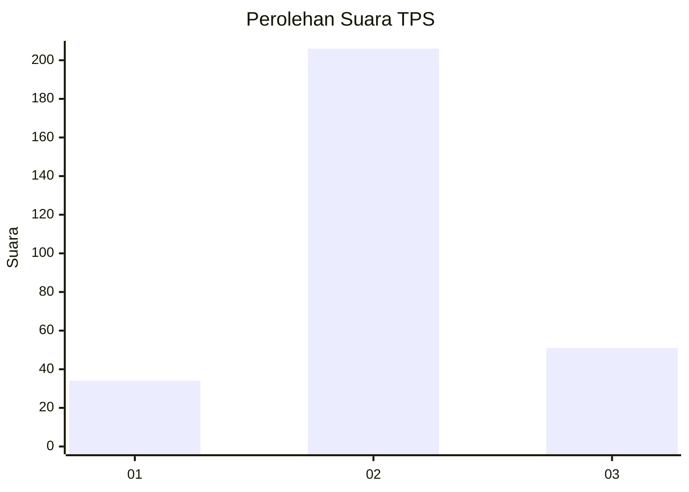
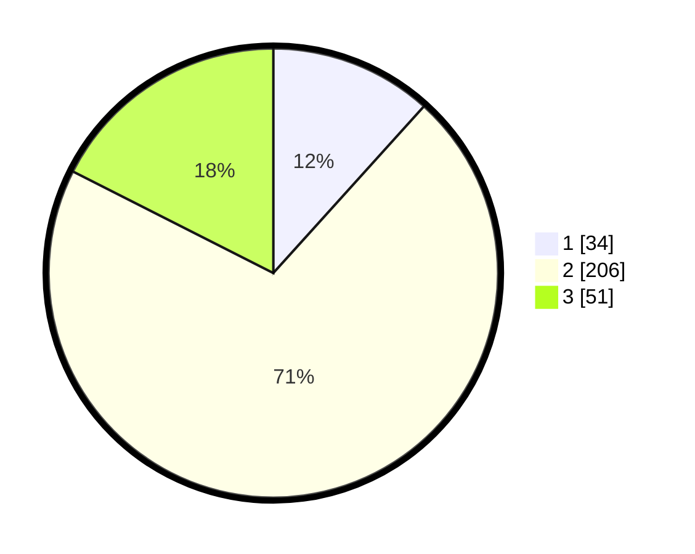

# Hasil

## Grafik

## Tabel

| No. | Nama Paslon    | Suara | Suara (raw) | Persentase |
|:--- |:-------------- | -----:| -----------:| ----------:|
| 1   | ANIES MUHAIMIN | 34    | [34][p-1]   | 11,68      |
| 2   | PRABOWO GIBRAN | 206   | [206][p-2]  | 70,79      |
| 3   | GANJAR MAHFUD  | 51    | [51][p-3]   | 17,53      |

[p-1]: https://github.com/gigit-pemilu/pemilu-2024/blob/main/pilpres/hitung-suara/sub/35-jawa-timur/sub/27-sampang/sub/09-banyuates/sub/2018-banyuates/sub/002-tps/sub/paslon-1.txt
[p-2]: https://github.com/gigit-pemilu/pemilu-2024/blob/main/pilpres/hitung-suara/sub/35-jawa-timur/sub/27-sampang/sub/09-banyuates/sub/2018-banyuates/sub/002-tps/sub/paslon-2.txt
[p-3]: https://github.com/gigit-pemilu/pemilu-2024/blob/main/pilpres/hitung-suara/sub/35-jawa-timur/sub/27-sampang/sub/09-banyuates/sub/2018-banyuates/sub/002-tps/sub/paslon-3.txt

## Foto C Plano

https://sirekap-obj-formc.kpu.go.id/5488/pemilu/ppwp/35/27/09/20/18/3527092018002-20240214-231733--3b41e78f-18d6-4558-9d15-7f63642028e0.jpg

https://sirekap-obj-formc.kpu.go.id/5488/pemilu/ppwp/35/27/09/20/18/3527092018002-20240214-231833--b7f156e1-dda1-459a-8a37-b227b969e73a.jpg

https://sirekap-obj-formc.kpu.go.id/5488/pemilu/ppwp/35/27/09/20/18/3527092018002-20240214-231954--52af5c4b-1408-47b6-becb-a0acc3ab291c.jpg

## Metadata

| Key        | Value               |
| ---------- | ------------------- |
| Time Stamp | 2024-02-17 10:00:02 |

