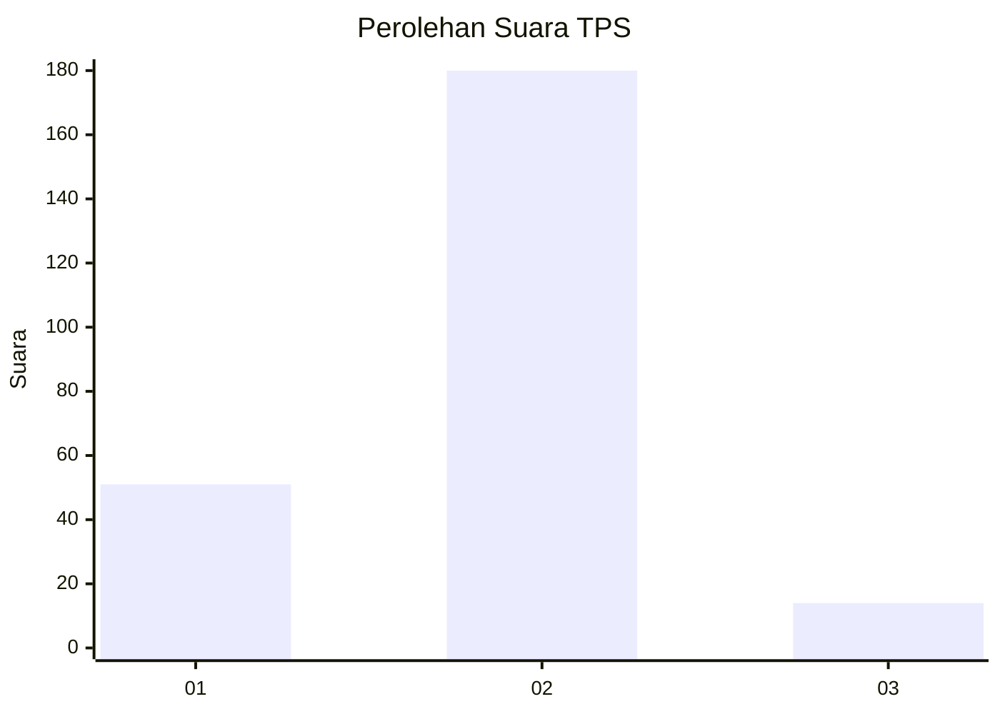

# Hasil

## Grafik

## Tabel

| No. | Nama Paslon    | Suara | Suara (raw) | Persentase |
|:--- |:-------------- | -----:| -----------:| ----------:|
| 1   | ANIES MUHAIMIN | 51    | [51][p-1]   | 20,82      |
| 2   | PRABOWO GIBRAN | 180   | [180][p-2]  | 73,47      |
| 3   | GANJAR MAHFUD  | 14    | [14][p-3]   | 5,71       |

[p-1]: https://github.com/gigit-pemilu/pemilu-2024/blob/main/pilpres/hitung-suara/sub/35-jawa-timur/sub/27-sampang/sub/09-banyuates/sub/2018-banyuates/sub/003-tps/sub/paslon-1.txt
[p-2]: https://github.com/gigit-pemilu/pemilu-2024/blob/main/pilpres/hitung-suara/sub/35-jawa-timur/sub/27-sampang/sub/09-banyuates/sub/2018-banyuates/sub/003-tps/sub/paslon-2.txt
[p-3]: https://github.com/gigit-pemilu/pemilu-2024/blob/main/pilpres/hitung-suara/sub/35-jawa-timur/sub/27-sampang/sub/09-banyuates/sub/2018-banyuates/sub/003-tps/sub/paslon-3.txt

## Foto C Plano

https://sirekap-obj-formc.kpu.go.id/1a42/pemilu/ppwp/35/27/09/20/18/3527092018003-20240214-194127--962d33d5-86a7-4a23-907c-6c92d2af9a52.jpg

https://sirekap-obj-formc.kpu.go.id/1a42/pemilu/ppwp/35/27/09/20/18/3527092018003-20240214-194255--3864168d-cfd5-4d0a-be2c-3c4a6a29b0af.jpg

https://sirekap-obj-formc.kpu.go.id/1a42/pemilu/ppwp/35/27/09/20/18/3527092018003-20240214-194404--ea8ce8fd-8e39-41d3-9de7-7aa05ff92bb3.jpg

## Metadata

| Key        | Value               |
| ---------- | ------------------- |
| Time Stamp | 2024-02-16 22:30:00 |

