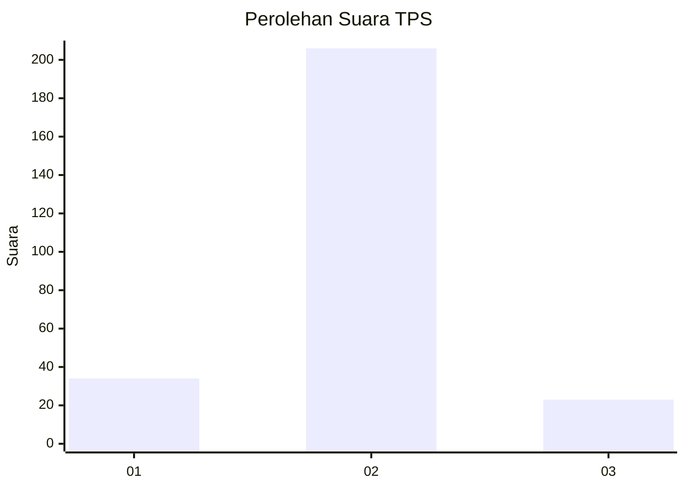
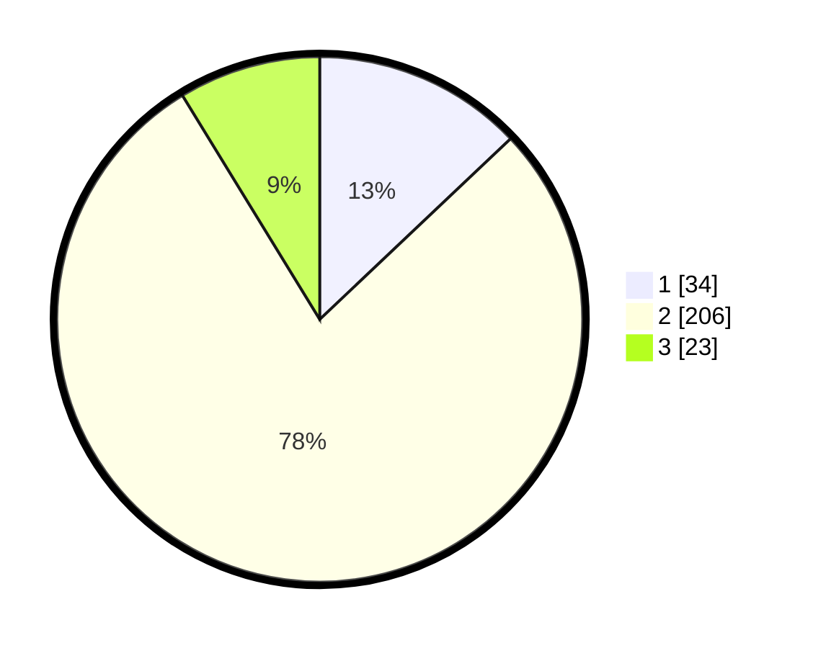

# Hasil

## Grafik

## Tabel

| No. | Nama Paslon    | Suara | Suara (raw) | Persentase |
|:--- |:-------------- | -----:| -----------:| ----------:|
| 1   | ANIES MUHAIMIN | 34    | [34][p-1]   | 12,93      |
| 2   | PRABOWO GIBRAN | 206   | [206][p-2]  | 78,33      |
| 3   | GANJAR MAHFUD  | 23    | [23][p-3]   | 8,75       |

[p-1]: https://github.com/gigit-pemilu/pemilu-2024/blob/main/pilpres/hitung-suara/sub/35-jawa-timur/sub/27-sampang/sub/09-banyuates/sub/2018-banyuates/sub/005-tps/sub/paslon-1.txt
[p-2]: https://github.com/gigit-pemilu/pemilu-2024/blob/main/pilpres/hitung-suara/sub/35-jawa-timur/sub/27-sampang/sub/09-banyuates/sub/2018-banyuates/sub/005-tps/sub/paslon-2.txt
[p-3]: https://github.com/gigit-pemilu/pemilu-2024/blob/main/pilpres/hitung-suara/sub/35-jawa-timur/sub/27-sampang/sub/09-banyuates/sub/2018-banyuates/sub/005-tps/sub/paslon-3.txt

## Foto C Plano

https://sirekap-obj-formc.kpu.go.id/f940/pemilu/ppwp/35/27/09/20/18/3527092018005-20240214-194128--5fccda4a-3284-4628-8b93-840eb89509c9.jpg

https://sirekap-obj-formc.kpu.go.id/f940/pemilu/ppwp/35/27/09/20/18/3527092018005-20240214-202225--13845677-f478-4c7c-9ea0-1dcc331918f2.jpg

https://sirekap-obj-formc.kpu.go.id/f940/pemilu/ppwp/35/27/09/20/18/3527092018005-20240214-202406--ad220e48-7323-4d9a-a9c6-ce6f633b26bc.jpg

## Metadata

| Key        | Value               |
| ---------- | ------------------- |
| Time Stamp | 2024-02-16 22:30:00 |

