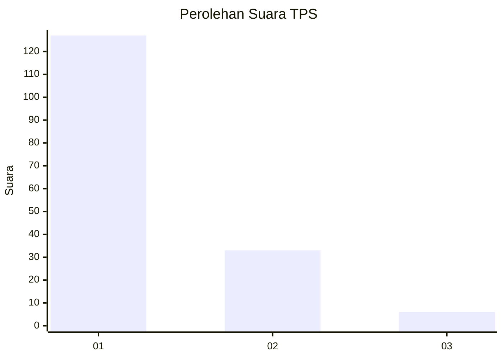
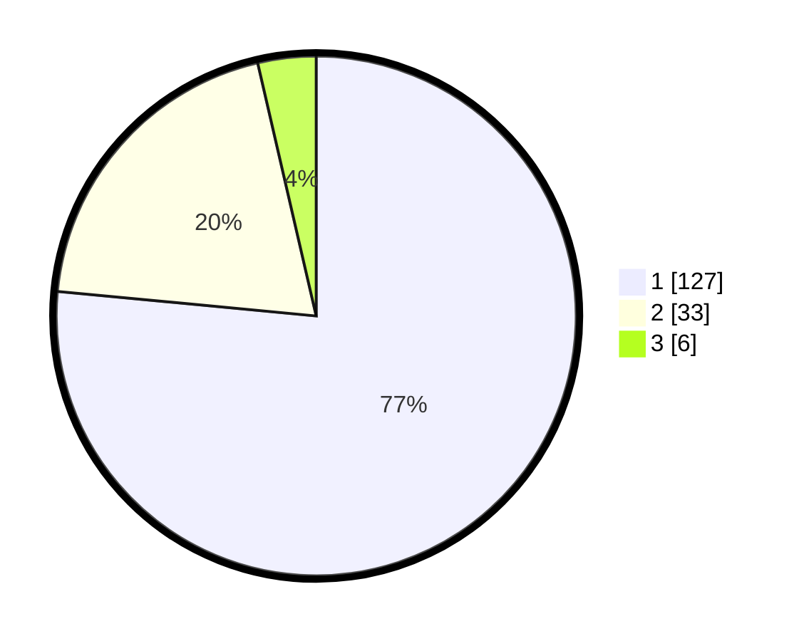

# Hasil

## Grafik

## Tabel

| No. | Nama Paslon    | Suara | Suara (raw) | Persentase |
|:--- |:-------------- | -----:| -----------:| ----------:|
| 1   | ANIES MUHAIMIN | 127   | [127][p-1]  | 76,51      |
| 2   | PRABOWO GIBRAN | 33    | [33][p-2]   | 19,88      |
| 3   | GANJAR MAHFUD  | 6     | [6][p-3]    | 3,61       |

[p-1]: https://github.com/gigit-pemilu/pemilu-2024-35-jawa-timur/blob/main/pilpres/hitung-suara/sub/35-jawa-timur/sub/27-sampang/sub/09-banyuates/sub/2020-tapa'an/sub/002-tps/sub/paslon-1.txt
[p-2]: https://github.com/gigit-pemilu/pemilu-2024-35-jawa-timur/blob/main/pilpres/hitung-suara/sub/35-jawa-timur/sub/27-sampang/sub/09-banyuates/sub/2020-tapa'an/sub/002-tps/sub/paslon-2.txt
[p-3]: https://github.com/gigit-pemilu/pemilu-2024-35-jawa-timur/blob/main/pilpres/hitung-suara/sub/35-jawa-timur/sub/27-sampang/sub/09-banyuates/sub/2020-tapa'an/sub/002-tps/sub/paslon-3.txt

## Foto C Plano

https://sirekap-obj-formc.kpu.go.id/841e/pemilu/ppwp/35/27/09/20/20/3527092020002-20240215-003216--792d35ac-363e-4456-9a09-52769068890b.jpg

https://sirekap-obj-formc.kpu.go.id/841e/pemilu/ppwp/35/27/09/20/20/3527092020002-20240214-230511--f3b4e38d-2254-44a4-b1c9-2e9f86f3e010.jpg

https://sirekap-obj-formc.kpu.go.id/841e/pemilu/ppwp/35/27/09/20/20/3527092020002-20240215-003355--5a696569-bfbb-46d4-aab9-7cc27a6f9e8f.jpg

## Metadata

| Key        | Value               |
| ---------- | ------------------- |
| Time Stamp | 2024-02-16 22:30:00 |

