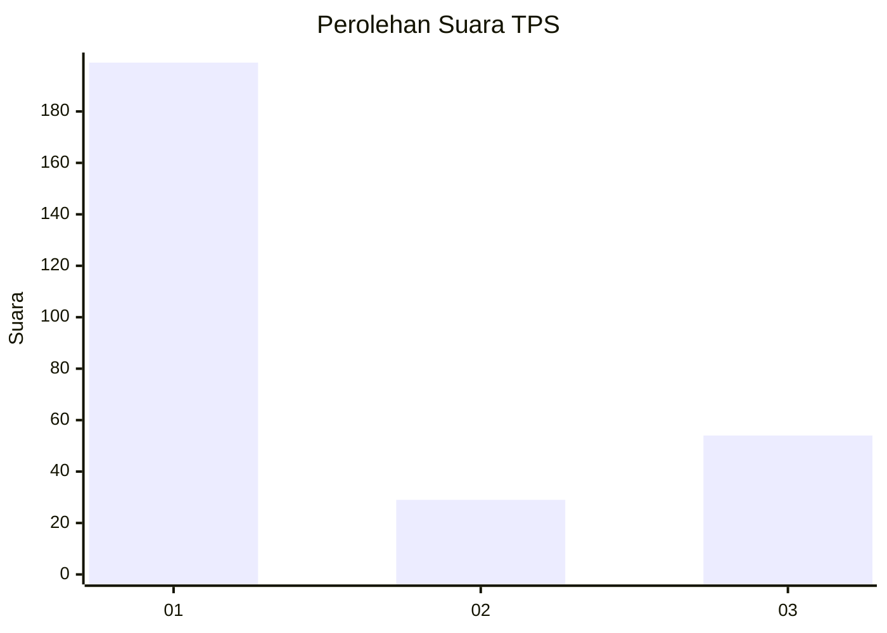
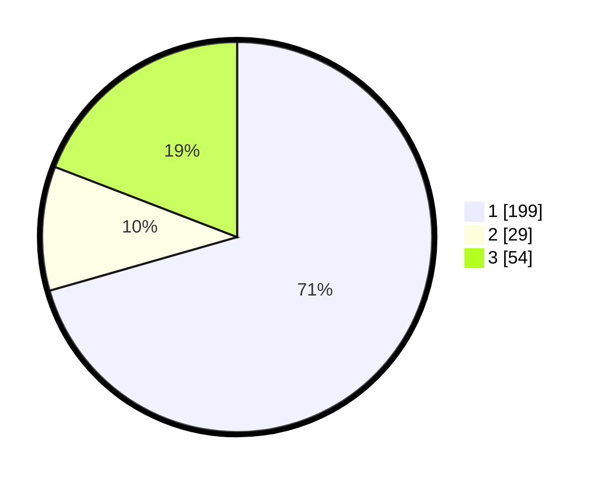

# Hasil

## Grafik

## Tabel

| No. | Nama Paslon    | Suara | Suara (raw) | Persentase |
|:--- |:-------------- | -----:| -----------:| ----------:|
| 1   | ANIES MUHAIMIN | 199   | [199][p-1]  | 70,57      |
| 2   | PRABOWO GIBRAN | 29    | [29][p-2]   | 10,28      |
| 3   | GANJAR MAHFUD  | 54    | [54][p-3]   | 19,15      |

[p-1]: https://github.com/gigit-pemilu/pemilu-2024/blob/main/pilpres/hitung-suara/sub/35-jawa-timur/sub/27-sampang/sub/09-banyuates/sub/2020-tapa'an/sub/004-tps/sub/paslon-1.txt
[p-2]: https://github.com/gigit-pemilu/pemilu-2024/blob/main/pilpres/hitung-suara/sub/35-jawa-timur/sub/27-sampang/sub/09-banyuates/sub/2020-tapa'an/sub/004-tps/sub/paslon-2.txt
[p-3]: https://github.com/gigit-pemilu/pemilu-2024/blob/main/pilpres/hitung-suara/sub/35-jawa-timur/sub/27-sampang/sub/09-banyuates/sub/2020-tapa'an/sub/004-tps/sub/paslon-3.txt

## Foto C Plano

https://sirekap-obj-formc.kpu.go.id/7e97/pemilu/ppwp/35/27/09/20/20/3527092020004-20240215-101519--b45432a0-2a2c-437c-9160-75208c25c2c3.jpg

https://sirekap-obj-formc.kpu.go.id/7e97/pemilu/ppwp/35/27/09/20/20/3527092020004-20240215-101759--abb02684-4aea-4e61-82a8-52b9717b80eb.jpg

https://sirekap-obj-formc.kpu.go.id/7e97/pemilu/ppwp/35/27/09/20/20/3527092020004-20240215-102350--ffe1cace-f3be-4925-8c81-373c1edee469.jpg

## Metadata

| Key        | Value               |
| ---------- | ------------------- |
| Time Stamp | 2024-02-16 22:30:00 |

