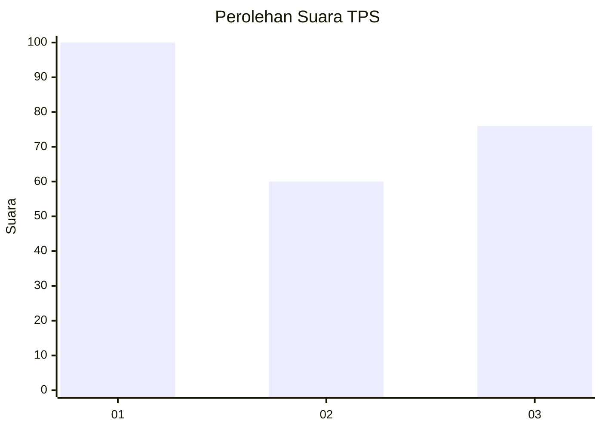
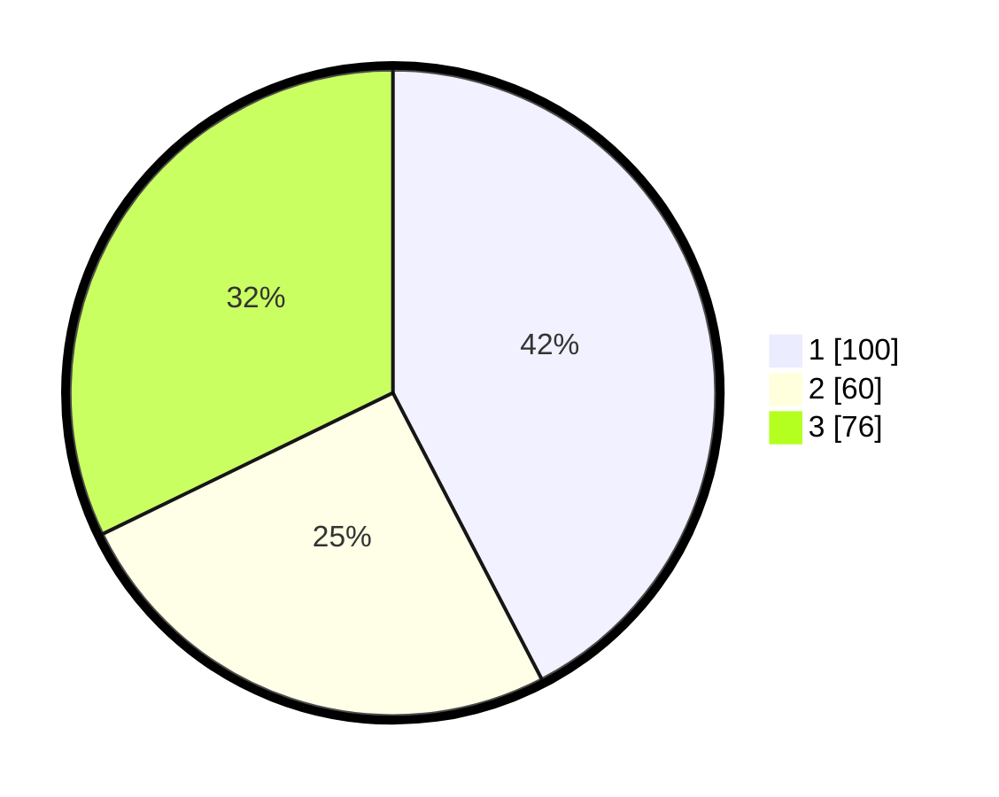

# Hasil

## Grafik

## Tabel

| No. | Nama Paslon    | Suara | Suara (raw) | Persentase |
|:--- |:-------------- | -----:| -----------:| ----------:|
| 1   | ANIES MUHAIMIN | 100   | [100][p-1]  | 42,37      |
| 2   | PRABOWO GIBRAN | 60    | [60][p-2]   | 25,42      |
| 3   | GANJAR MAHFUD  | 76    | [76][p-3]   | 32,20      |

[p-1]: https://github.com/gigit-pemilu/pemilu-2024/blob/main/pilpres/hitung-suara/sub/35-jawa-timur/sub/27-sampang/sub/09-banyuates/sub/2020-tapa'an/sub/005-tps/sub/paslon-1.txt
[p-2]: https://github.com/gigit-pemilu/pemilu-2024/blob/main/pilpres/hitung-suara/sub/35-jawa-timur/sub/27-sampang/sub/09-banyuates/sub/2020-tapa'an/sub/005-tps/sub/paslon-2.txt
[p-3]: https://github.com/gigit-pemilu/pemilu-2024/blob/main/pilpres/hitung-suara/sub/35-jawa-timur/sub/27-sampang/sub/09-banyuates/sub/2020-tapa'an/sub/005-tps/sub/paslon-3.txt

## Foto C Plano

https://sirekap-obj-formc.kpu.go.id/39ef/pemilu/ppwp/35/27/09/20/20/3527092020005-20240215-091419--992d2b30-8ceb-4314-9dc1-0399913f97d3.jpg

https://sirekap-obj-formc.kpu.go.id/39ef/pemilu/ppwp/35/27/09/20/20/3527092020005-20240215-091542--571fe796-e53a-46df-b640-cb9fdb4ec717.jpg

https://sirekap-obj-formc.kpu.go.id/39ef/pemilu/ppwp/35/27/09/20/20/3527092020005-20240215-091715--bc39abc8-4020-45b0-9406-f5060e59e897.jpg

## Metadata

| Key        | Value               |
| ---------- | ------------------- |
| Time Stamp | 2024-02-17 10:00:02 |

