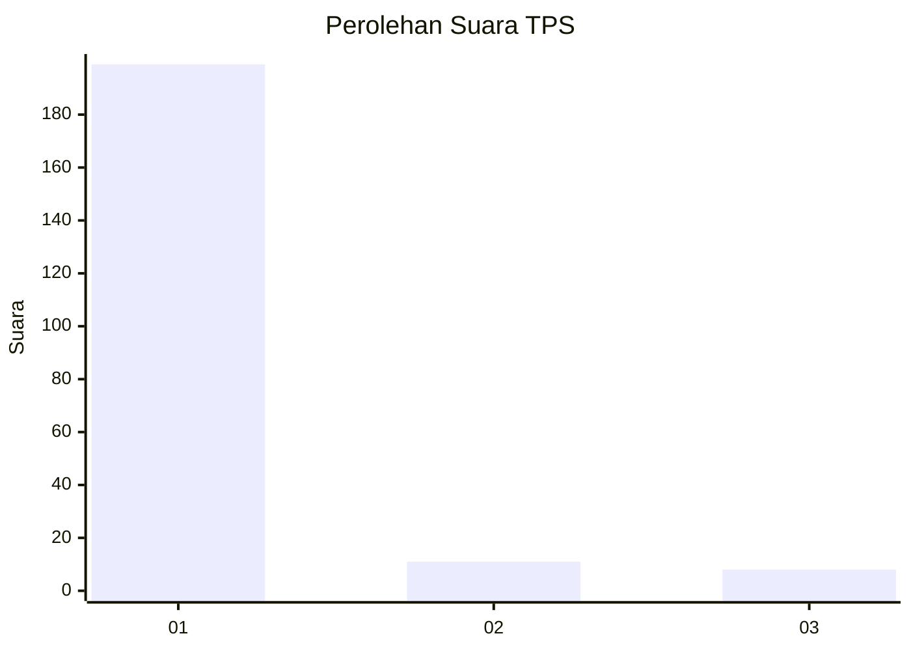
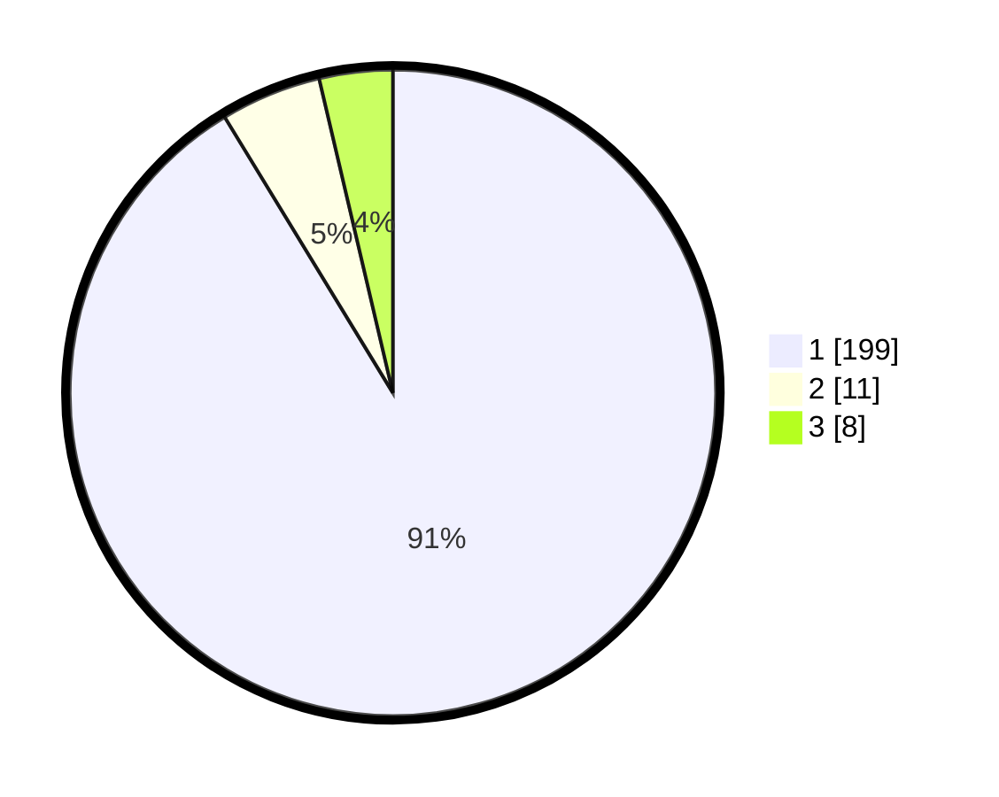

# Hasil

## Grafik

## Tabel

| No. | Nama Paslon    | Suara | Suara (raw) | Persentase |
|:--- |:-------------- | -----:| -----------:| ----------:|
| 1   | ANIES MUHAIMIN | 199   | [199][p-1]  | 91,28      |
| 2   | PRABOWO GIBRAN | 11    | [11][p-2]   | 5,05       |
| 3   | GANJAR MAHFUD  | 8     | [8][p-3]    | 3,67       |

[p-1]: https://github.com/gigit-pemilu/pemilu-2024-35-jawa-timur/blob/main/pilpres/hitung-suara/sub/35-jawa-timur/sub/27-sampang/sub/09-banyuates/sub/2020-tapa'an/sub/007-tps/sub/paslon-1.txt
[p-2]: https://github.com/gigit-pemilu/pemilu-2024-35-jawa-timur/blob/main/pilpres/hitung-suara/sub/35-jawa-timur/sub/27-sampang/sub/09-banyuates/sub/2020-tapa'an/sub/007-tps/sub/paslon-2.txt
[p-3]: https://github.com/gigit-pemilu/pemilu-2024-35-jawa-timur/blob/main/pilpres/hitung-suara/sub/35-jawa-timur/sub/27-sampang/sub/09-banyuates/sub/2020-tapa'an/sub/007-tps/sub/paslon-3.txt

## Foto C Plano

https://sirekap-obj-formc.kpu.go.id/8f8f/pemilu/ppwp/35/27/09/20/20/3527092020007-20240214-214304--070d9086-56e6-4810-9a85-dbf679b77ed6.jpg

https://sirekap-obj-formc.kpu.go.id/8f8f/pemilu/ppwp/35/27/09/20/20/3527092020007-20240214-214359--eea30fe0-4010-454a-9497-1488cc3f0035.jpg

https://sirekap-obj-formc.kpu.go.id/8f8f/pemilu/ppwp/35/27/09/20/20/3527092020007-20240214-214518--7970efa2-6d97-4950-be4d-7024fdfae4f9.jpg

## Metadata

| Key        | Value               |
| ---------- | ------------------- |
| Time Stamp | 2024-02-17 10:00:02 |

