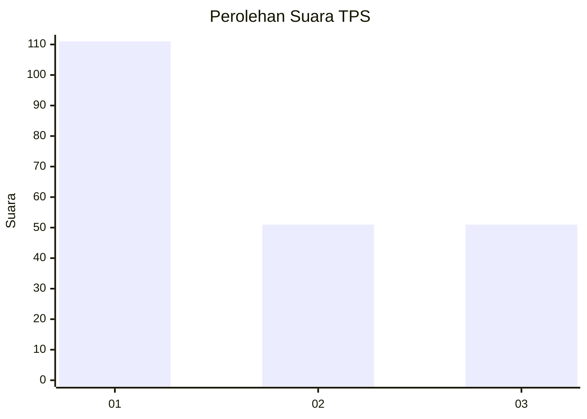
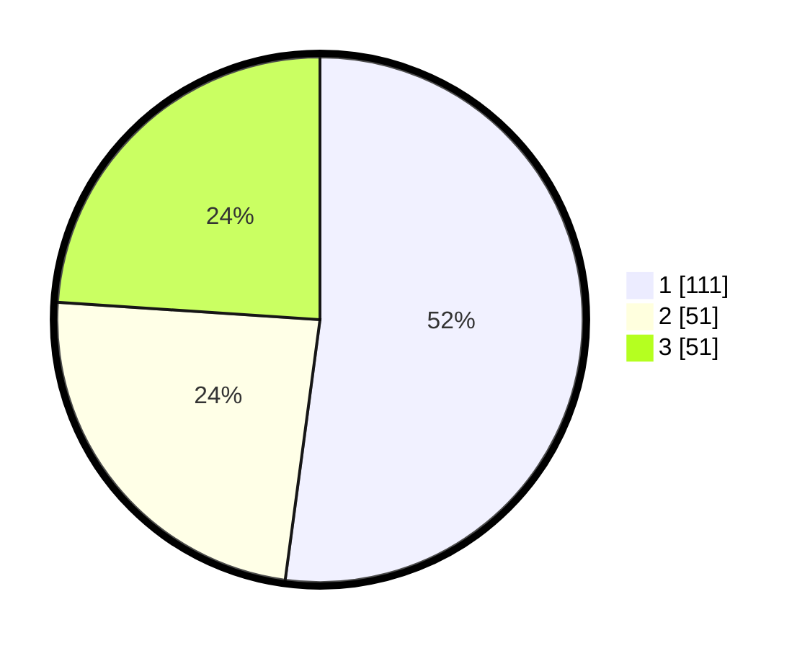

# Hasil

## Grafik

## Tabel

| No. | Nama Paslon    | Suara | Suara (raw) | Persentase |
|:--- |:-------------- | -----:| -----------:| ----------:|
| 1   | ANIES MUHAIMIN | 111   | [111][p-1]  | 52,11      |
| 2   | PRABOWO GIBRAN | 51    | [51][p-2]   | 23,94      |
| 3   | GANJAR MAHFUD  | 51    | [51][p-3]   | 23,94      |

[p-1]: https://github.com/gigit-pemilu/pemilu-2024-35-jawa-timur/blob/main/pilpres/hitung-suara/sub/35-jawa-timur/sub/27-sampang/sub/09-banyuates/sub/2020-tapa'an/sub/008-tps/sub/paslon-1.txt
[p-2]: https://github.com/gigit-pemilu/pemilu-2024-35-jawa-timur/blob/main/pilpres/hitung-suara/sub/35-jawa-timur/sub/27-sampang/sub/09-banyuates/sub/2020-tapa'an/sub/008-tps/sub/paslon-2.txt
[p-3]: https://github.com/gigit-pemilu/pemilu-2024-35-jawa-timur/blob/main/pilpres/hitung-suara/sub/35-jawa-timur/sub/27-sampang/sub/09-banyuates/sub/2020-tapa'an/sub/008-tps/sub/paslon-3.txt

## Foto C Plano

https://sirekap-obj-formc.kpu.go.id/1abf/pemilu/ppwp/35/27/09/20/20/3527092020008-20240214-215149--f3b5d73a-c05a-4fb4-ad39-9fa4f748398e.jpg

https://sirekap-obj-formc.kpu.go.id/1abf/pemilu/ppwp/35/27/09/20/20/3527092020008-20240214-214715--0b6aa2f6-a74b-44f7-9235-43d903565641.jpg

https://sirekap-obj-formc.kpu.go.id/1abf/pemilu/ppwp/35/27/09/20/20/3527092020008-20240214-214958--9884e338-db51-4a15-9b31-adfe7567dd40.jpg

## Metadata

| Key        | Value               |
| ---------- | ------------------- |
| Time Stamp | 2024-02-16 22:30:00 |

