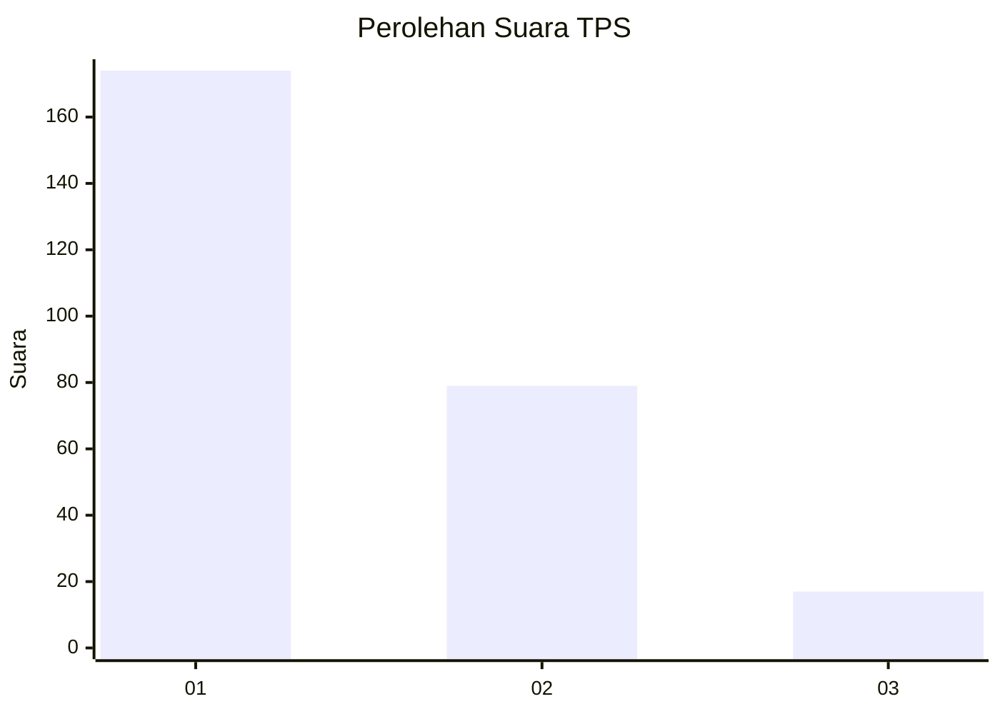
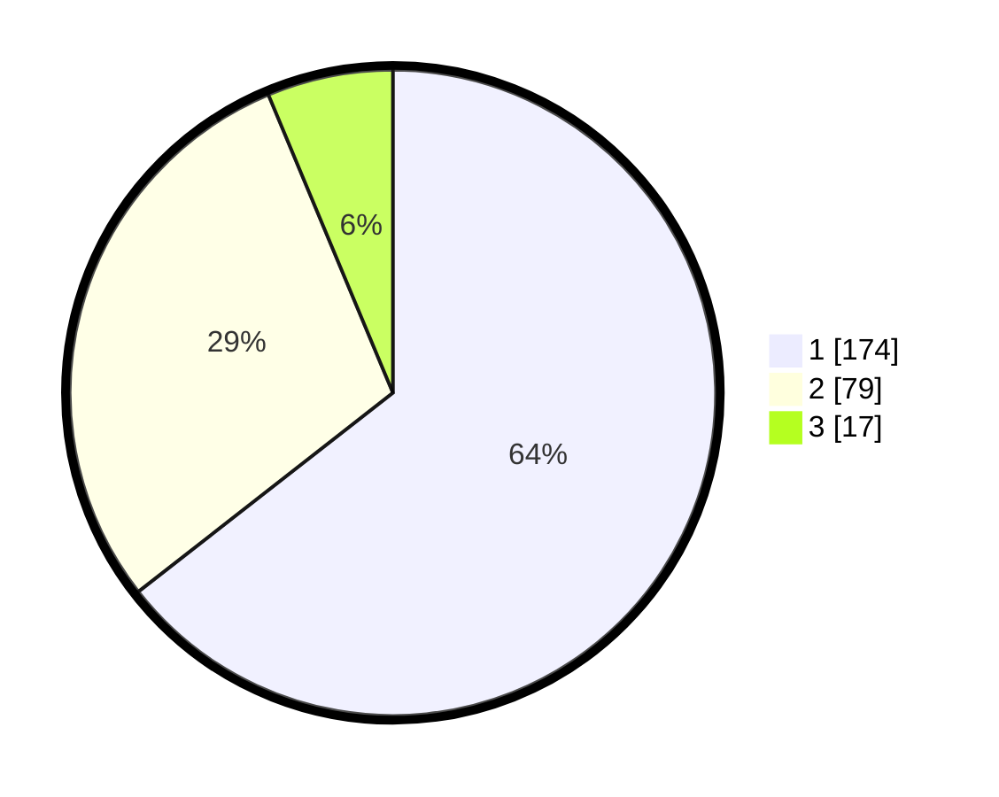

# Hasil

## Grafik

## Tabel

| No. | Nama Paslon    | Suara | Suara (raw) | Persentase |
|:--- |:-------------- | -----:| -----------:| ----------:|
| 1   | ANIES MUHAIMIN | 174   | [174][p-1]  | 64,44      |
| 2   | PRABOWO GIBRAN | 79    | [79][p-2]   | 29,26      |
| 3   | GANJAR MAHFUD  | 17    | [17][p-3]   | 6,30       |

[p-1]: https://github.com/gigit-pemilu/pemilu-2024/blob/main/pilpres/hitung-suara/sub/35-jawa-timur/sub/27-sampang/sub/10-robatal/sub/2008-lepelle/sub/013-tps/sub/paslon-1.txt
[p-2]: https://github.com/gigit-pemilu/pemilu-2024/blob/main/pilpres/hitung-suara/sub/35-jawa-timur/sub/27-sampang/sub/10-robatal/sub/2008-lepelle/sub/013-tps/sub/paslon-2.txt
[p-3]: https://github.com/gigit-pemilu/pemilu-2024/blob/main/pilpres/hitung-suara/sub/35-jawa-timur/sub/27-sampang/sub/10-robatal/sub/2008-lepelle/sub/013-tps/sub/paslon-3.txt

## Foto C Plano

https://sirekap-obj-formc.kpu.go.id/abd3/pemilu/ppwp/35/27/10/20/08/3527102008013-20240214-191345--7a80aed3-e4b2-43ee-b8bd-a118c301bff1.jpg

https://sirekap-obj-formc.kpu.go.id/abd3/pemilu/ppwp/35/27/10/20/08/3527102008013-20240214-191620--7145fd63-9dc8-433a-84d1-e69961695c8e.jpg

## Metadata

| Key        | Value               |
| ---------- | ------------------- |
| Time Stamp | 2024-02-24 22:31:28 |

