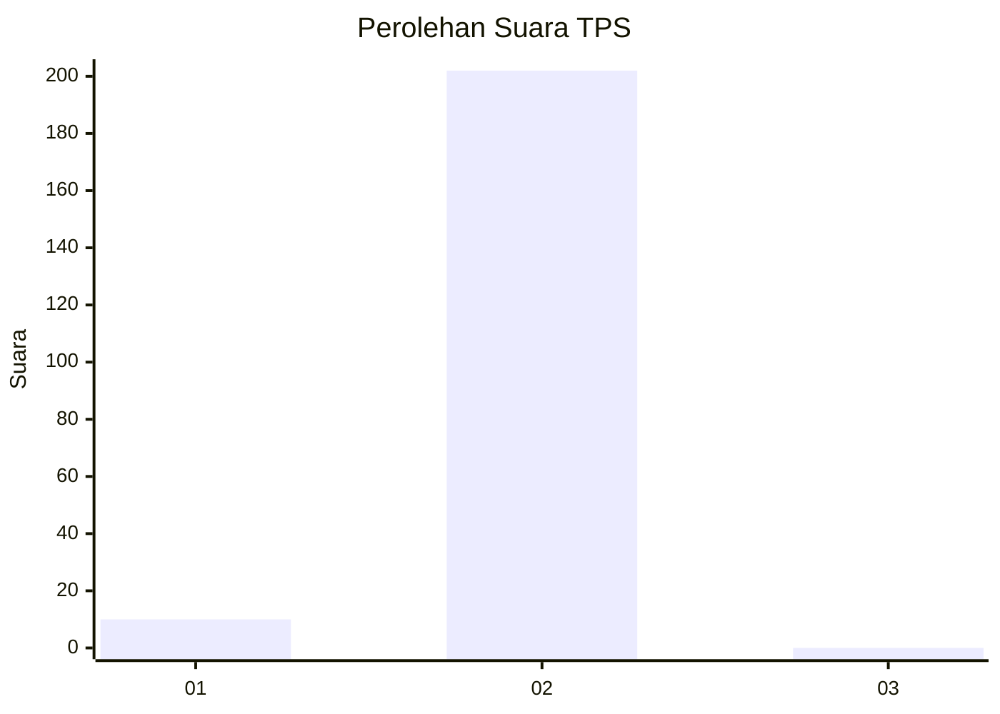
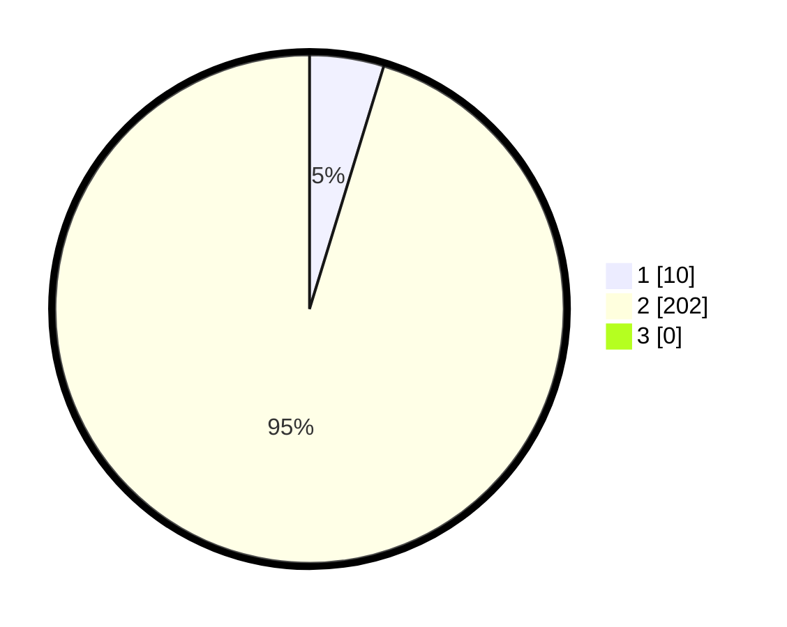

# Hasil

## Grafik

## Tabel

| No. | Nama Paslon    | Suara | Suara (raw) | Persentase |
|:--- |:-------------- | -----:| -----------:| ----------:|
| 1   | ANIES MUHAIMIN | 10    | [10][p-1]   | 4,72       |
| 2   | PRABOWO GIBRAN | 202   | [202][p-2]  | 95,28      |
| 3   | GANJAR MAHFUD  | 0     | [0][p-3]    | 0,00       |

[p-1]: https://github.com/gigit-pemilu/pemilu-2024-35-jawa-timur/blob/main/pilpres/hitung-suara/sub/35-jawa-timur/sub/27-sampang/sub/10-robatal/sub/2009-bapelle/sub/004-tps/sub/paslon-1.txt
[p-2]: https://github.com/gigit-pemilu/pemilu-2024-35-jawa-timur/blob/main/pilpres/hitung-suara/sub/35-jawa-timur/sub/27-sampang/sub/10-robatal/sub/2009-bapelle/sub/004-tps/sub/paslon-2.txt
[p-3]: https://github.com/gigit-pemilu/pemilu-2024-35-jawa-timur/blob/main/pilpres/hitung-suara/sub/35-jawa-timur/sub/27-sampang/sub/10-robatal/sub/2009-bapelle/sub/004-tps/sub/paslon-3.txt

## Foto C Plano

https://sirekap-obj-formc.kpu.go.id/e260/pemilu/ppwp/35/27/10/20/09/3527102009004-20240214-195044--c59e5410-1721-4736-8ff4-57440cc9767b.jpg

https://sirekap-obj-formc.kpu.go.id/e260/pemilu/ppwp/35/27/10/20/09/3527102009004-20240214-195206--352066d6-6e32-49f1-802e-bb92ca94bba3.jpg

https://sirekap-obj-formc.kpu.go.id/e260/pemilu/ppwp/35/27/10/20/09/3527102009004-20240214-195402--1e957782-053b-4c6f-879a-83b05c576f69.jpg

## Metadata

| Key        | Value               |
| ---------- | ------------------- |
| Time Stamp | 2024-02-25 18:00:00 |

