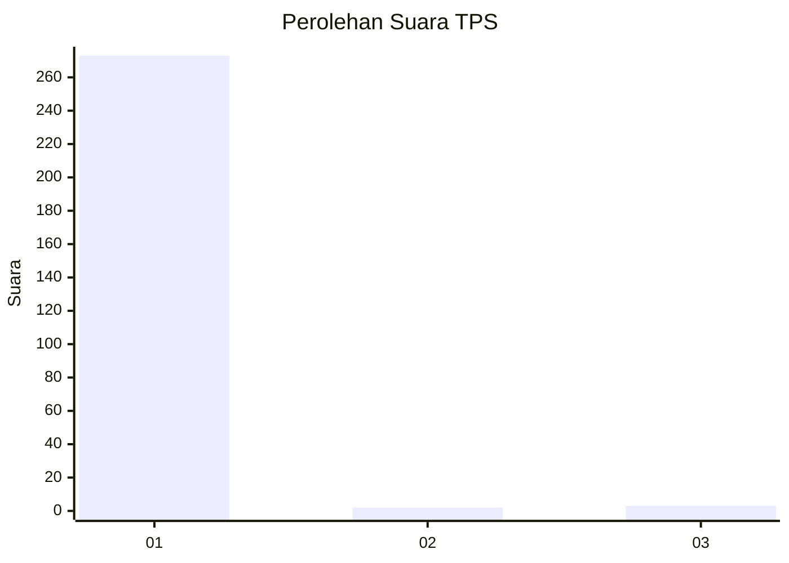
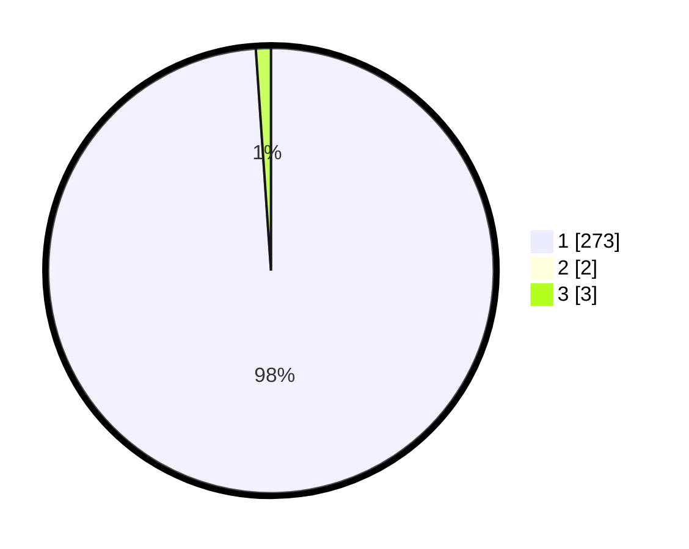

# Hasil

## Grafik

## Tabel

| No. | Nama Paslon    | Suara | Suara (raw) | Persentase |
|:--- |:-------------- | -----:| -----------:| ----------:|
| 1   | ANIES MUHAIMIN | 273   | [273][p-1]  | 98,20      |
| 2   | PRABOWO GIBRAN | 2     | [2][p-2]    | 0,72       |
| 3   | GANJAR MAHFUD  | 3     | [3][p-3]    | 1,08       |

[p-1]: https://github.com/gigit-pemilu/pemilu-2024/blob/main/pilpres/hitung-suara/sub/35-jawa-timur/sub/27-sampang/sub/10-robatal/sub/2010-sawah-tengah/sub/003-tps/sub/paslon-1.txt
[p-2]: https://github.com/gigit-pemilu/pemilu-2024/blob/main/pilpres/hitung-suara/sub/35-jawa-timur/sub/27-sampang/sub/10-robatal/sub/2010-sawah-tengah/sub/003-tps/sub/paslon-2.txt
[p-3]: https://github.com/gigit-pemilu/pemilu-2024/blob/main/pilpres/hitung-suara/sub/35-jawa-timur/sub/27-sampang/sub/10-robatal/sub/2010-sawah-tengah/sub/003-tps/sub/paslon-3.txt

## Foto C Plano

https://sirekap-obj-formc.kpu.go.id/c6d3/pemilu/ppwp/35/27/10/20/10/3527102010003-20240214-190955--1f2c4f7a-10cb-4bb6-9516-811d48da9f13.jpg

https://sirekap-obj-formc.kpu.go.id/c6d3/pemilu/ppwp/35/27/10/20/10/3527102010003-20240214-191000--958202b5-84a1-4bba-a7c2-ba7de7bce46c.jpg

https://sirekap-obj-formc.kpu.go.id/c6d3/pemilu/ppwp/35/27/10/20/10/3527102010003-20240214-191004--35a8d366-d642-487e-bf6d-4412213157e7.jpg

## Metadata

| Key        | Value               |
| ---------- | ------------------- |
| Time Stamp | 2024-02-16 09:00:28 |

