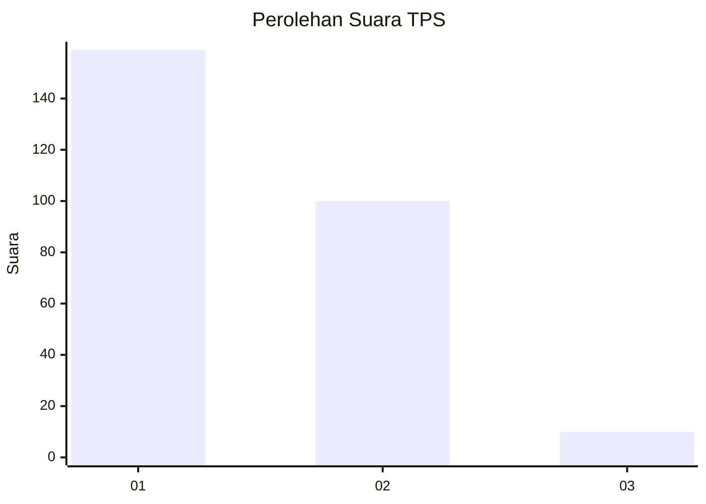
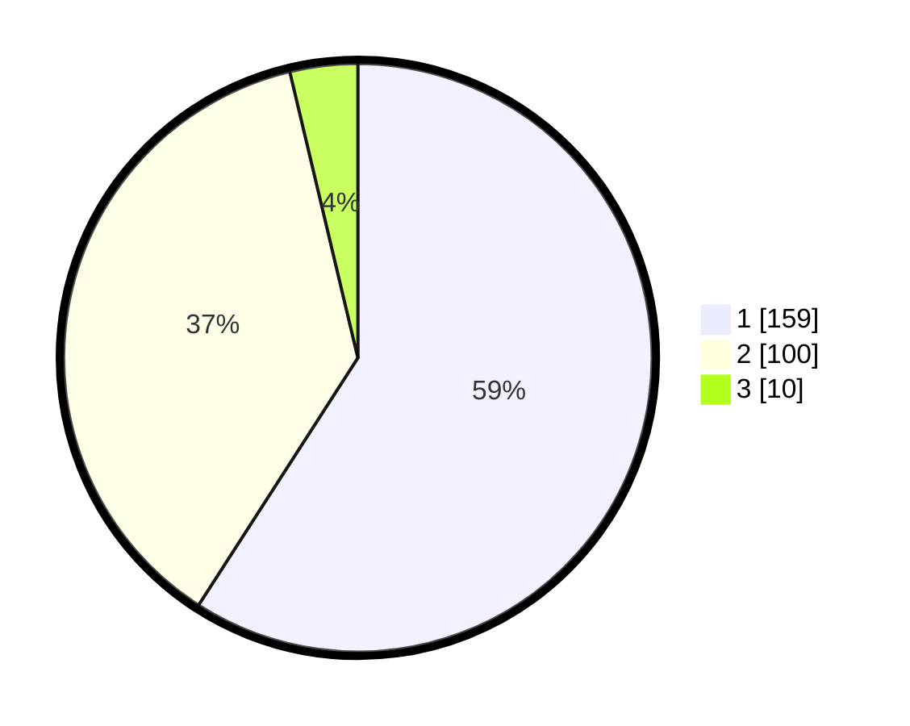

# Hasil

## Grafik

## Tabel

| No. | Nama Paslon    | Suara | Suara (raw) | Persentase |
|:--- |:-------------- | -----:| -----------:| ----------:|
| 1   | ANIES MUHAIMIN | 159   | [159][p-1]  | 59,11      |
| 2   | PRABOWO GIBRAN | 100   | [100][p-2]  | 37,17      |
| 3   | GANJAR MAHFUD  | 10    | [10][p-3]   | 3,72       |

[p-1]: https://github.com/gigit-pemilu/pemilu-2024/blob/main/pilpres/hitung-suara/sub/35-jawa-timur/sub/27-sampang/sub/10-robatal/sub/2011-torjunan/sub/001-tps/sub/paslon-1.txt
[p-2]: https://github.com/gigit-pemilu/pemilu-2024/blob/main/pilpres/hitung-suara/sub/35-jawa-timur/sub/27-sampang/sub/10-robatal/sub/2011-torjunan/sub/001-tps/sub/paslon-2.txt
[p-3]: https://github.com/gigit-pemilu/pemilu-2024/blob/main/pilpres/hitung-suara/sub/35-jawa-timur/sub/27-sampang/sub/10-robatal/sub/2011-torjunan/sub/001-tps/sub/paslon-3.txt

## Foto C Plano

https://sirekap-obj-formc.kpu.go.id/4090/pemilu/ppwp/35/27/10/20/11/3527102011001-20240215-044407--b7a99ad1-4fb4-4f53-9723-cad1755f4142.jpg

https://sirekap-obj-formc.kpu.go.id/4090/pemilu/ppwp/35/27/10/20/11/3527102011001-20240215-044416--bf099e8d-582c-411a-872c-4473ddd2cfe1.jpg

https://sirekap-obj-formc.kpu.go.id/4090/pemilu/ppwp/35/27/10/20/11/3527102011001-20240215-044423--81a3c3f2-7227-46c7-9c77-07263f9786c1.jpg

## Metadata

| Key        | Value               |
| ---------- | ------------------- |
| Time Stamp | 2024-02-16 12:51:22 |

