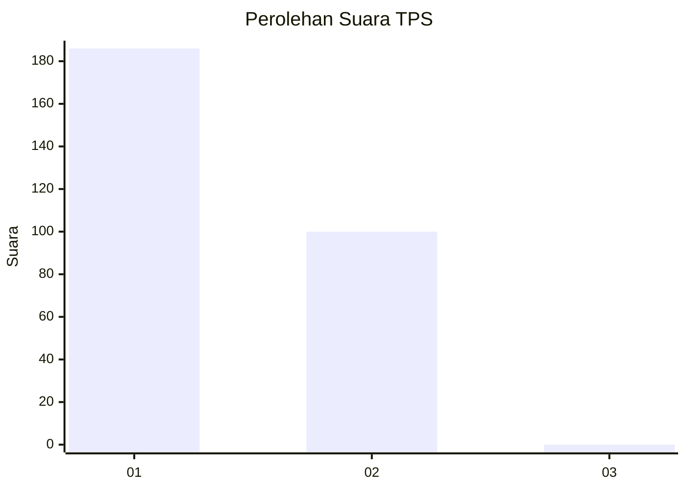
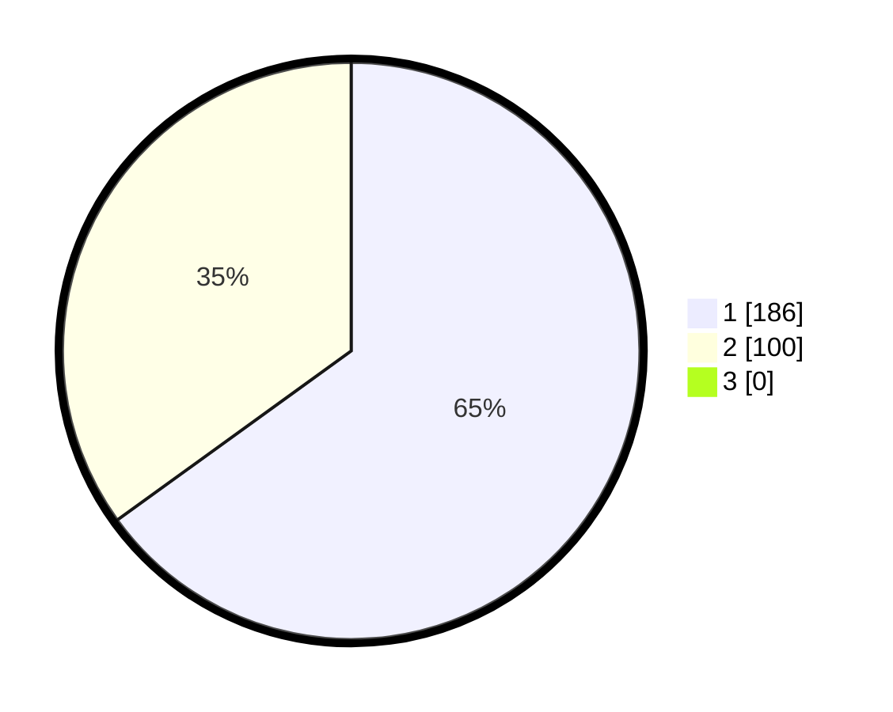

# Hasil

## Grafik

## Tabel

| No. | Nama Paslon    | Suara | Suara (raw) | Persentase |
|:--- |:-------------- | -----:| -----------:| ----------:|
| 1   | ANIES MUHAIMIN | 186   | [186][p-1]  | 65,03      |
| 2   | PRABOWO GIBRAN | 100   | [100][p-2]  | 34,97      |
| 3   | GANJAR MAHFUD  | 0     | [0][p-3]    | 0,00       |

[p-1]: https://github.com/gigit-pemilu/pemilu-2024-35-jawa-timur/blob/main/pilpres/hitung-suara/sub/35-jawa-timur/sub/27-sampang/sub/10-robatal/sub/2011-torjunan/sub/002-tps/sub/paslon-1.txt
[p-2]: https://github.com/gigit-pemilu/pemilu-2024-35-jawa-timur/blob/main/pilpres/hitung-suara/sub/35-jawa-timur/sub/27-sampang/sub/10-robatal/sub/2011-torjunan/sub/002-tps/sub/paslon-2.txt
[p-3]: https://github.com/gigit-pemilu/pemilu-2024-35-jawa-timur/blob/main/pilpres/hitung-suara/sub/35-jawa-timur/sub/27-sampang/sub/10-robatal/sub/2011-torjunan/sub/002-tps/sub/paslon-3.txt

## Foto C Plano

https://sirekap-obj-formc.kpu.go.id/840e/pemilu/ppwp/35/27/10/20/11/3527102011002-20240214-194104--04488c5b-861c-4dff-bf17-a7242271025c.jpg

https://sirekap-obj-formc.kpu.go.id/840e/pemilu/ppwp/35/27/10/20/11/3527102011002-20240214-194144--ea618a37-c725-46a8-854a-5e7f894e1210.jpg

https://sirekap-obj-formc.kpu.go.id/840e/pemilu/ppwp/35/27/10/20/11/3527102011002-20240214-194226--0ae8d984-5f5a-4d8f-9012-50f44e73091a.jpg

## Metadata

| Key        | Value               |
| ---------- | ------------------- |
| Time Stamp | 2024-02-20 11:00:00 |

