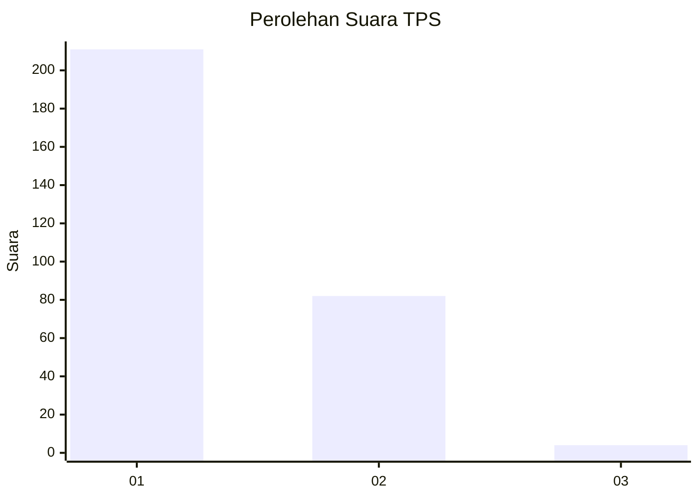
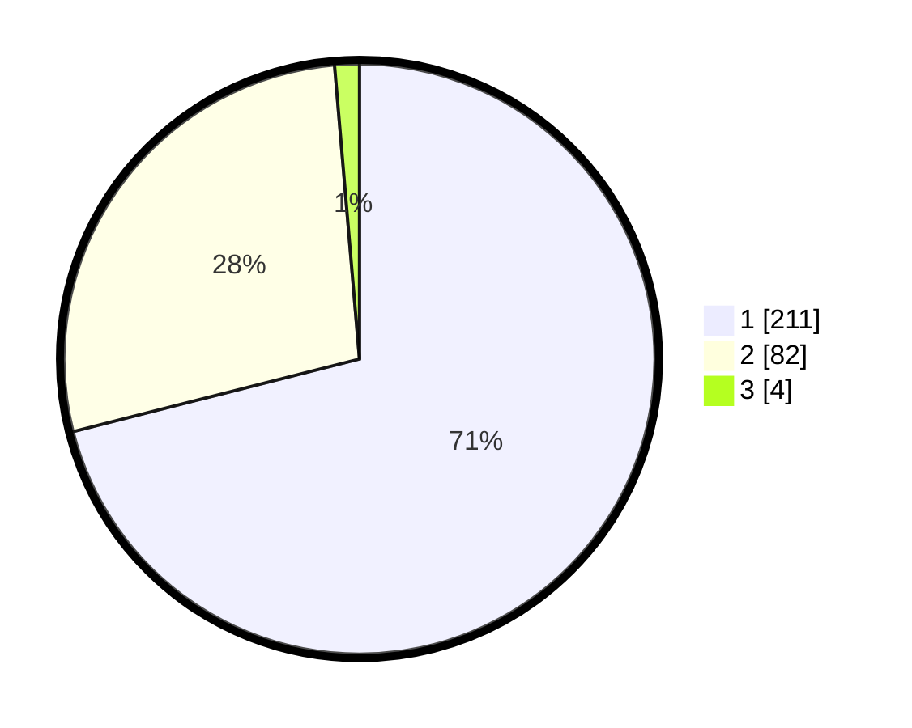

# Hasil

## Grafik

## Tabel

| No. | Nama Paslon    | Suara | Suara (raw) | Persentase |
|:--- |:-------------- | -----:| -----------:| ----------:|
| 1   | ANIES MUHAIMIN | 211   | [211][p-1]  | 71,04      |
| 2   | PRABOWO GIBRAN | 82    | [82][p-2]   | 27,61      |
| 3   | GANJAR MAHFUD  | 4     | [4][p-3]    | 1,35       |

[p-1]: https://github.com/gigit-pemilu/pemilu-2024/blob/main/pilpres/hitung-suara/sub/35-jawa-timur/sub/27-sampang/sub/11-sokobanah/sub/2001-tobai-barat/sub/001-tps/sub/paslon-1.txt
[p-2]: https://github.com/gigit-pemilu/pemilu-2024/blob/main/pilpres/hitung-suara/sub/35-jawa-timur/sub/27-sampang/sub/11-sokobanah/sub/2001-tobai-barat/sub/001-tps/sub/paslon-2.txt
[p-3]: https://github.com/gigit-pemilu/pemilu-2024/blob/main/pilpres/hitung-suara/sub/35-jawa-timur/sub/27-sampang/sub/11-sokobanah/sub/2001-tobai-barat/sub/001-tps/sub/paslon-3.txt

## Foto C Plano

https://sirekap-obj-formc.kpu.go.id/94a2/pemilu/ppwp/35/27/11/20/01/3527112001001-20240216-010443--204197ef-ef47-4987-b7f6-0896de92625c.jpg

https://sirekap-obj-formc.kpu.go.id/94a2/pemilu/ppwp/35/27/11/20/01/3527112001001-20240216-010445--88ae56ac-183d-4fe3-a349-9b8fc0bdf849.jpg

https://sirekap-obj-formc.kpu.go.id/94a2/pemilu/ppwp/35/27/11/20/01/3527112001001-20240216-010444--b51f91c6-0753-40b8-ade8-746dc9773705.jpg

## Metadata

| Key        | Value               |
| ---------- | ------------------- |
| Time Stamp | 2024-02-16 02:00:27 |

## DATA PEMILIH TETAP

Jumlah pemilih dalam DPT: **196**.
 * L: **132**.
 * P: **164**.

## DATA PENGGUNA HAK PILIH

Jumlah pengguna hak pilih dalam DPT: **196**.
 * L: **132**.
 * P: **164**.

Jumlah pengguna hak pilih dalam DPTb: **1**.
 * L: **1**.
 * P: **0**.

Jumlah pengguna hak pilih dalam DPK: **0**.
 * L: **0**.
 * P: **0**.

Jumlah pengguna hak pilih: **297**.
 * L: **133**.
 * P: **164**.

## JUMLAH SUARA SAH DAN TIDAK SAH

JUMLAH SELURUH SUARA SAH: **297**.

JUMLAH SUARA TIDAK SAH: **0**.

JUMLAH SELURUH SUARA SAH DAN SUARA TIDAK SAH: **0**.

