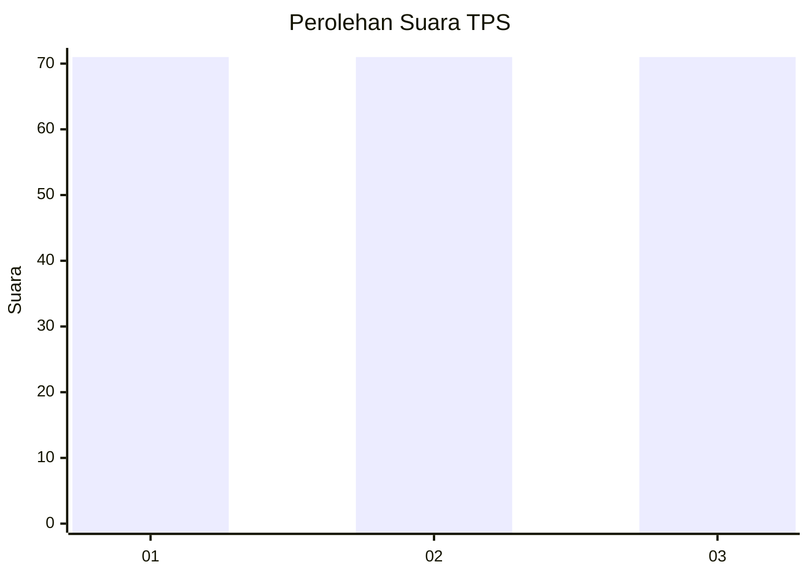
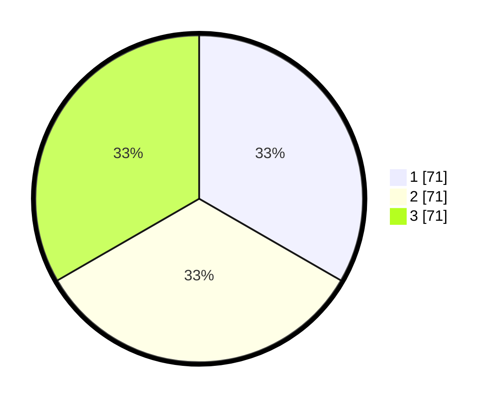

# Hasil

## Grafik

## Tabel

| No. | Nama Paslon    | Suara | Suara (raw) | Persentase |
|:--- |:-------------- | -----:| -----------:| ----------:|
| 1   | ANIES MUHAIMIN | 71    | [71][p-1]   | 33,33      |
| 2   | PRABOWO GIBRAN | 71    | [71][p-2]   | 33,33      |
| 3   | GANJAR MAHFUD  | 71    | [71][p-3]   | 33,33      |

[p-1]: https://github.com/gigit-pemilu/pemilu-2024-35-jawa-timur/blob/main/pilpres/hitung-suara/sub/35-jawa-timur/sub/27-sampang/sub/11-sokobanah/sub/2001-tobai-barat/sub/009-tps/sub/paslon-1.txt
[p-2]: https://github.com/gigit-pemilu/pemilu-2024-35-jawa-timur/blob/main/pilpres/hitung-suara/sub/35-jawa-timur/sub/27-sampang/sub/11-sokobanah/sub/2001-tobai-barat/sub/009-tps/sub/paslon-2.txt
[p-3]: https://github.com/gigit-pemilu/pemilu-2024-35-jawa-timur/blob/main/pilpres/hitung-suara/sub/35-jawa-timur/sub/27-sampang/sub/11-sokobanah/sub/2001-tobai-barat/sub/009-tps/sub/paslon-3.txt

## Foto C Plano

https://sirekap-obj-formc.kpu.go.id/ad7c/pemilu/ppwp/35/27/11/20/01/3527112001009-20240214-221940--cdf421ff-1af6-4df9-98d7-01a33fd7934b.jpg

https://sirekap-obj-formc.kpu.go.id/ad7c/pemilu/ppwp/35/27/11/20/01/3527112001009-20240214-223003--b963647e-32b2-4dc0-8521-e2828a0cb41a.jpg

https://sirekap-obj-formc.kpu.go.id/ad7c/pemilu/ppwp/35/27/11/20/01/3527112001009-20240214-222759--2512bea3-a0ab-4464-9dbc-a1e919124e49.jpg

## Metadata

| Key        | Value               |
| ---------- | ------------------- |
| Time Stamp | 2024-02-16 23:00:00 |

