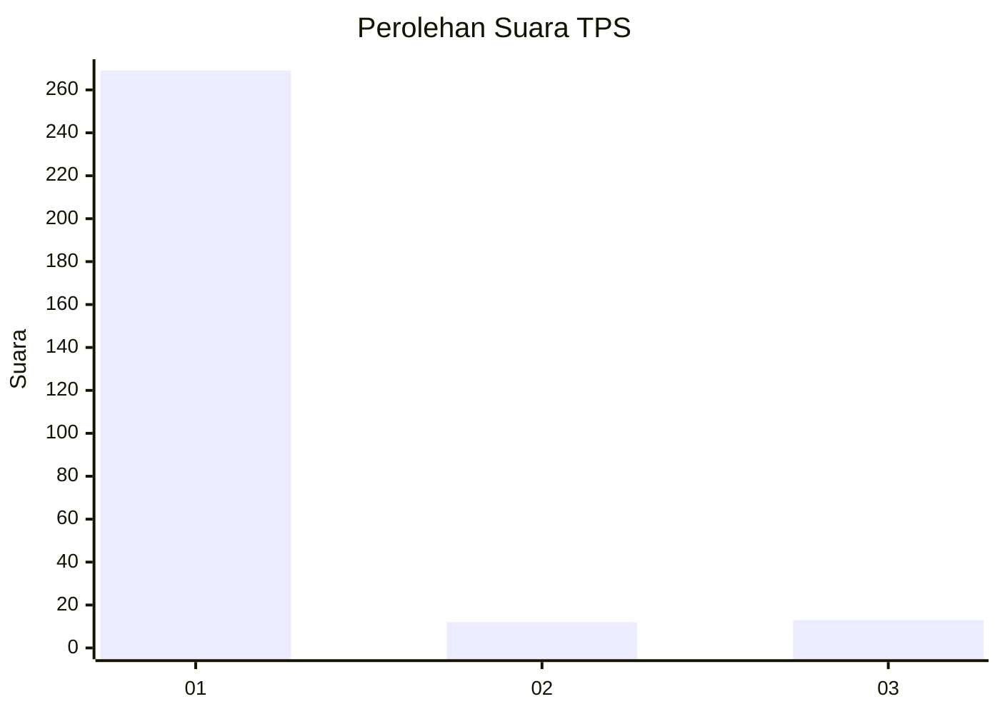
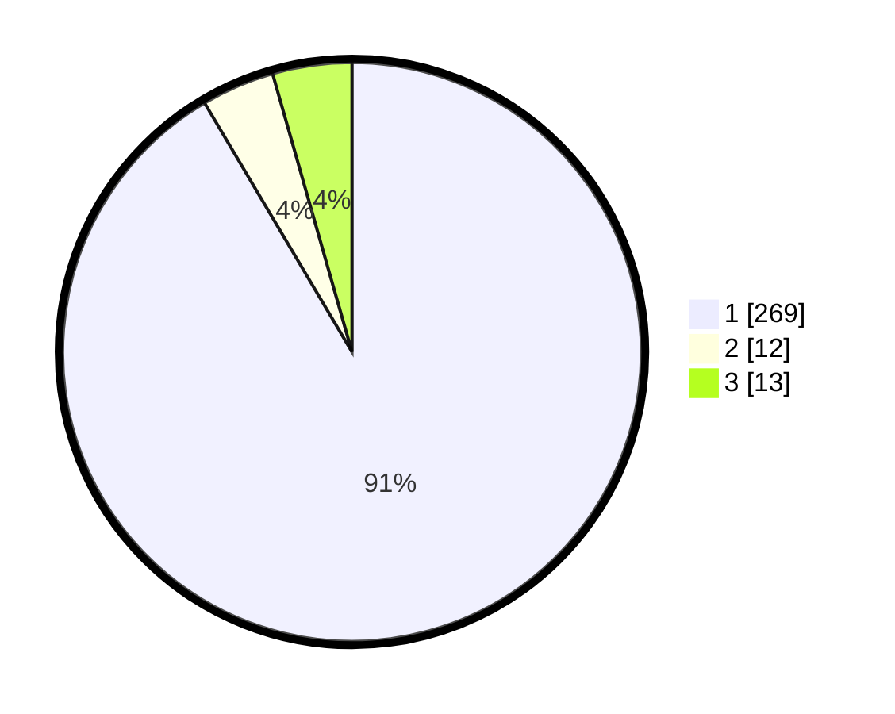

# Hasil

## Grafik

## Tabel

| No. | Nama Paslon    | Suara | Suara (raw) | Persentase |
|:--- |:-------------- | -----:| -----------:| ----------:|
| 1   | ANIES MUHAIMIN | 269   | [269][p-1]  | 91,50      |
| 2   | PRABOWO GIBRAN | 12    | [12][p-2]   | 4,08       |
| 3   | GANJAR MAHFUD  | 13    | [13][p-3]   | 4,42       |

[p-1]: https://github.com/gigit-pemilu/pemilu-2024-35-jawa-timur/blob/main/pilpres/hitung-suara/sub/35-jawa-timur/sub/27-sampang/sub/11-sokobanah/sub/2001-tobai-barat/sub/018-tps/sub/paslon-1.txt
[p-2]: https://github.com/gigit-pemilu/pemilu-2024-35-jawa-timur/blob/main/pilpres/hitung-suara/sub/35-jawa-timur/sub/27-sampang/sub/11-sokobanah/sub/2001-tobai-barat/sub/018-tps/sub/paslon-2.txt
[p-3]: https://github.com/gigit-pemilu/pemilu-2024-35-jawa-timur/blob/main/pilpres/hitung-suara/sub/35-jawa-timur/sub/27-sampang/sub/11-sokobanah/sub/2001-tobai-barat/sub/018-tps/sub/paslon-3.txt

## Foto C Plano

https://sirekap-obj-formc.kpu.go.id/9ef3/pemilu/ppwp/35/27/11/20/01/3527112001018-20240214-204155--051bc6cb-996b-46ff-860b-41fe49c9e999.jpg

https://sirekap-obj-formc.kpu.go.id/9ef3/pemilu/ppwp/35/27/11/20/01/3527112001018-20240214-204351--21e4fb34-0cdd-4188-9070-126fd1f67cda.jpg

https://sirekap-obj-formc.kpu.go.id/9ef3/pemilu/ppwp/35/27/11/20/01/3527112001018-20240214-204533--788057cd-a93a-4bba-9a68-a436672953ec.jpg

## Metadata

| Key        | Value               |
| ---------- | ------------------- |
| Time Stamp | 2024-02-16 12:51:22 |

